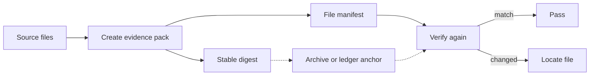
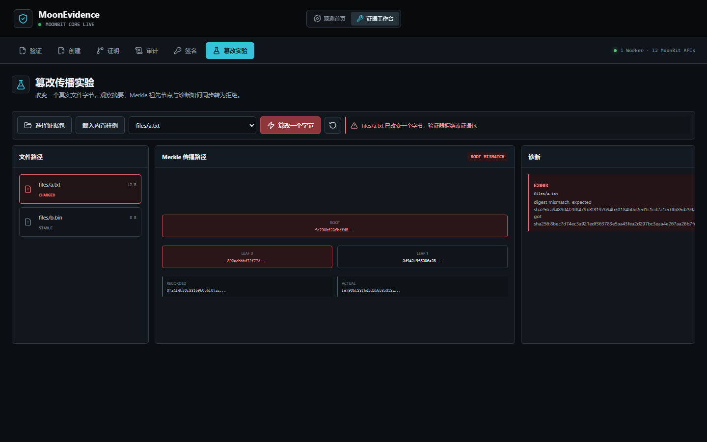
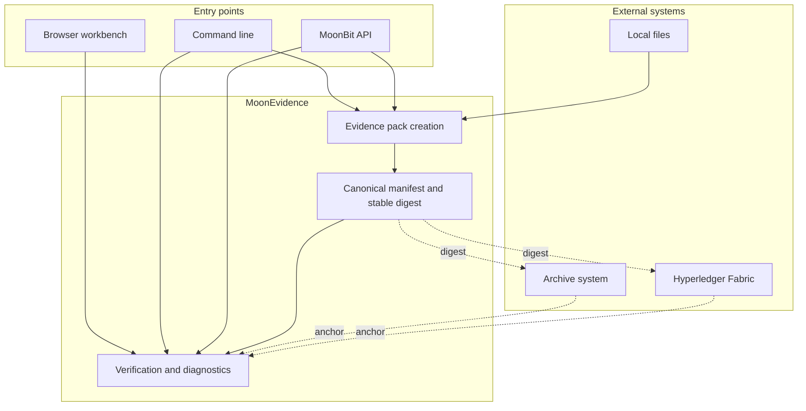

# MoonEvidence

[](https://github.com/wenlittle/MoonEvidence/actions/workflows/ci.yml)
[](https://wenlittle.github.io/MoonEvidence/)
[](https://mooncakes.io/docs/#/starlittle/MoonEvidence)
[](LICENSE)

[简体中文](README.md) | English

**Trusted evidence packs for file archives, AI output audits, and pre-chain verification.**

MoonEvidence turns a set of files into a reviewable evidence pack, produces a stable digest, and locates changed files during later verification. Its core is implemented in MoonBit and runs as a library, CLI, or browser workbench. The optional Hyperledger Fabric adapter provides an `anchor-pack` flow that verifies first and then submits; the ledger stores the canonical digest and first-submission context for later backfeed into local verification.

[Live experience](https://wenlittle.github.io/MoonEvidence/) · [Start verifying](https://wenlittle.github.io/MoonEvidence/#workbench/verify) · [Run the five-minute path](#quick-start)


## Overview

A MoonEvidence run accepts source files and produces a self-contained evidence pack, canonical manifest, stable digest, and structured verification result. The pack can travel with the files, while the digest can be recorded in a database, object store, or shared ledger.

During review, the verifier recomputes file digests and the Merkle root, then checks the manifest, optional version chain, and any external anchor. A change becomes a diagnostic with a path and stable error code. Automation can consume the same result as canonical JSON.

| Input | Deliverable | Review result |
| --- | --- | --- |
| File directory | `manifest.json`, `files/`, canonical digest | Pass, or the path of a changed file |
| Existing evidence pack | Structured report, exit code, readable findings | File change, manifest conflict, version anomaly |
| External anchor | Ledger or archival digest | Whether the current pack matches the recorded state |

## Use Cases

### Dataset archives

Freeze the file inventory, byte lengths, digests, and version relationship before release. Verify the archive again after transfer, backup, or long-term storage and locate damaged files directly.

### AI output audits

Package model output, prompts, configuration, and evaluation results together. Both sides of a handoff can review the same manifest, and the verification report can feed an automated audit pipeline.

### Ledger anchoring

Submit the canonical digest after local verification and keep file content off-chain. Later review checks both the current files and the original ledger anchor, so a regenerated manifest still exposes a historical mismatch.

## Workflow



The evidence pack retains the complete inspection data, while an external system only needs the stable digest. They meet again during review to catch both file changes and historical conflicts after manifest regeneration.

## Quick Start

### Browser

The [live homepage](https://wenlittle.github.io/MoonEvidence/) presents the full workflow. The [verification workbench](https://wenlittle.github.io/MoonEvidence/#workbench/verify) loads built-in examples or local files. The [tamper lab](https://wenlittle.github.io/MoonEvidence/#workbench/tamper) places the candidate file digest, candidate Merkle root, and rejection against the original manifest side by side.

Computation runs in a browser Web Worker against the same compiled MoonBit APIs. Local files are not uploaded to a server.

Run it locally with Node.js 22, npm, and the MoonBit toolchain:

```powershell
cd showcase
npm ci
npm run dev
```



### Command line

Local reproduction requires Git 2.40+, Node.js 20+, and the MoonBit toolchain; the first clone also requires network access. The five-minute path starts after those tools are installed and the terminal is open.

The following PowerShell path verifies a valid example, creates a new pack, changes one file, and prints the exact location of the mismatch:

```powershell
git clone https://github.com/wenlittle/MoonEvidence.git
cd MoonEvidence

moon build --target js
$cli = "_build/js/debug/build/src/cmd/main/main.js"

# Verify the bundled valid example
node $cli verify examples/valid-pack

# Create a new evidence pack
$pack = Join-Path $env:TEMP "moon-evidence-review-pack"
Remove-Item -Recurse -Force $pack -ErrorAction SilentlyContinue
node $cli pack examples/valid-pack/files -o $pack --subject-id review --json
node $cli verify $pack

# Change one file and verify again
Add-Content "$pack/files/a.txt" "tamper"
node $cli explain $pack
```

The last command exits with `1` and reports a digest mismatch at `files/a.txt`. Stable CLI exit codes are `0` for success or verification pass, `1` for a completed evidence rejection, and `2` for usage, permission, IO, or an incomplete directory inventory. Directory mode scans `files/` completely before reporting unlisted payloads. Verify `create`'s in-place output through its manifest path; use `pack` for archival handoff.

See the [User Guide](docs/GUIDE.md) for the complete command set, batch mode, and troubleshooting.

### MoonBit integration

Mooncakes publishes `starlittle/MoonEvidence` v0.5.0:

```powershell
moon add starlittle/MoonEvidence
```

Import the required packages in your application's `moon.pkg`:

```moonbit
import {
  "starlittle/MoonEvidence/src/create",
  "starlittle/MoonEvidence/src/diag",
  "starlittle/MoonEvidence/src/digest",
  "starlittle/MoonEvidence/src/verify",
}
```

Create a manifest and verify it against the same in-memory files:

```moonbit
fn main {
  let files : Map[String, Bytes] = {
    "files/report.txt": b"reviewed result",
    "files/config.json": b"{\"model\":\"v1\"}",
  }
  let options : @create.CreateOptions = {
    subject: { id: "release-001", kind: "ai-output" },
    algorithm: @digest.Sha256,
    version_id: "v1",
    version_parent: None,
  }
  let manifest = @create.create_manifest(files, options)
  let report = @verify.verify_manifest(manifest, files)
  println(@diag.explain(report))
}
```

The MoonBit field `SubjectInfo.kind` is serialized as manifest `subject.type`; `kind` avoids the MoonBit keyword.

The complete repository example creates a manifest, verifies the original
files, and confirms that changed bytes are rejected:

```powershell
moon run examples/quickstart
```

The [Evidence Pack Specification](docs/spec/EVIDENCE_PACK_SPEC.md) defines the format and field semantics.

## Verification Results

A valid pack produces a direct conclusion and inspection statistics:

```text
verification OK
checked 2 files, 2 passed; merkle root verified; 0 errors, 0 warnings
```

The single-byte change in the bundled tampered example is located at its file path:

```text
verification FAILED
  [E2003] files/a.txt: digest mismatch, expected sha256:a948... got sha256:7509...
checked 2 files, 1 passed; merkle root verified; 1 error, 0 warnings
```

`verify --json` returns the same semantics as canonical JSON for CI, gateway, and audit consumers. The [CLI Contract](docs/spec/CLI_MACHINE_CONTRACT.md) defines the complete error-code and machine-interface surface.

A direct payload change produces `E2003` against the original manifest. The report can still say `merkle root verified` because the unchanged manifest entries remain consistent with their recorded root. The tamper lab also rebuilds candidate entries and a candidate root; after manifest regeneration, an independently stored old manifest digest detects the historical change as `E2004`.

## Core Capabilities

| User outcome | Implementation |
| --- | --- |
| Identical content produces a stable record | RFC 8785 canonical JSON; evidence packs use SHA-256 or SHA-512 |
| Shared-key applications can authenticate bytes | The digest library provides HMAC-SHA256 separately from manifest algorithms |
| A multi-file state can be reviewed as one unit | RFC 6962-style Merkle roots; inclusion proofs are separate API artifacts |
| A change is located at its file | Seven-step verification pipeline, structured codes, readable findings |
| Repeated releases preserve a continuous history | Version-chain checks for one root, no cycles, and no forks |
| Automation receives a stable interface | Versioned receipts for `pack` and `inspect`, stable diagnostic JSON for `verify`, and fixed exit codes |
| Operation records support signed review | Hash-chained audit log and pure-MoonBit Ed25519 signing and verification |
| One evidence model serves multiple entry points | MoonBit library, native/wasm/wasm-gc/js, CLI, browser workbench |

Core computation performs no filesystem IO. The CLI, browser, and Fabric gateway own input and output, while every entry point shares the same manifest and verification semantics.

## Fabric Anchoring

The standard `anchor-pack` flow performs complete MoonEvidence verification off-chain before submitting the canonical digest to Hyperledger Fabric. A TypeScript Gateway owns that flow, the network connection, and commit receipts. The Go chaincode v1 API has no update or delete transaction. A sequential duplicate returns the first stored record. For concurrent first writes, the Gateway normalizes the losing submission only when Fabric reports MVCC validation code `11` and a follow-up query confirms a matching ledger record; every other rejected commit remains an error. Files, paths, the complete manifest, and the local verification report stay off-chain. The ledger confirms that a Fabric identity submitted the digest; MoonEvidence provides the verification conclusion.

```text
local create and verify → canonical digest → Fabric Gateway → chaincode → receipt
                         current pack ← ledger query ← original digest
```

The two-organization experiment recorded on 2026-07-11 produced reviewable evidence:

| Check | Result |
| --- | --- |
| Network | Fabric v3.1.4, Org1 and Org2, `evidencechannel` |
| Digest algorithm | This protocol run used SHA-256; the contract also accepts canonical SHA-512 digests |
| First commit | block `6`, status `VALID`, transaction `ca3dc781…a28393` |
| Cross-organization query | Org1 and Org2 returned the same original record |
| File change | Local backfeed verification returned `E2003` |
| Regenerated manifest | Comparison with the original ledger digest returned `E2004` |

The [Fabric Integration Guide](integrations/fabric/README.md) provides deployment and invocation commands. The [experiment record](docs/records/fabric-e2e/2026-07-11/) stores transaction, query, and digest-backfeed results.

## Architecture



File access and ledger connections stay at the entry layer. The verification core accepts only text and bytes. This boundary keeps CLI, browser, multi-backend CI, and Fabric integration results aligned while deployment environments retain independent permission and key management.

See the [Architecture](docs/ARCHITECTURE.md) for the detailed design and the [Fabric Anchor Specification](docs/spec/FABRIC_ANCHOR_SPEC.md) for the external record format.

## Quality Evidence

| Evidence | Current baseline | Source |
| --- | --- | --- |
| MoonBit tests | **357** test declarations: 353 executable tests and 4 benchmark wrappers | [Results Log](docs/records/RESULTS_LOG.md) |
| Independent references | 4 RFC 8032 examples, 150 Google Wycheproof Ed25519 vectors, and repository-maintained Node.js digest/Merkle oracles that do not call MoonBit code | [Test Plan](docs/TEST_PLAN.md) |
| Fault injection | Existing tests caught 18/18 implementation faults | [Gate script](tools/mutation-check.mjs) |
| Multiple backends | native, wasm, wasm-gc, and js enter CI; PowerShell and bash CLI suites each pass 68/68 | [CI](https://github.com/wenlittle/MoonEvidence/actions/workflows/ci.yml) |
| Browser | 12 MoonBit APIs share one Web Worker and receive smoke, malformed-input, and semantic-property checks | [Showcase Guide](showcase/README.md) |
| Fabric adapters | 82.1% chaincode statement coverage, Gateway 19/19, and a required CI job | [Results Log](docs/records/RESULTS_LOG.md) · [CI](https://github.com/wenlittle/MoonEvidence/actions/workflows/ci.yml) |
| Fabric protocol | Recorded two-organization submission, cross-organization query, idempotent duplicate, and digest backfeed | [Experiment record](docs/records/fabric-e2e/2026-07-11/) |
| MoonBit source | **14,977** lines: 6,547 implementation + 8,430 tests; 12 product packages and 1 native timing package | [Results Log](docs/records/RESULTS_LOG.md) |

The test system moves from standard examples and independent references through randomized differential checks, malformed inputs, fault injection, CLI black-box tests, and a real ledger experiment. Gates measure whether tests catch faults, not only how many tests pass.

## Scope

The current release supports reproducible archives, data handoffs, AI output audits, teaching and research, competition demonstrations, and controlled business prototypes. The core library owns deterministic evidence semantics. External adapters own filesystem permissions, network identities, and ledger connections.

Production deployments protecting high-value assets should add independent cryptographic review, managed key storage, operating-system file controls, Fabric organization governance, and continuous runtime monitoring. The current layering lets those controls evolve while the evidence-pack format and verification interface remain stable.

See [Security](SECURITY.md) for the current assurance level, reporting channel, and deployment checklist.

## Documentation

| Task | Documents |
| --- | --- |
| Start using the project | [User Guide](docs/GUIDE.md) · [Web Experience](showcase/README.md) · [Demo Script](docs/DEMO_SCRIPT.md) |
| Understand the design | [Architecture](docs/ARCHITECTURE.md) · [Development Report](docs/report/DEVELOPMENT_REPORT.md) · [Evidence Pack Specification](docs/spec/EVIDENCE_PACK_SPEC.md) |
| Integrate another system | [CLI Contract](docs/spec/CLI_MACHINE_CONTRACT.md) · [Fabric Specification](docs/spec/FABRIC_ANCHOR_SPEC.md) · [Fabric Guide](integrations/fabric/README.md) |
| Review quality | [Test Plan](docs/TEST_PLAN.md) · [Test Governance](docs/TEST_GOVERNANCE.md) · [Acceptance Checklist](docs/records/ACCEPTANCE_CHECKLIST.md) |
| Maintain the repository | [Project Index](docs/PROJECT_INDEX.md) · [Decision Log](docs/records/DECISION_LOG.md) · [Roadmap](docs/ROADMAP.md) |

## License

MoonEvidence is licensed under the [Apache License 2.0](LICENSE).

Maintainer: Chen Junwen. GitHub uses [`wenlittle`](https://github.com/wenlittle); GitLink and Mooncakes use the `starlittle` namespace.

[GitHub](https://github.com/wenlittle/MoonEvidence) · [GitLink](https://gitlink.org.cn/starlittle/MoonEvidence) · [Mooncakes](https://mooncakes.io/docs/#/starlittle/MoonEvidence)
