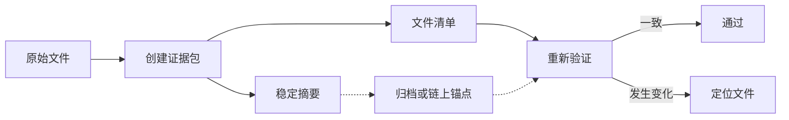
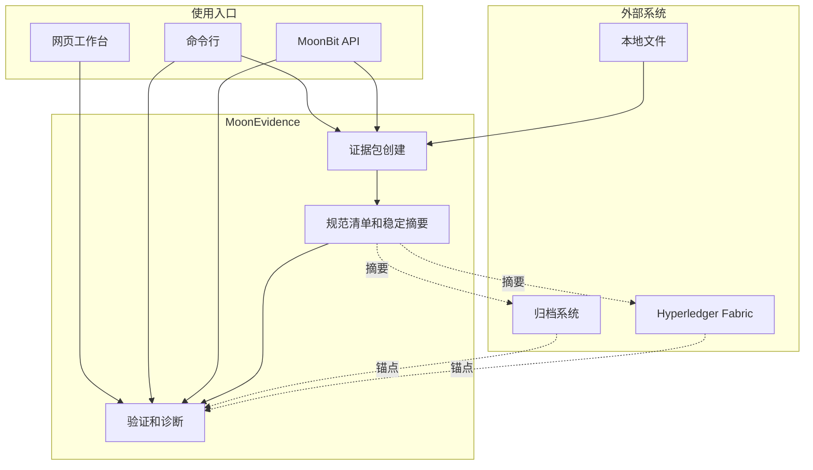

# MoonEvidence

[](https://github.com/wenlittle/MoonEvidence/actions/workflows/ci.yml)
[](https://wenlittle.github.io/MoonEvidence/)
[](https://mooncakes.io/docs/#/starlittle/MoonEvidence)
[](LICENSE)

简体中文 | [English](README.en.md)

**面向文件归档、AI 产物审计和上链存证的可信证据包工具。**

MoonEvidence 将一组文件整理成可复核的证据包，生成稳定摘要，并在内容发生变化时定位异常文件。核心能力由 MoonBit 实现，可作为库、命令行工具和浏览器工作台运行；可选的 Hyperledger Fabric 适配器提供先验证、再提交的 `anchor-pack` 流程，账本保存规范摘要和首笔提交上下文，后续再将摘要回传给本地验证器。

[在线体验](https://wenlittle.github.io/MoonEvidence/) · [开始验证](https://wenlittle.github.io/MoonEvidence/#workbench/verify) · [查看五分钟流程](#快速开始)


## 概览

一次 MoonEvidence 流程接收原始文件，输出自包含证据包、规范清单、稳定摘要和结构化验证结果。证据包可以随文件一起归档，摘要可以写入数据库、对象存储或共享账本。

复核时，验证器重新计算文件摘要和 Merkle 根，并检查清单、可选版本链和外部锚点。内容变化会形成带路径和错误码的诊断，脚本可以继续处理同一份机器可读结果。

| 输入 | 交付物 | 复核结果 |
| --- | --- | --- |
| 文件目录 | `manifest.json`、`files/`、规范摘要 | 通过，或定位到发生变化的文件 |
| 现有证据包 | 结构化报告、退出码、可读诊断 | 文件变化、清单冲突、版本异常 |
| 外部锚点 | 账本摘要或归档摘要 | 当前证据包和既有记录是否一致 |

## 使用场景

### 数据集归档

发布前固定文件清单、字节长度、摘要和版本关系。资料经过迁移、备份或长期保存后，可以重新验证并定位损坏文件。

### AI 产物审计

将模型输出、提示词、配置和评估结果放入同一证据包。交付双方使用同一份清单复核内容，验证报告可以进入自动化审计流水线。

### 上链存证

本地验证通过后提交规范摘要，文件内容继续保留在链下。后续复核同时检查当前文件和原始链上锚点，清单被重新生成时仍能识别历史不一致。

## 工作流程



证据包保留完整检查信息，外部系统只需保存稳定摘要。两者在复核阶段重新汇合，既能发现文件变化，也能识别重新生成清单后的历史冲突。

## 快速开始

### 网页体验

[在线首页](https://wenlittle.github.io/MoonEvidence/) 展示完整工作流程；[验证工作台](https://wenlittle.github.io/MoonEvidence/#workbench/verify) 可以直接加载内置样例或本地文件；[篡改实验](https://wenlittle.github.io/MoonEvidence/#workbench/tamper) 会并列显示单字节变化产生的候选文件摘要、候选 Merkle 根和针对原 manifest 的拒绝结论。

计算过程在浏览器 Web Worker 中完成，调用同一套 MoonBit 编译产物。文件无需上传到服务端。

本地启动需要 Node.js 22、npm 和 MoonBit 工具链：

```powershell
cd showcase
npm ci
npm run dev
```


### 命令行

本地复现需要 Git 2.40+、Node.js 20+ 和 MoonBit 工具链；首次克隆需要网络连接。下面五分钟路径从工具已经安装、终端已经打开时开始计时。

下面的 PowerShell 命令依次验证完好样例、创建新证据包、修改一个文件，再输出定位结果：

```powershell
git clone https://github.com/wenlittle/MoonEvidence.git
cd MoonEvidence

moon build --target js
$cli = "_build/js/debug/build/src/cmd/main/main.js"

# 验证仓库内的完好样例
node $cli verify examples/valid-pack

# 创建一份新的证据包
$pack = Join-Path $env:TEMP "moon-evidence-review-pack"
Remove-Item -Recurse -Force $pack -ErrorAction SilentlyContinue
node $cli pack examples/valid-pack/files -o $pack --subject-id review --json
node $cli verify $pack

# 修改一个文件并重新验证
Add-Content "$pack/files/a.txt" "tamper"
node $cli explain $pack
```

最后一条命令返回退出码 `1`，并指出 `files/a.txt` 的摘要不一致。CLI 的稳定退出码为：`0` 表示成功或验证通过，`1` 表示验证完成并拒绝证据，`2` 表示用法、权限、IO 或目录清单扫描不完整。目录模式会完整扫描 `files/` 后再报告未登记文件；`create` 的就地 manifest 通过 manifest 文件路径复核，归档交付使用 `pack`。

完整命令、批量模式和故障排查见[用户指南](docs/GUIDE.md)。

### MoonBit 接入

Mooncakes 已发布 `starlittle/MoonEvidence` v0.5.1：

```powershell
moon add starlittle/MoonEvidence
```

在应用的 `moon.pkg` 中导入需要的包：

```moonbit
import {
  "starlittle/MoonEvidence/src/create",
  "starlittle/MoonEvidence/src/diag",
  "starlittle/MoonEvidence/src/digest",
  "starlittle/MoonEvidence/src/verify",
}
```

创建清单后可以直接使用同一组内存文件完成验证：

```moonbit
fn main {
  let files : Map[String, Bytes] = {
    "files/report.txt": b"reviewed result",
    "files/config.json": b"{\"model\":\"v1\"}",
  }
  let options : @create.CreateOptions = {
    subject: { id: "release-001", kind: "ai-output" },
    algorithm: @digest.Sha256,
    version_id: "v1",
    version_parent: None,
  }
  let manifest = @create.create_manifest(files, options)
  let report = @verify.verify_manifest(manifest, files)
  println(@diag.explain(report))
}
```

MoonBit 结构体字段 `SubjectInfo.kind` 会写入 manifest 的 `subject.type`；`kind` 用于避开 MoonBit 关键字。

仓库中的完整示例可以直接运行，它会依次创建清单、验证原始文件，再确认修改后的文件被拒绝：

```powershell
moon run examples/quickstart
```

证据包格式和字段语义见[证据包规范](docs/spec/EVIDENCE_PACK_SPEC.md)。

## 验证结果

完好证据包会给出明确结论和检查统计：

```text
verification OK
checked 2 files, 2 passed; merkle root verified; 0 errors, 0 warnings
```

样例中的单字节变化会被定位到具体文件：

```text
verification FAILED
  [E2003] files/a.txt: digest mismatch, expected sha256:a948... got sha256:7509...
checked 2 files, 1 passed; merkle root verified; 1 error, 0 warnings
```

`verify --json` 输出相同语义的规范 JSON，便于 CI、网关和审计脚本消费。完整错误码和机器接口见 [CLI 契约](docs/spec/CLI_MACHINE_CONTRACT.md)。

文件字节被直接改动时，`E2003` 对照原 manifest 定位文件。报告中的 `merkle root verified` 表示原 manifest 内的文件条目仍与其记录根一致。篡改实验会进一步重算候选条目和候选根；重新生成 manifest 后，外部保存的旧清单摘要通过 `E2004` 识别历史变化。

## 核心能力

| 用户结果 | 实现方式 |
| --- | --- |
| 同一内容得到稳定记录 | RFC 8785 规范 JSON；证据包使用 SHA-256 或 SHA-512 |
| 共享密钥场景可以认证字节 | 摘要库单独提供 HMAC-SHA256，不进入 manifest 算法字段 |
| 多文件状态可以整体复核 | RFC 6962 风格 Merkle 根；包含性证明作为独立 API 产物 |
| 变化可以定位到文件 | 七步验证流程、结构化错误码、可读诊断 |
| 多次发布保留连续历史 | 唯一根节点、无环、无分叉的版本链检查 |
| 自动化工具获得稳定接口 | `pack`、`inspect` 的版本化回执，`verify` 的稳定诊断 JSON 和固定退出码 |
| 操作记录可以继续签名复核 | 哈希链审计日志、纯 MoonBit Ed25519 签名和验签 |
| 同一语义覆盖多种入口 | MoonBit 库、native/wasm/wasm-gc/js、CLI、浏览器工作台 |

核心计算不访问文件系统。CLI、浏览器和 Fabric 网关负责输入输出，所有入口共享同一套清单和验证语义。

## Fabric 锚定

标准 `anchor-pack` 流程先在链下调用 MoonEvidence 完整验证，再把规范摘要提交到 Hyperledger Fabric。TypeScript Gateway 负责这条流程、网络连接和提交回执。Go Chaincode v1 不提供更新或删除交易，顺序重复提交直接返回已保存的首笔记录。并发首写中，只有提交结果为 Fabric MVCC validation code `11`，且随后查询确认账本记录与待提交摘要一致时，Gateway 才把失败方归一化为重复成功；其他拒绝保持错误。文件、路径、完整清单和本地验证报告继续留在链下。账本记录能够确认某个 Fabric 身份提交了该摘要，验证结论由 MoonEvidence 报告提供。

```text
本地创建和验证 → 规范摘要 → Fabric Gateway → Chaincode → 交易回执
                  当前证据包 ← 账本查询 ← 原始摘要
```

2026-07-12 的双组织实验直接使用 `v0.5.1` 发布压缩包，留下了可复核记录：

| 检查项 | 结果 |
| --- | --- |
| 网络 | Fabric v3.1.4，Org1 和 Org2，`evidencechannel` |
| 摘要算法 | 本次协议运行使用 SHA-256；合同同时接受规范 SHA-512 摘要 |
| 发布文件 | `starlittle-MoonEvidence-0.5.1.zip`，SHA-256 `7208a251…479a3ef` |
| 首次提交 | block `8`，状态 `VALID`，交易 `a6d812ac…4529dc` |
| 跨组织查询 | Org1、Org2 返回同一条原始记录 |
| 文件变化 | 本地复核返回 `E2003` |
| 清单重建 | 对照原始账本摘要返回 `E2004` |

[实链记录页](https://wenlittle.github.io/MoonEvidence/#ledger)提供可视化回放，[Fabric 集成指南](integrations/fabric/README.md)提供部署和调用命令，[发布实验记录](docs/records/fabric-e2e/2026-07-12-v0.5.1/)保存制品哈希、交易、查询和回灌结果。

## 系统架构



文件读写和账本连接停留在入口层，验证核心只接收文本和字节。这个边界让 CLI、浏览器、多后端 CI 和 Fabric 集成保持一致结果，也为部署环境保留独立的权限和密钥管理空间。

深入设计见[架构文档](docs/ARCHITECTURE.md)，外部锚点格式见 [Fabric 规范](docs/spec/FABRIC_ANCHOR_SPEC.md)。

## 质量证据

| 证据 | 当前基线 | 来源 |
| --- | --- | --- |
| MoonBit 测试 | **357** 个测试声明，353 个可执行测试，4 个基准包装 | [结果记录](docs/records/RESULTS_LOG.md) |
| 独立参考 | 4 条 RFC 8032 样例、150 条 Google Wycheproof Ed25519 向量、仓库内不调用 MoonBit 代码的 Node.js 摘要和 Merkle oracle | [测试计划](docs/TEST_PLAN.md) |
| 故障注入 | 18/18 个实现故障被现有测试捕获 | [门禁脚本](tools/mutation-check.mjs) |
| 多后端 | native、wasm、wasm-gc、js 进入 CI 检查；CLI PowerShell/bash 各 68/68 | [CI](https://github.com/wenlittle/MoonEvidence/actions/workflows/ci.yml) |
| 浏览器 | 12 个 MoonBit API 共用 Web Worker，并由 smoke、异常输入和语义属性检查覆盖 | [展示说明](showcase/README.md) |
| Fabric 适配器 | Chaincode 82.1% 语句覆盖，Gateway 19/19，required CI 持续执行 | [结果记录](docs/records/RESULTS_LOG.md) · [CI](https://github.com/wenlittle/MoonEvidence/actions/workflows/ci.yml) |
| Fabric 协议 | `v0.5.1` 发布包、双组织提交、跨组织查询、幂等重复和摘要回传已留存 | [发布实验记录](docs/records/fabric-e2e/2026-07-12-v0.5.1/) |
| MoonBit 源码 | **14,977** 行（实现 6,547 + 测试 8,430），12 个产品包和 1 个原生计时工具包 | [结果记录](docs/records/RESULTS_LOG.md) |

测试从标准样例、独立参考结果、随机差分、异常输入、故障注入一路覆盖到 CLI 黑盒和真实账本实验。门禁关注测试能否抓住错误，避免只统计通过数量。

## 适用范围

当前版本适合可复现归档、数据交付、AI 产物审计、教学研究、竞赛展示和受控业务原型。核心库提供确定性证据语义，外部适配器负责文件权限、网络身份和账本连接。

保护高价值资产的生产部署需要完成独立密码学审查、托管密钥接入、操作系统级文件保护、Fabric 组织治理和持续运行监控。现有分层允许这些控制独立演进，证据包格式和验证接口保持稳定。

当前保障级别、报告渠道和部署检查项见[安全说明](SECURITY.md)。

## 文档索引

| 任务 | 文档 |
| --- | --- |
| 开始使用 | [用户指南](docs/GUIDE.md) · [网页说明](showcase/README.md) · [演示脚本](docs/DEMO_SCRIPT.md) |
| 理解设计 | [架构文档](docs/ARCHITECTURE.md) · [开发报告](docs/report/DEVELOPMENT_REPORT.md) · [证据包规范](docs/spec/EVIDENCE_PACK_SPEC.md) |
| 接入系统 | [CLI 契约](docs/spec/CLI_MACHINE_CONTRACT.md) · [Fabric 规范](docs/spec/FABRIC_ANCHOR_SPEC.md) · [Fabric 指南](integrations/fabric/README.md) |
| 检查质量 | [测试计划](docs/TEST_PLAN.md) · [测试治理](docs/TEST_GOVERNANCE.md) · [验收清单](docs/records/ACCEPTANCE_CHECKLIST.md) |
| 维护项目 | [项目索引](docs/PROJECT_INDEX.md) · [决策记录](docs/records/DECISION_LOG.md) · [路线图](docs/ROADMAP.md) |

## 开源许可

MoonEvidence 使用 [Apache License 2.0](LICENSE)。

维护者：陈俊文。GitHub 使用 [`wenlittle`](https://github.com/wenlittle)，GitLink 和 Mooncakes 使用 `starlittle` 命名空间。

[GitHub](https://github.com/wenlittle/MoonEvidence) · [GitLink](https://gitlink.org.cn/starlittle/MoonEvidence) · [Mooncakes](https://mooncakes.io/docs/#/starlittle/MoonEvidence)
