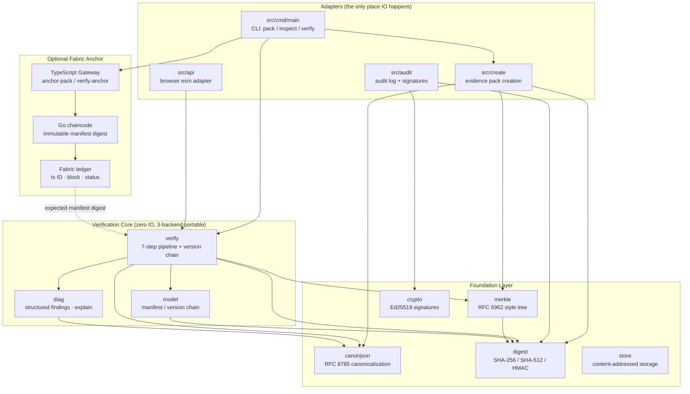

# MoonEvidence

[](https://github.com/wenlittle/MoonEvidence/actions/workflows/ci.yml)

English | [中文](README.zh.md)

MoonEvidence is a MoonBit ecosystem project for trusted evidence pack verification.

The project provides a reusable MoonBit library and CLI that can create and
verify deterministic evidence packs, plus an optional Hyperledger Fabric
adapter that anchors the verified manifest digest and feeds it back into local
verification.

## Positioning

MoonEvidence keeps evidence semantics chain-agnostic: prove that a local pack
is complete, deterministic, and untampered before notarization, archival,
copyright packaging, AI output audit, or research release. When a shared
ledger is required, the Fabric adapter records only that verified pack's
canonical manifest digest and returns transaction, block, and validation
evidence.

## 5-Minute Reviewer Path

This path exercises the project value loop end to end: build the CLI, verify a
known-good pack, create a new pack, tamper with one byte, and confirm the
diagnostic catches it. Run from the repository root:

```powershell
moon build --target js
$cli = "_build/js/debug/build/src/cmd/main/main.js"

node $cli verify examples/valid-pack

Remove-Item -Recurse -Force "$env:TEMP\moon-evidence-review-pack" -ErrorAction SilentlyContinue
node $cli pack examples/valid-pack/files -o "$env:TEMP\moon-evidence-review-pack" --subject-id review --json
node $cli verify "$env:TEMP\moon-evidence-review-pack"

Add-Content "$env:TEMP\moon-evidence-review-pack\files\a.txt" "tamper"
node $cli explain "$env:TEMP\moon-evidence-review-pack"

moon build --target js --release src/api
node tools/smoke-api.mjs
```

The same release JS artifact powers `demo/web/`; the optional Fabric path uses
the same canonical digest and verification report rather than implementing a
second evidence model.

## Interactive Web Experience

[Open the live MoonEvidence experience](https://wenlittle.github.io/MoonEvidence/)

The public homepage introduces the product first, then turns one byte-level
change into a four-chapter scroll story: collect the material, create a
reviewable credential, observe the result fork, and locate the rejected file.
The desktop story reuses the live Three.js evidence graph; mobile presents the
same conclusions in a purpose-built compact flow.


Run it locally:

```powershell
cd showcase
npm ci
npm run dev
```

`Start verification` opens a separate native React Evidence Workbench with six
operational tools: verify, create, Merkle proof, audit log, Ed25519 signing,
and a byte-level tamper lab. The homepage and Workbench are distinct surfaces,
while the Workbench keeps its state when navigating between them. All real
results come from one Web Worker and the same 12 compiled MoonBit APIs, with no
iframe or backend involved.


See [`showcase/README.md`](showcase/README.md) for the architecture and
production build commands.

## Features

### Core Verification
- Canonical JSON serialization (RFC 8785) for stable digests.
- Pure MoonBit SHA-256 and SHA-512 digest implementations.
- HMAC-SHA256 message authentication (RFC 2104).
- Evidence manifest model and validation (path traversal rejected at parse time).
- Merkle root/proof verification (RFC 6962 style).
- Linear version chain verification (unique root, no cycles, no forks).
- 7-step verification pipeline: parse → canonicalize → digest → merkle → version chain → diagnostics.
- Structured diagnostics and human-readable explain output.
- Frozen exit codes: 0 (pass), 1 (fail), 2 (usage/IO error).

### Pack Creation & Extensions
- **One-command evidence pack creation**: `pack`/`seal` creates the complete
  `manifest.json + files/` layout; `create` remains available for existing
  directory layouts.
- **Machine contract**: versioned JSON from `pack`, `create`, and `inspect`,
  plus external-anchor verification through `--expected-manifest-digest`.
- **Incremental verification**: digest caching, skip unchanged files.
- **Batch CLI mode**: verify multiple packs at once, summarize results.
- **In-memory deduplication store**: content stored once per unique SHA-256 digest.

### Advanced Capabilities
- **Audit log**: hash-chained append-only operation records.
- **Ed25519 digital signatures**: pure MoonBit implementation, from finite field to sign/verify (~800 lines).
- **Audit log + signature integration**: optional Ed25519 signature verification.
- **Hyperledger Fabric anchor**: immutable Go chaincode and a TypeScript
  Gateway adapter with commit-status receipts, duplicate normalization, and
  two-organization ledger-backfed verification.

## Architecture at a Glance



File bytes are injected by the adapters (`Map[String, Bytes]`); the core
only computes. That boundary is what lets the same semantics run in the
CLI, in CI's three-backend matrix, and in the browser.

## Project Documents

### Getting Started
- [User Guide (three real scenarios)](docs/GUIDE.md)
- [Hyperledger Fabric integration (source repository)](https://github.com/wenlittle/MoonEvidence/tree/main/integrations/fabric)
- [Environment Setup](docs/ENVIRONMENT.md)
- [Demo Script (5-minute presentation)](docs/DEMO_SCRIPT.md)

### Deep Dive
- [Architecture](docs/ARCHITECTURE.md)
- [Evidence Pack Specification](docs/spec/EVIDENCE_PACK_SPEC.md)
- [CLI Machine Contract](docs/spec/CLI_MACHINE_CONTRACT.md)
- [Fabric Anchor Contract](docs/spec/FABRIC_ANCHOR_SPEC.md)
- [Roadmap](docs/ROADMAP.md)
- [Development Report](docs/report/DEVELOPMENT_REPORT.md)

### Engineering & Quality
- [Project Index](docs/PROJECT_INDEX.md)
- [Code Guidelines](docs/CODE_GUIDELINES.md)
- Results Log (repo-only, [see GitHub](https://github.com/wenlittle/MoonEvidence/blob/main/docs/records/RESULTS_LOG.md))
- Acceptance Checklist (repo-only, [see GitHub](https://github.com/wenlittle/MoonEvidence/blob/main/docs/records/ACCEPTANCE_CHECKLIST.md))
- Decision Log (repo-only, [see GitHub](https://github.com/wenlittle/MoonEvidence/blob/main/docs/records/DECISION_LOG.md))

## Quick Start (CLI)

Mooncakes registry version: `starlittle/MoonEvidence` v0.4.1.

The published v0.4.1 package is the stable MoonBit library baseline. Repository
HEAD is the next minor release candidate and adds the `pack`/`inspect`
machine contract, external-anchor verification, and the repository-level
Fabric adapter described below. Build this checkout to exercise those paths;
they are tracked under `Unreleased` in the changelog.

```powershell
moon add starlittle/MoonEvidence
```

```powershell
# build the CLI (js artifact, runs via node; native works wherever a C compiler exists)
moon build --target js
$cli = "_build/js/debug/build/src/cmd/main/main.js"

# verify the bundled example packs
node $cli verify examples/valid-pack
node $cli explain examples/tampered-pack

# create a complete evidence pack and expose its canonical anchor
node $cli pack examples/valid-pack/files -o my-pack --subject-id demo --json
node $cli inspect --json my-pack
node $cli verify my-pack

# machine-readable report / human-readable findings
node $cli verify --json examples/valid-pack
node $cli explain examples/tampered-pack

# run the full black-box suite
powershell -ExecutionPolicy Bypass -File tools/cli-test.ps1 -Target js
bash ./tools/cli-test.sh js
```

Exit codes are frozen: `0` verification passed, `1` verification failed,
`2` usage or IO error. On machines with a system C compiler (and in CI) the
same CLI builds natively: `moon build --target native` then
`tools/cli-test.ps1 -Target native`.

## Hyperledger Fabric Anchor

The optional adapter runs the complete boundary rather than presenting an
on-chain mock:

```text
MoonBit pack/verify -> TypeScript Gateway -> Go chaincode -> Fabric ledger
                    <- ledger query <- expected digest verification
```

The recorded two-organization experiment committed the bundled golden pack as
`VALID` in block 6. Org1 and Org2 queried the same immutable record; an Org2
duplicate preserved the original transaction ID. Feeding the ledger digest
back into MoonEvidence passed the original pack, produced exactly `E2003` for
a changed payload, and exactly `E2004` after regenerating a manifest around
that changed payload.

Build the adapter with `npm --prefix integrations/fabric/gateway ci` and
`npm run fabric:build`, then use `me-fabric anchor-pack` and
`me-fabric verify-anchor`. Full test-network deployment commands, local profile
rules, and programmatic Node.js usage are in
the [Fabric integration source guide](https://github.com/wenlittle/MoonEvidence/blob/main/integrations/fabric/README.md).
Sanitized transaction receipts are in the
[Fabric E2E record](https://github.com/wenlittle/MoonEvidence/tree/main/docs/records/fabric-e2e/2026-07-11).

## Try It in the Browser

The same pure verification core compiles to a self-contained esm bundle
(`src/api`, exporting a string-in/string-out `verify_evidence`), so packs
can be verified entirely client-side - no upload, no server round-trip:

```powershell
moon build --target js --release src/api

# serve the repository root with any static server, then open
#   http://localhost:8765/demo/web/
python -m http.server 8765
```

Pick `examples/valid-pack` or `examples/tampered-pack` in the page (or
paste a manifest JSON to check its structure, canonicalization, and
Merkle root without file bytes):


The findings table and the `explain` text mirror the CLI byte for byte;
`node tools/smoke-api.mjs` runs the same adapter contract in CI.

## Diagnostics Preview

Every verification failure maps to a frozen error code (`E1xxx`..`E5xxx`,
`W1xxx`). The `explain` renderer prints one finding per line and always
closes with a summary:

```text
verification FAILED
  [E2003] files/data.csv: digest mismatch, expected sha256:ab.. got sha256:cd..
  [W1001] files/extra.bin: file present in pack but not listed in manifest
checked 12 files, 11 passed; merkle root verified; 1 error, 1 warning
```

The machine-readable twin (`to_json`) emits the same report as canonical
JSON (RFC 8785 key order), so report bytes are digest-stable:

```json
{"findings":[],"ok":true,"stats":{"files_passed":2,"files_total":2,"merkle_checked":true}}
```

## Performance

Measured with `moon bench --target js` (criterion-style, 10 batches per
bench) on moon 0.1.20260529 / Node v22.22.0 / Windows. Payloads are
deterministic (seeded splitmix64), and the pipeline packs carry real
digests and a real Merkle root - a guard assertion aborts if the pack
ever stops verifying, so the benchmark cannot silently measure the
cheaper failure path.

| Benchmark | Mean ± σ | Derived rate |
| --- | --- | --- |
| SHA-256, 1 MiB payload | 17.10 ms ± 0.21 ms | ~58 MiB/s |
| SHA-256, 64 KiB payload | 1.12 ms ± 0.02 ms | ~56 MiB/s |
| Full verify, 1k-file manifest (64 B files) | 25.65 ms ± 0.78 ms | ~26 µs/file |
| Full verify, 10k-file manifest (64 B files) | 283.52 ms ± 6.18 ms | ~28 µs/file |

Full verify covers parse, canonicalization, per-file digests, and Merkle
root recomputation. Cost scales near-linearly in file count (10x files
-> 11.05x time; the residual is the Merkle tree's log-depth term), so
manifest size, not file count, is the practical ceiling. Numbers come
from the pure-MoonBit SHA-256 on the js backend; the native backend (CI)
is expected to be faster. Methodology and raw output:
`docs/records/RESULTS_LOG.md` (step 8 task 4).

## Current Status

All 12 product packages are implemented and fully tested across three backends;
`src/timing` is a native-only measurement package for local Ed25519 timing
experiments.

### Core Packages (zero IO)
- `canonjson` — RFC 8785 escaping, code-unit key order, full ECMAScript number serialization (Appendix B vectors)
- `digest` — pure MoonBit SHA-256 / SHA-512 / HMAC (NIST vectors)
- `merkle` — RFC 6962 style domain separation, cross-checked against independent Node reference
- `model` — validated manifest + version chain, path traversal rejected at parse time
- `verify` — seven-step verification pipeline
- `diag` — structured findings, explain, canonical JSON reports

### Extension Packages
- `create` — evidence pack creation from raw files
- `store` — in-memory deduplication map (SHA-256 keyed)
- `audit` — hash-chained append-only audit log
- `crypto` — Ed25519 digital signatures (pure MoonBit, from GF(2^255-19) up)

### Adapters
- **CLI** (`src/cmd/main`): `pack` / `inspect` / `verify` / `explain` /
  `create`, with versioned JSON and frozen exit codes
- **Browser** (`src/api`): esm bundle for client-side verification
- **Fabric** (`integrations/fabric`): TypeScript Gateway adapter + immutable Go
  digest-anchor chaincode

### Test Coverage
- **351 unit tests** declared (347 executable tests + 4 benchmark wrappers), with native/wasm-gc/js passing locally
- **62-case black-box CLI suite**: the 54-case verification/create contract plus 8 machine-interface and external-anchor cases, with PowerShell/bash parity
- **Fabric adapter tests**: Go chaincode 82.1% statement coverage; TypeScript Gateway 19/19 tests; real two-organization anchor/query/duplicate/tamper E2E recorded
- **Property tests**: canonicalization idempotence, Merkle proof soundness (mutation-verified)
- **Native timing probe**: dudect-style Ed25519 verify/sign sampler for local native release builds; reports Welch t as an engineering assurance signal for this toolchain
- **CI three-backend matrix**: native / wasm-gc / js build + test + browser smoke test

```powershell
moon check
moon test --target native,wasm-gc,js
moon build --target js
moon build --target js --release src/api
moon build --target native
powershell -ExecutionPolicy Bypass -File tools/cli-test.ps1 -Target js
powershell -ExecutionPolicy Bypass -File tools/cli-test.ps1 -Target native
bash ./tools/cli-test.sh js
bash ./tools/cli-test.sh native
node tools/smoke-api.mjs
npm run fabric:test
moon bench --target js
```

As of 2026-07-11 Asia/Shanghai, the local native/wasm-gc/js test baseline is
green; native was verified on Windows with MSVC 19.44 and Windows SDK
10.0.26100.0. Codebase is 14571
effective MoonBit lines (implementation 6453 + tests 8118); the implementation
size remains within the 4-10k competition range.
