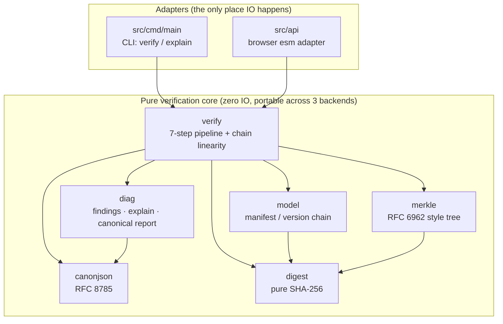

# MoonEvidence

[](https://github.com/wenlittle/MoonEvidence/actions/workflows/ci.yml)

English | [中文](README.zh.md)

MoonEvidence is a MoonBit ecosystem project for trusted evidence pack verification.

The project goal is to provide a reusable MoonBit library and native CLI that can verify whether a group of files, metadata, Merkle proofs, and version records remain complete and untampered.

## Positioning

MoonEvidence is not a blockchain application or smart contract framework. It is a chain-agnostic verification core that can be used before blockchain notarization, dataset archival, digital copyright packaging, AI output audit, or research artifact release.

## Features

### Core Verification (v0.1)
- Canonical JSON serialization (RFC 8785) for stable digests.
- Pure MoonBit SHA-256 and SHA-512 digest implementations.
- HMAC-SHA256 message authentication (RFC 2104).
- Evidence manifest model and validation.
- Merkle root/proof verification (RFC 6962 style).
- Linear version chain verification.
- Structured diagnostics and human-readable explain output.
- Native CLI entry points: `verify` and `explain`.

### Pack Creation (v0.2)
- Evidence pack creation from raw files (`create_manifest` API).
- Incremental verification with digest caching.
- Multi-algorithm support (SHA-256, SHA-512).

## Architecture at a Glance



File bytes are injected by the adapters (`Map[String, Bytes]`); the core
only computes. That boundary is what lets the same semantics run in the
CLI, in CI's three-backend matrix, and in the browser.

## Project Documents

- [User Guide (three real scenarios)](docs/GUIDE.md)
- [Project Index](docs/PROJECT_INDEX.md)
- [Architecture](docs/ARCHITECTURE.md)
- [Evidence Pack Spec](docs/spec/EVIDENCE_PACK_SPEC.md)
- [Environment Setup](docs/ENVIRONMENT.md)
- [Code Guidelines](docs/CODE_GUIDELINES.md)
- [Roadmap](docs/ROADMAP.md)
- [Results Log](docs/records/RESULTS_LOG.md)

## Quick Start (CLI)

```powershell
# build the CLI (js artifact, runs via node; native works wherever a C compiler exists)
moon build --target js

# verify the bundled example packs
node _build/js/debug/build/src/cmd/main/main.js verify examples/valid-pack
node _build/js/debug/build/src/cmd/main/main.js verify examples/tampered-pack

# machine-readable report / human-readable findings
node _build/js/debug/build/src/cmd/main/main.js verify --json examples/valid-pack
node _build/js/debug/build/src/cmd/main/main.js explain examples/tampered-pack

# run the full black-box suite (12 cases)
powershell -ExecutionPolicy Bypass -File tools/cli-test.ps1 -Target js
```

Exit codes are frozen: `0` verification passed, `1` verification failed,
`2` usage or IO error. On machines with a system C compiler (and in CI) the
same CLI builds natively: `moon build --target native` then
`tools/cli-test.ps1 -Target native`.

## Try It in the Browser

The same pure verification core compiles to a self-contained esm bundle
(`src/api`, exporting a string-in/string-out `verify_evidence`), so packs
can be verified entirely client-side - no upload, no server round-trip:

```powershell
moon build --target js

# serve the repository root with any static server, then open
#   http://localhost:8765/demo/web/
python -m http.server 8765
```

Pick `examples/valid-pack` or `examples/tampered-pack` in the page (or
paste a manifest JSON to check its structure, canonicalization, and
Merkle root without file bytes):


The findings table and the `explain` text mirror the CLI byte for byte;
`node tools/smoke-api.mjs` runs the same adapter contract in CI.

## Diagnostics Preview

Every verification failure maps to a frozen error code (`E1xxx`..`E4xxx`,
`W1xxx`). The `explain` renderer prints one finding per line and always
closes with a summary:

```text
verification FAILED
  [E2003] files/data.csv: digest mismatch, expected sha256:ab.. got sha256:cd..
  [W1001] files/extra.bin: file present in pack but not listed in manifest
checked 12 files, 11 passed; merkle root verified; 1 error, 1 warning
```

The machine-readable twin (`to_json`) emits the same report as canonical
JSON (RFC 8785 key order), so report bytes are digest-stable:

```json
{"findings":[],"ok":true,"stats":{"files_passed":2,"files_total":2,"merkle_checked":true}}
```

## Performance

Measured with `moon bench --target js` (criterion-style, 10 batches per
bench) on moon 0.1.20260529 / Node v22.22.0 / Windows. Payloads are
deterministic (seeded splitmix64), and the pipeline packs carry real
digests and a real Merkle root - a guard assertion aborts if the pack
ever stops verifying, so the benchmark cannot silently measure the
cheaper failure path.

| Benchmark | Mean ± σ | Derived rate |
| --- | --- | --- |
| SHA-256, 1 MiB payload | 17.10 ms ± 0.21 ms | ~58 MiB/s |
| SHA-256, 64 KiB payload | 1.12 ms ± 0.02 ms | ~56 MiB/s |
| Full verify, 1k-file manifest (64 B files) | 25.65 ms ± 0.78 ms | ~26 µs/file |
| Full verify, 10k-file manifest (64 B files) | 283.52 ms ± 6.18 ms | ~28 µs/file |

Full verify covers parse, canonicalization, per-file digests, and Merkle
root recomputation. Cost scales near-linearly in file count (10x files
-> 11.05x time; the residual is the Merkle tree's log-depth term), so
manifest size, not file count, is the practical ceiling. Numbers come
from the pure-MoonBit SHA-256 on the js backend; the native backend (CI)
is expected to be faster. Methodology and raw output:
`docs/records/RESULTS_LOG.md` (step 8 task 4).

## Current Status

All eight pure library packages are implemented and green: `canonjson`
(RFC 8785 escaping, code-unit key order, full ECMAScript number
serialization pinned by the Appendix B vectors), `digest` (pure
MoonBit SHA-256, NIST vectors), `merkle` (RFC 6962 style domain separation,
cross-checked against an independent Node reference), `model` (validated
manifest + version chain, traversal-hostile paths rejected at parse time),
`verify` (seven-step pipeline), and `diag` (structured findings, explain,
canonical JSON reports). On top of them sit two thin adapters: the CLI
(`src/cmd/main`) ships `verify [--json]` / `explain` with frozen exit
codes, exercised by a 22-case black-box suite: 12 cases over the bundled
`examples/` packs plus a 10-pack tamper matrix
(`tests/fixtures/packs/`, generated by an independent Node reference
implementation and rot-guarded in CI); the browser adapter (`src/api`)
exposes the same pipeline as a single esm export consumed by the
`demo/web` page and smoke-tested in CI via Node. Properties
(canonicalization idempotence, Merkle proof soundness) are pinned by
mutation-verified property suites, and throughput is tracked by
`moon bench` suites (see Performance above).

```powershell
moon check
moon test --target wasm-gc,js
moon build --target js
powershell -ExecutionPolicy Bypass -File tools/cli-test.ps1 -Target js
node tools/smoke-api.mjs
moon bench --target js
```

All commands pass locally (155/155 unit tests on both wasm-gc and js,
22/22 black-box cases, adapter smoke green) as of 2026-06-11 Asia/Shanghai;
CI additionally builds all three backends (native, wasm-gc, js) and runs
the black-box suite against the native CLI. Next up: Mooncakes release and
documentation close-out (master plan step 10).
