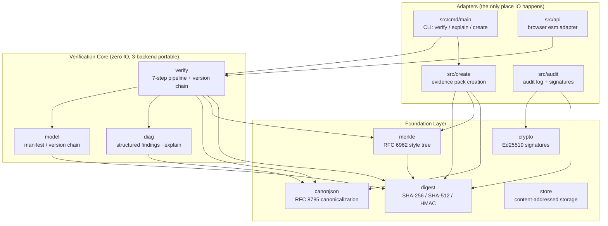
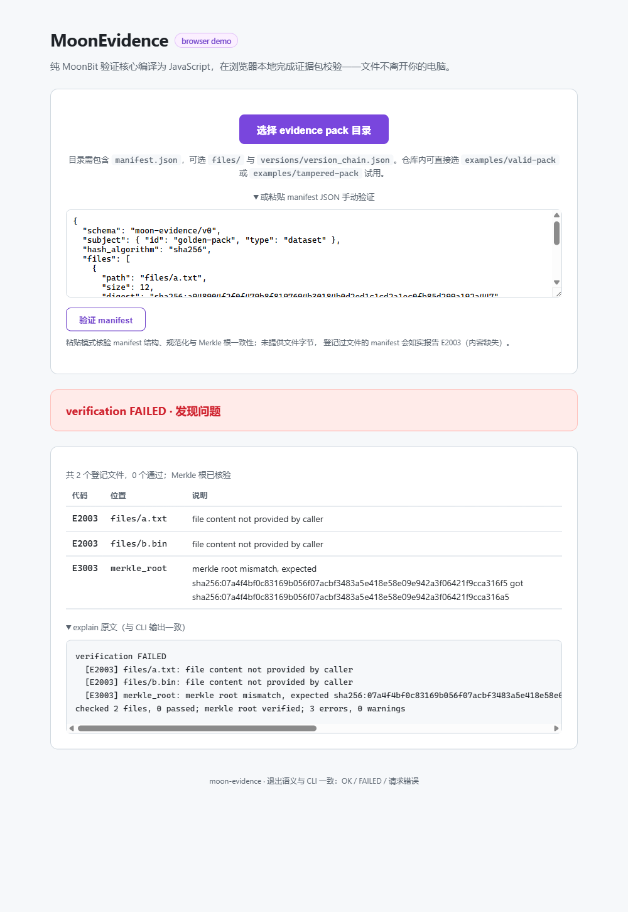

# MoonEvidence

[](https://github.com/starlittle/MoonEvidence/actions/workflows/ci.yml)

English | [中文](README.zh.md)

MoonEvidence is a MoonBit ecosystem project for trusted evidence pack verification.

The project goal is to provide a reusable MoonBit library and native CLI that can verify whether a group of files, metadata, Merkle proofs, and version records remain complete and untampered.

## Positioning

MoonEvidence is not a blockchain application or smart contract framework. It is a chain-agnostic verification core that can be used before blockchain notarization, dataset archival, digital copyright packaging, AI output audit, or research artifact release.

## Features

### Core Verification
- Canonical JSON serialization (RFC 8785) for stable digests.
- Pure MoonBit SHA-256 and SHA-512 digest implementations.
- HMAC-SHA256 message authentication (RFC 2104).
- Evidence manifest model and validation (path traversal rejected at parse time).
- Merkle root/proof verification (RFC 6962 style).
- Linear version chain verification (unique root, no cycles, no forks).
- 7-step verification pipeline: parse → canonicalize → digest → merkle → version chain → diagnostics.
- Structured diagnostics and human-readable explain output.
- Frozen exit codes: 0 (pass), 1 (fail), 2 (usage/IO error).

### Pack Creation & Extensions
- **Evidence pack creation**: `create` CLI command + `create_manifest` API.
- **Incremental verification**: digest caching, skip unchanged files.
- **Batch CLI mode**: verify multiple packs at once, summarize results.
- **In-memory deduplication store**: content stored once per unique SHA-256 digest.

### Advanced Capabilities
- **Audit log**: hash-chained append-only operation records.
- **Ed25519 digital signatures**: pure MoonBit implementation, from finite field to sign/verify (~800 lines).
- **Audit log + signature integration**: optional Ed25519 signature verification.

## Architecture at a Glance



File bytes are injected by the adapters (`Map[String, Bytes]`); the core
only computes. That boundary is what lets the same semantics run in the
CLI, in CI's three-backend matrix, and in the browser.

## Project Documents

### Getting Started
- [User Guide (three real scenarios)](docs/GUIDE.md)
- [Environment Setup](docs/ENVIRONMENT.md)
- [Demo Script (5-minute presentation)](docs/DEMO_SCRIPT.md)

### Deep Dive
- [Architecture](docs/ARCHITECTURE.md)
- [Evidence Pack Specification](docs/spec/EVIDENCE_PACK_SPEC.md)
- [Roadmap](docs/ROADMAP.md)
- Development Report (repo-only, [see GitHub](https://github.com/starlittle/MoonEvidence/blob/main/docs/report/DEVELOPMENT_REPORT.md))

### Engineering & Quality
- [Project Index](docs/PROJECT_INDEX.md)
- [Code Guidelines](docs/CODE_GUIDELINES.md)
- Results Log (repo-only, [see GitHub](https://github.com/starlittle/MoonEvidence/blob/main/docs/records/RESULTS_LOG.md))
- Acceptance Checklist (repo-only, [see GitHub](https://github.com/starlittle/MoonEvidence/blob/main/docs/records/ACCEPTANCE_CHECKLIST.md))
- Decision Log (repo-only, [see GitHub](https://github.com/starlittle/MoonEvidence/blob/main/docs/records/DECISION_LOG.md))

## Quick Start (CLI)

```powershell
# build the CLI (js artifact, runs via node; native works wherever a C compiler exists)
moon build --target js
$cli = "_build/js/debug/build/src/cmd/main/main.js"

# verify the bundled example packs
node $cli verify examples/valid-pack
node $cli explain examples/tampered-pack

# create your own evidence pack
node $cli create examples/valid-pack/files my-pack
node $cli verify my-pack

# machine-readable report / human-readable findings
node $cli verify --json examples/valid-pack
node $cli explain examples/tampered-pack

# run the full black-box suite
powershell -ExecutionPolicy Bypass -File tools/cli-test.ps1 -Target js
```

Exit codes are frozen: `0` verification passed, `1` verification failed,
`2` usage or IO error. On machines with a system C compiler (and in CI) the
same CLI builds natively: `moon build --target native` then
`tools/cli-test.ps1 -Target native`.

## Try It in the Browser

The same pure verification core compiles to a self-contained esm bundle
(`src/api`, exporting a string-in/string-out `verify_evidence`), so packs
can be verified entirely client-side - no upload, no server round-trip:

```powershell
moon build --target js

# serve the repository root with any static server, then open
#   http://localhost:8765/demo/web/
python -m http.server 8765
```

Pick `examples/valid-pack` or `examples/tampered-pack` in the page (or
paste a manifest JSON to check its structure, canonicalization, and
Merkle root without file bytes):



The findings table and the `explain` text mirror the CLI byte for byte;
`node tools/smoke-api.mjs` runs the same adapter contract in CI.

## Diagnostics Preview

Every verification failure maps to a frozen error code (`E1xxx`..`E5xxx`,
`W1xxx`). The `explain` renderer prints one finding per line and always
closes with a summary:

```text
verification FAILED
  [E2003] files/data.csv: digest mismatch, expected sha256:ab.. got sha256:cd..
  [W1001] files/extra.bin: file present in pack but not listed in manifest
checked 12 files, 11 passed; merkle root verified; 1 error, 1 warning
```

The machine-readable twin (`to_json`) emits the same report as canonical
JSON (RFC 8785 key order), so report bytes are digest-stable:

```json
{"findings":[],"ok":true,"stats":{"files_passed":2,"files_total":2,"merkle_checked":true}}
```

## Performance

Measured with `moon bench --target js` (criterion-style, 10 batches per
bench) on moon 0.1.20260529 / Node v22.22.0 / Windows. Payloads are
deterministic (seeded splitmix64), and the pipeline packs carry real
digests and a real Merkle root - a guard assertion aborts if the pack
ever stops verifying, so the benchmark cannot silently measure the
cheaper failure path.

| Benchmark | Mean ± σ | Derived rate |
| --- | --- | --- |
| SHA-256, 1 MiB payload | 17.10 ms ± 0.21 ms | ~58 MiB/s |
| SHA-256, 64 KiB payload | 1.12 ms ± 0.02 ms | ~56 MiB/s |
| Full verify, 1k-file manifest (64 B files) | 25.65 ms ± 0.78 ms | ~26 µs/file |
| Full verify, 10k-file manifest (64 B files) | 283.52 ms ± 6.18 ms | ~28 µs/file |

Full verify covers parse, canonicalization, per-file digests, and Merkle
root recomputation. Cost scales near-linearly in file count (10x files
-> 11.05x time; the residual is the Merkle tree's log-depth term), so
manifest size, not file count, is the practical ceiling. Numbers come
from the pure-MoonBit SHA-256 on the js backend; the native backend (CI)
is expected to be faster. Methodology and raw output:
`docs/records/RESULTS_LOG.md` (step 8 task 4).

## Current Status

All 12 packages are implemented and fully tested across three backends.

### Core Packages (zero IO)
- `canonjson` — RFC 8785 escaping, code-unit key order, full ECMAScript number serialization (Appendix B vectors)
- `digest` — pure MoonBit SHA-256 / SHA-512 / HMAC (NIST vectors)
- `merkle` — RFC 6962 style domain separation, cross-checked against independent Node reference
- `model` — validated manifest + version chain, path traversal rejected at parse time
- `verify` — seven-step verification pipeline
- `diag` — structured findings, explain, canonical JSON reports

### Extension Packages
- `create` — evidence pack creation from raw files
- `store` — in-memory deduplication map (SHA-256 keyed)
- `audit` — hash-chained append-only audit log
- `crypto` — Ed25519 digital signatures (pure MoonBit, from GF(2^255-19) up)

### Adapters
- **CLI** (`src/cmd/main`): `verify` / `explain` / `create` with frozen exit codes
- **Browser** (`src/api`): esm bundle for client-side verification

### Test Coverage
- **286 unit tests** passing on native / wasm-gc / js
- **53-case black-box CLI suite**: 12 command-shape + 10-pack tamper matrix + 19 error-code fixtures + 9 create + 3 incremental
- **Property tests**: canonicalization idempotence, Merkle proof soundness (mutation-verified)
- **CI three-backend matrix**: native / wasm-gc / js build + test + browser smoke test

```powershell
moon check
moon test --target native,wasm-gc,js
moon build --target js
powershell -ExecutionPolicy Bypass -File tools/cli-test.ps1 -Target js
node tools/smoke-api.mjs
moon bench --target js
```

All commands pass locally as of 2026-07-05 Asia/Shanghai. Codebase is 11146
effective MoonBit lines (implementation 5370 + tests 5776), well within the 4-10k competition range.
