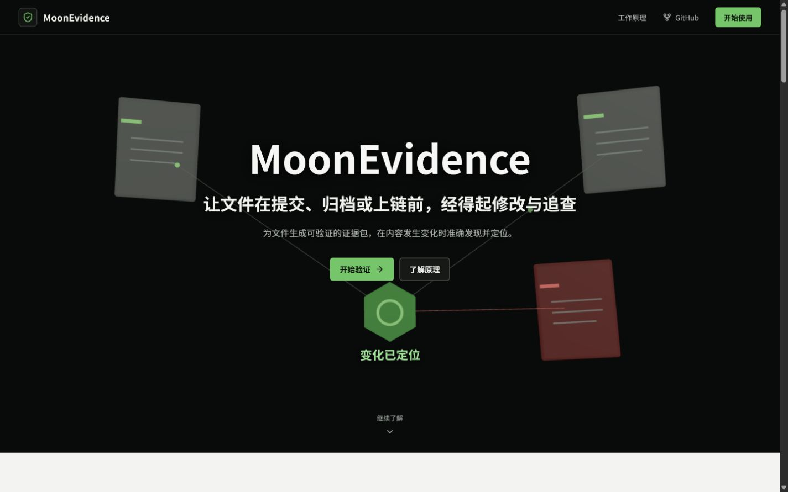
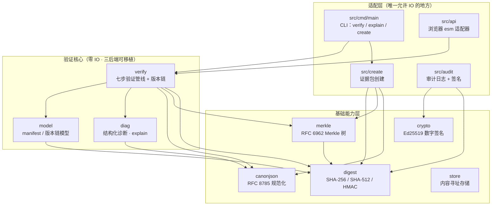

# MoonEvidence

[](https://github.com/wenlittle/MoonEvidence/actions/workflows/ci.yml)

[English](README.md) | 中文

MoonEvidence 是一个用 MoonBit 编写的**可信证据包验证库与 CLI**：验证一组文件、元数据、Merkle 证明和版本记录是否完整、未被篡改。

## 定位

MoonEvidence 是面向上链存证、数据集归档、数字版权打包、AI 产物审计和科研资料发布前置环节的**链无关验证核心**：在外部系统记录之前，先证明本地证据包完整、确定、未被篡改。

- **确定性**：规范化 JSON（RFC 8785）保证同一份数据在任何机器上得到同一个摘要。
- **可解释**：每个失败映射到冻结的错误码（`E1xxx`–`E5xxx`、`W1xxx`），`explain` 输出人类可读的逐条诊断。
- **可移植**：纯验证核心零 IO，native / wasm-gc / js 三后端编译，同一套语义跑在 CLI 和浏览器里。

## 5 分钟评审路径

这条路径直接跑通项目主线：构建 CLI，验证完好证据包，创建新证据包，篡改一个字节，再确认诊断能抓到篡改。所有命令都在仓库根目录执行：

```powershell
moon build --target js
$cli = "_build/js/debug/build/src/cmd/main/main.js"

node $cli verify examples/valid-pack

Remove-Item -Recurse -Force "$env:TEMP\moon-evidence-review-pack" -ErrorAction SilentlyContinue
node $cli create examples/valid-pack/files "$env:TEMP\moon-evidence-review-pack"
node $cli verify "$env:TEMP\moon-evidence-review-pack"

Add-Content "$env:TEMP\moon-evidence-review-pack\files\a.txt" "tamper"
node $cli explain "$env:TEMP\moon-evidence-review-pack"

moon build --target js --release src/api
node tools/smoke-api.mjs
```

`demo/web/` 使用同一个 release JS 产物，展示的是上链存证、外部归档或审计交付之前的本地可信校验闭环。

## 交互式网页体验

[打开 MoonEvidence 在线体验](https://wenlittle.github.io/MoonEvidence/)

公开首页先说明项目价值，再用四章滚动叙事展示一次字节级变化如何被发现：
材料进入证据包、形成可复核凭证、修改后结果分叉、准确定位并拒绝不一致材料。
桌面端复用实时 Three.js 证据图，移动端使用专门排布的紧凑流程，结论保持一致。



本地启动：

```powershell
cd showcase
npm ci
npm run dev
```

点击“开始验证”进入独立的原生 React 证据工作台，使用验证、创建、证明、
审计、签名与篡改实验六项真实工具。首页与工作台各自承担介绍和操作职责，
切换时保留工作台状态；所有结果都由同一个 Web Worker 调用 12 个已编译
MoonBit API 产生，无 iframe、无后端。架构与生产构建命令见
[`showcase/README.md`](showcase/README.md)。

## 30 秒上手

Mooncakes 注册表版本：`starlittle/MoonEvidence` v0.4.1。

```powershell
moon add starlittle/MoonEvidence
```

```powershell
# 构建 CLI（js 产物用 node 运行；有 C 编译器的机器可用 native）
moon build --target js
$cli = "_build/js/debug/build/src/cmd/main/main.js"

# 验证内置示例包：一个完好、一个被篡改
node $cli verify examples/valid-pack
node $cli explain examples/tampered-pack

# 创建自己的证据包
node $cli create examples/valid-pack/files my-pack
node $cli verify my-pack
```

退出码冻结：`0` 验证通过，`1` 验证失败，`2` 用法或 IO 错误。

`explain` 对篡改包的输出（与浏览器 demo 逐字节一致）：

```text
verification FAILED
  [E2003] files/a.txt: digest mismatch, expected sha256:a948904f.. got sha256:7509e5bd..
checked 2 files, 1 passed; merkle root verified; 1 error, 0 warnings
```

## 在浏览器试用

同一个纯核心编译为自包含 esm bundle（`src/api`，导出字符串进/字符串出的 `verify_evidence`），证据包验证完全在浏览器本地完成——文件不上传：

```powershell
moon build --target js --release src/api
python -m http.server 8765   # 任何静态服务器均可，从仓库根目录启动
# 打开 http://localhost:8765/demo/web/
```

页面中选择 `examples/valid-pack` 或 `examples/tampered-pack` 目录，或直接粘贴 manifest JSON 做结构校验：


## 架构



文件字节由适配层注入（`Map[String, Bytes]`），核心只做纯计算——这也是三后端测试矩阵能钉死跨端语义一致的原因。

## API 速览

### 验证核心

| 包 | 入口 | 作用 |
| --- | --- | --- |
| `verify` | `verify_manifest(manifest_json, files, expected_manifest_digest?)` | 七步管线：解析 → 规范化 → manifest 摘要 → 逐文件摘要 → 未登记文件 → Merkle 根，返回完备（非 fail-fast）报告 |
| `verify` | `verify_version_chain(nodes)` | 版本链线性性：唯一根、父引用可达、无环、无分叉 |
| `model` | `Manifest::parse(input)` | 解析并校验 manifest（路径穿越在解析期拒绝） |
| `model` | `parse_version_chain(input)` | 解析 `versions/version_chain.json` |
| `canonjson` | `canonicalize(input)` | RFC 8785 规范化（键序、转义、ECMAScript 最短数字） |
| `digest` | `sha256_hex(data)` / `sha512_hex(data)` / `hmac_sha256(...)` | 纯 MoonBit SHA-256 / SHA-512 / HMAC，`<algo>:<hex>` 文本形式 |
| `merkle` | `compute_root` / `compute_proof` / `verify_inclusion` | 域分离的叶/内节点哈希、根计算、包含性证明 |
| `diag` | `explain(report)` / `to_json(report)` | 人类可读报告 / 规范 JSON 报告（字节稳定） |

### 创建与扩展

| 包 | 入口 | 作用 |
| --- | --- | --- |
| `create` | `create_manifest(files, options)` | 从文件构建证据包，生成 manifest.json |
| `store` | `ObjectStore` | 内存去重 Map，SHA-256 键，支持完整性验证 |
| `audit` | `AuditLog` | 哈希链串联的追加式审计日志，支持 Ed25519 签名 |
| `crypto` | `Ed25519::sign` / `Ed25519::verify` | 纯 MoonBit Ed25519 数字签名（RFC 8032） |

### 适配层

| 包 | 入口 | 作用 |
| --- | --- | --- |
| `cmd/main` | CLI：`verify` / `explain` / `create` | 命令行工具，冻结退出码 0/1/2 |
| `api` | `verify_evidence(request_json)` | 浏览器边界：JSON 字符串进出，零 MoonBit 类型跨界 |

## 错误码表

| 码段 | 含义 |
| --- | --- |
| `E1001` | manifest JSON 无法解析 |
| `E1002` | 必填字段缺失、为空或非法（含路径穿越拒绝） |
| `E1003` | schema 版本不支持（要求 `moon-evidence/v0`） |
| `E1004` | 规范化失败（含无最短形式的数字） |
| `E2001` | 哈希算法不支持 |
| `E2002` | 摘要字符串格式非法（要求 `<algo>:<小写hex>`） |
| `E2003` | 文件内容摘要与 manifest 条目不符 |
| `E2004` | manifest 规范摘要与外部记录值不符 |
| `E3001` | files 非空但 Merkle 根缺失（或根存在但 files 为空） |
| `E3002` | 证明格式非法 |
| `E3003` | Merkle 根/证明复算不匹配 |
| `E4001` | 版本链为空 |
| `E4002` | 父版本引用断裂 |
| `E4003` | 版本链成环或存在不可达节点 |
| `E4004` | 重复 id / 多根 / 分叉（链必须线性） |
| `E5001` | 路径不存在（适配层） |
| `E5002` | 文件读取失败（适配层） |
| `W1001` | 包内存在未登记文件（警告，不导致失败） |

## 性能

js 后端实测（moon 0.1.20260529 / Node v22.22.0 / Windows，确定性负载，`moon bench`）：

| 基准 | 均值 ± σ | 折算 |
| --- | --- | --- |
| SHA-256，1 MiB | 17.10 ms ± 0.21 ms | ~58 MiB/s |
| SHA-256，64 KiB | 1.12 ms ± 0.02 ms | ~56 MiB/s |
| 全量验证，1k 文件 manifest | 25.65 ms ± 0.78 ms | ~26 µs/文件 |
| 全量验证，10k 文件 manifest | 283.52 ms ± 6.18 ms | ~28 µs/文件 |

耗时随文件数近线性增长（10 倍文件 → 11.05 倍耗时，残差为 Merkle 树对数深度项）。方法学与原始输出见 `docs/records/RESULTS_LOG.md`。

## 功能总览

### 核心验证
- Canonical JSON（RFC 8785）规范化序列化
- SHA-256 / SHA-512 纯 MoonBit 实现，NIST 向量全过
- HMAC-SHA256 消息认证码（RFC 2104）
- Merkle 树（RFC 6962 风格）：根计算 + 证明验证
- 证据清单模型：路径穿越在解析期即拒绝
- 线性版本链验证：唯一根、无环、不分叉
- 7 步验证流水线：解析 → 规范化 → 摘要 → Merkle → 版本链 → 诊断

### 证据包创建与扩展
- **证据包创建**：`create` 命令 + `create_manifest` API，从文件构建证据包
- **增量验证**：摘要缓存，跳过未改动文件，大幅提速
- **批量 CLI 模式**：一次验证多个包，汇总通过/失败数
- **内存去重 Map**：SHA-256 键去重，支持完整性验证和文件重建

### 进阶能力
- **审计日志**：哈希链串联的追加式操作记录
- **Ed25519 数字签名**：纯 MoonBit 实现，从有限域到签名验签全栈（约 800 行）
- **审计日志签名集成**：可选 Ed25519 签名验证

## 测试与质量

- **348 个单元测试**声明（344 个可执行测试 + 4 个基准 wrapper）；native/wasm-gc/js 本地全绿；NIST SHA-256/512 向量、RFC 8785 Appendix B 向量全过
- **54 用例 CLI 黑盒套件**：12 命令形状 + 10 包篡改矩阵 + 19 错误码夹具 + 10 create + 3 incremental（独立 Node 参考实现生成，CI 防腐化校验）
- **变异验证过的 property 测试**：规范化幂等、Merkle 证明可靠性
- **native timing 探针**：dudect-style Ed25519 verify/sign 采样器，面向本机 native release 构建输出 Welch t，作为当前工具链下的工程化侧信道 assurance 信号
- **CI 三后端矩阵**：native / wasm-gc / js 构建与测试，js 产物浏览器适配器烟测

```powershell
moon check
moon test --target native,wasm-gc,js
moon build --target js --release src/api
moon build --target native
powershell -ExecutionPolicy Bypass -File tools/cli-test.ps1 -Target js
powershell -ExecutionPolicy Bypass -File tools/cli-test.ps1 -Target native
bash ./tools/cli-test.sh js
bash ./tools/cli-test.sh native
node tools/smoke-api.mjs
```

截至 2026-07-07 Asia/Shanghai，native/wasm-gc/js 本地测试基线全绿；native 已在 Windows 的 MSVC 19.44 + Windows SDK 10.0.26100.0 环境验证。代码库共 13943 有效 MoonBit 行（实现 5876 + 测试 8067），实现规模仍处于竞赛 4-10k 区间内。

## 项目文档

### 入门
- [用户指南（三个真实场景）](docs/GUIDE.md)
- [环境搭建](docs/ENVIRONMENT.md)
- [演示脚本（5分钟展示）](docs/DEMO_SCRIPT.md)

### 深入了解
- [架构说明](docs/ARCHITECTURE.md)
- [证据包规范](docs/spec/EVIDENCE_PACK_SPEC.md)
- [开发路线图](docs/ROADMAP.md)
- [开发报告](docs/report/DEVELOPMENT_REPORT.md)

### 工程与质量
- [项目索引](docs/PROJECT_INDEX.md)
- [代码规范](docs/CODE_GUIDELINES.md)
- 结果记录（仅源码仓库，[见 GitHub](https://github.com/wenlittle/MoonEvidence/blob/main/docs/records/RESULTS_LOG.md)）
- 验收自查清单（仅源码仓库，[见 GitHub](https://github.com/wenlittle/MoonEvidence/blob/main/docs/records/ACCEPTANCE_CHECKLIST.md)）
- 决策日志（仅源码仓库，[见 GitHub](https://github.com/wenlittle/MoonEvidence/blob/main/docs/records/DECISION_LOG.md)）

## 许可证

Apache-2.0
