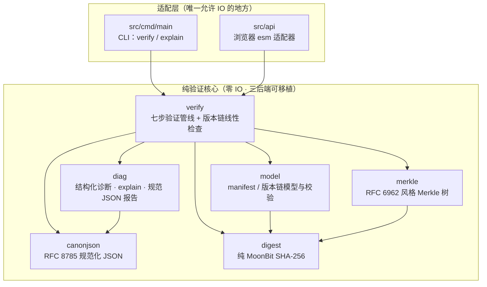

# MoonEvidence

[](https://github.com/wenlittle/MoonEvidence/actions/workflows/ci.yml)

[English](README.md) | 中文

MoonEvidence 是一个用 MoonBit 编写的**可信证据包验证库与 CLI**：验证一组文件、元数据、Merkle 证明和版本记录是否完整、未被篡改。

## 定位

MoonEvidence **不是**区块链应用，也不是智能合约框架。它是**链无关**的验证核心，适用于上链存证之前、数据集归档、数字版权打包、AI 产物审计、科研资料发布等任何需要"可复核完整性"的场景。

- **确定性**：规范化 JSON（RFC 8785）保证同一份数据在任何机器上得到同一个摘要。
- **可解释**：每个失败映射到冻结的错误码（`E1xxx`–`E5xxx`、`W1xxx`），`explain` 输出人类可读的逐条诊断。
- **可移植**：纯验证核心零 IO，native / wasm-gc / js 三后端编译，同一套语义跑在 CLI 和浏览器里。

## 30 秒上手

```powershell
# 构建 CLI（js 产物用 node 运行；有 C 编译器的机器可用 native）
moon build --target js

# 验证内置示例包：一个完好、一个被篡改
node _build/js/debug/build/src/cmd/main/main.js verify examples/valid-pack
node _build/js/debug/build/src/cmd/main/main.js explain examples/tampered-pack
```

退出码冻结：`0` 验证通过，`1` 验证失败，`2` 用法或 IO 错误。

`explain` 对篡改包的输出（与浏览器 demo 逐字节一致）：

```text
verification FAILED
  [E2003] files/a.txt: digest mismatch, expected sha256:a948904f.. got sha256:7509e5bd..
checked 2 files, 1 passed; merkle root verified; 1 error, 0 warnings
```

## 在浏览器试用

同一个纯核心编译为自包含 esm bundle（`src/api`，导出字符串进/字符串出的 `verify_evidence`），证据包验证完全在浏览器本地完成——文件不上传：

```powershell
moon build --target js
python -m http.server 8765   # 任何静态服务器均可，从仓库根目录启动
# 打开 http://localhost:8765/demo/web/
```

页面中选择 `examples/valid-pack` 或 `examples/tampered-pack` 目录，或直接粘贴 manifest JSON 做结构校验：


## 架构



文件字节由适配层注入（`Map[String, Bytes]`），核心只做纯计算——这也是三后端测试矩阵能钉死跨端语义一致的原因。

## API 速览

| 包 | 入口 | 作用 |
| --- | --- | --- |
| `verify` | `verify_manifest(manifest_json, files, expected_manifest_digest?)` | 七步管线：解析 → 规范化 → manifest 摘要 → 逐文件摘要 → 未登记文件 → Merkle 根，返回完备（非 fail-fast）报告 |
| `verify` | `verify_version_chain(nodes)` | 版本链线性性：唯一根、父引用可达、无环、无分叉 |
| `model` | `Manifest::parse(input)` | 解析并校验 manifest（路径穿越在解析期拒绝） |
| `model` | `parse_version_chain(input)` | 解析 `versions/version_chain.json` |
| `canonjson` | `canonicalize(input)` | RFC 8785 规范化（键序、转义、ECMAScript 最短数字） |
| `digest` | `sha256_hex(data)` / `Digest::of_bytes(...)` | 纯 MoonBit SHA-256，`sha256:<hex>` 文本形式 |
| `merkle` | `compute_root` / `compute_proof` / `verify_inclusion` | 域分离的叶/内节点哈希、根计算、包含性证明 |
| `diag` | `explain(report)` / `to_json(report)` | 人类可读报告 / 规范 JSON 报告（字节稳定） |
| `api` | `verify_evidence(request_json)` | 浏览器边界：JSON 字符串进出，零 MoonBit 类型跨界 |

## 错误码表

| 码段 | 含义 |
| --- | --- |
| `E1001` | manifest JSON 无法解析 |
| `E1002` | 必填字段缺失、为空或非法（含路径穿越拒绝） |
| `E1003` | schema 版本不支持（要求 `moon-evidence/v0`） |
| `E1004` | 规范化失败（含无最短形式的数字） |
| `E2001` | 哈希算法不支持 |
| `E2002` | 摘要字符串格式非法（要求 `<algo>:<小写hex>`） |
| `E2003` | 文件内容摘要与 manifest 条目不符 |
| `E2004` | manifest 规范摘要与外部记录值不符 |
| `E3001` | files 非空但 Merkle 根缺失（或根存在但 files 为空） |
| `E3002` | 证明格式非法 |
| `E3003` | Merkle 根/证明复算不匹配 |
| `E4001` | 版本链为空 |
| `E4002` | 父版本引用断裂 |
| `E4003` | 版本链成环或存在不可达节点 |
| `E4004` | 重复 id / 多根 / 分叉（链必须线性） |
| `E5001` | 路径不存在（适配层） |
| `E5002` | 文件读取失败（适配层） |
| `W1001` | 包内存在未登记文件（警告，不导致失败） |

## 性能

js 后端实测（moon 0.1.20260529 / Node v22.22.0 / Windows，确定性负载，`moon bench`）：

| 基准 | 均值 ± σ | 折算 |
| --- | --- | --- |
| SHA-256，1 MiB | 17.10 ms ± 0.21 ms | ~58 MiB/s |
| SHA-256，64 KiB | 1.12 ms ± 0.02 ms | ~56 MiB/s |
| 全量验证，1k 文件 manifest | 25.65 ms ± 0.78 ms | ~26 µs/文件 |
| 全量验证，10k 文件 manifest | 283.52 ms ± 6.18 ms | ~28 µs/文件 |

耗时随文件数近线性增长（10 倍文件 → 11.05 倍耗时，残差为 Merkle 树对数深度项）。方法学与原始输出见 `docs/records/RESULTS_LOG.md`。

## 测试与质量

- **155 个单元测试**在 wasm-gc 与 js 双后端全绿；NIST SHA-256 向量、RFC 8785 Appendix B 向量全过
- **22 用例 CLI 黑盒套件**：12 个示例包用例 + 10 包篡改矩阵（独立 Node 参考实现生成，CI 防腐化校验）
- **变异验证过的 property 测试**：规范化幂等、Merkle 证明可靠性
- **CI 三后端矩阵**：native / wasm-gc / js 构建，wasm-gc + js 测试，js 产物浏览器适配器烟测

```powershell
moon check
moon test --target wasm-gc,js
powershell -ExecutionPolicy Bypass -File tools/cli-test.ps1 -Target js
node tools/smoke-api.mjs
```

## 项目文档

- [用户指南（三个真实场景）](docs/GUIDE.md)
- [架构说明](docs/ARCHITECTURE.md)
- [证据包规范](docs/spec/EVIDENCE_PACK_SPEC.md)
- [项目索引](docs/PROJECT_INDEX.md)
- [环境搭建](docs/ENVIRONMENT.md)
- [结果记录](docs/records/RESULTS_LOG.md)

## 许可证

Apache-2.0
