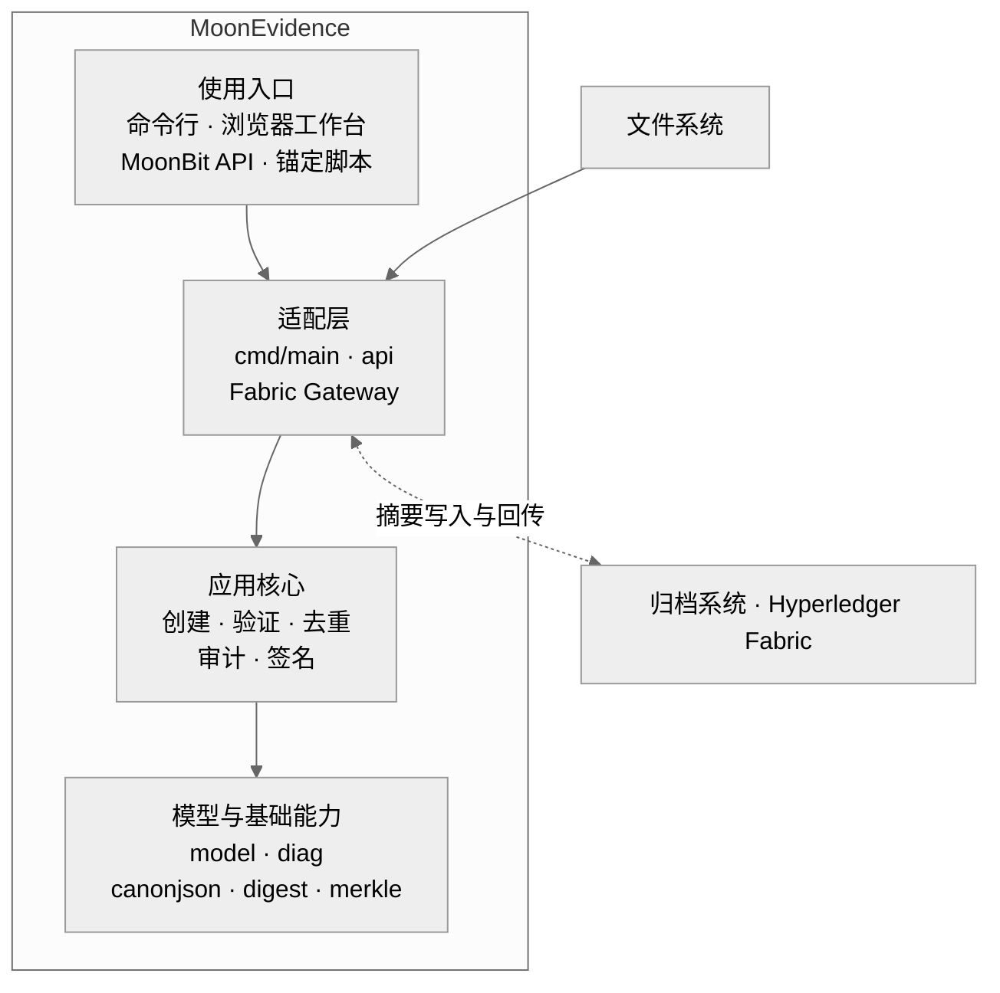
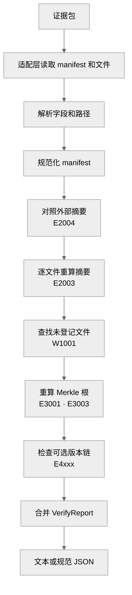
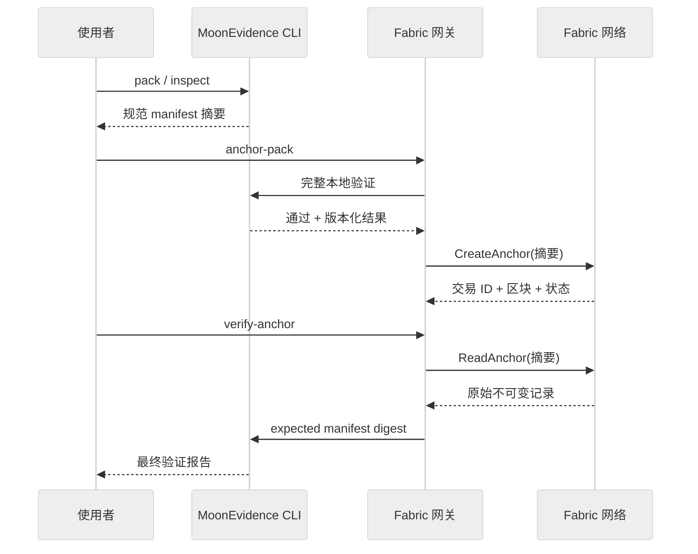
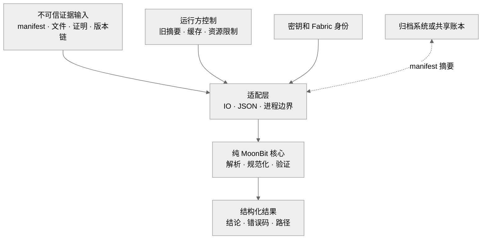

# MoonEvidence 架构

> 当前版本：v0.5.0
>
> 架构基线：2026-07-11 Asia/Shanghai

[项目首页](../README.md) · [用户指南](GUIDE.md) · [开发报告](report/DEVELOPMENT_REPORT.md) · [安全说明](../SECURITY.md)

MoonEvidence 使用纯 MoonBit 核心定义证据包语义。文件系统、浏览器事件、进程调用和 Fabric 网络连接由适配层处理。所有入口最终共享同一套规范清单、摘要、Merkle 和诊断规则。

## 架构概览



依赖从入口向核心和基础能力单向流动。纯核心接收文本、字节和结构化参数，不读取文件，不启动进程，也不连接网络。Go 和 TypeScript 适配器消费 MoonBit 产生的版本化结果，不复制证据语义。

Mooncakes 发布模块包含 12 个产品包和 1 个原生计时工具包。浏览器 Showcase 和 Fabric 适配器保留在公开仓库中，按运行场景独立构建。

## 组件职责

### 纯核心

| 组件 | 输入 | 产出 | 职责 |
| --- | --- | --- | --- |
| `canonjson` | JSON 文本 | 规范 JSON 文本 | 实现 RFC 8785 确定性序列化 |
| `digest` | 字节、密钥 | SHA-256、SHA-512、HMAC-SHA256 | 提供摘要类型、流式上下文和编码转换 |
| `merkle` | 规范文件条目 | 根、完整树、包含性证明 | 实现带域分隔的 Merkle 构造 |
| `model` | manifest、版本链文本 | 证据模型或结构化错误 | 固定字段、路径、算法和版本形状 |
| `diag` | 检查结果 | 人类文本、规范 JSON | 汇总错误码、路径、消息和统计 |
| `create` | 文件字节映射、创建选项 | manifest 文本 | 排序条目，计算摘要和 Merkle 根 |
| `verify` | manifest、文件字节、可选旧摘要 | 完整或增量报告 | 编排清单、文件、Merkle 和版本检查 |
| `store` | 文件字节映射 | 去重对象和索引 | 提供内存内容寻址、重建和完整性检查 |
| `crypto` | 密钥、消息、签名 | Ed25519 结果 | 提供纯 MoonBit 签名和验签 |
| `audit` | 操作记录、可选签名 | 追加式审计链 | 连接前序哈希并验证条目和签名 |

产品依赖图保持无环。关键方向如下：

```text
verify  -> model + diag + canonjson + digest + merkle
create  -> model + canonjson + digest + merkle
store   -> canonjson + digest
audit   -> canonjson + digest + crypto
crypto  -> digest
```

`moon.pkg` 文件是包依赖的权威来源。`moon info` 生成的 `pkg.generated.mbti` 是当前公开接口的机器可读来源，CI 要求重新生成后没有差异。

### 适配器

| 组件 | 边界职责 | 调用核心 |
| --- | --- | --- |
| `src/cmd/main` | 路径解析、目录遍历、文件读写、退出码、JSON 进程合同 | `create`、`verify`、`model`、`diag` |
| `src/api` | 将 12 个浏览器入口收敛为 JSON 字符串请求和响应 | 创建、验证、摘要、证明、审计、签名 |
| `showcase` | 页面导航、Web Worker、交互状态和可视化 | 只调用发布版 `api` 产物 |
| `demo/web` | 轻量静态演示和示例数据加载 | 直接调用发布版 `api` 产物 |
| `integrations/fabric/gateway` | TLS 配置、身份装载、CLI 进程校验、提交和查询 | 调用 CLI 机器合同 |
| `integrations/fabric/chaincode-go` | 验证规范摘要，保存首笔不可变记录 | 不处理文件或 manifest |
| `src/timing` | 原生计时采样和环境记录 | 直接调用 `crypto` |

## 数据流

系统处理五类长期数据：

| 数据 | 形成位置 | 保存位置 | 作用 |
| --- | --- | --- | --- |
| 原始文件 | 业务系统 | 本地目录或业务存储 | 被检查的实际内容 |
| `manifest.json` | `create` | 证据包 | 描述当前文件、对象和版本 |
| manifest 摘要 | `canonjson + digest` | 归档系统、数据库或账本 | 固定一份历史清单 |
| 版本链 | 调用方 | `versions/version_chain.json` | 表达连续发布关系 |
| 验证报告 | `verify + diag` | 控制台、CI 或业务系统 | 给出结论、路径、错误码和统计 |

文件内容与 manifest 摘要承担不同职责。文件摘要定位单个内容变化，Merkle 根固定文件条目集合，manifest 摘要覆盖完整规范清单，外部锚点保存历史对照值。

### 创建

1. CLI 适配器遍历输入目录，读取文件字节，并把包内路径统一放在 `files/` 下。
2. `create_manifest` 按 UTF-16 码元顺序排列路径，生成文件条目和 Merkle 根。
3. manifest 经过 RFC 8785 规范化，随后形成可归档的 `manifest_digest`。
4. `pack` 拒绝覆盖已有输出目录。写入中途失败时，它删除本轮创建的不完整目录。
5. 成功结果包含完整证据包和版本化 JSON 回执。

目录收集在适配层设置 32 层深度和 10,000 文件上限。创建命中任一上限时直接中止，避免形成静默截断的证据包。

## 验证流程



### 完整验证

CLI 先读取 manifest。模型解析成功后，适配器按照清单路径读取文件，并收集包内未登记文件。纯核心依次执行：

1. 检查字段、路径、算法和摘要格式。
2. 生成规范 manifest 字节。
3. 对照可选的外部 manifest 摘要。
4. 逐文件重算内容摘要。
5. 检查未登记文件。
6. 重算 Merkle 根。

验证器采用完备式报告。一个文件失败后，剩余文件继续检查。适配器再合并文件 IO 错误和可选版本链结果，最终以错误级发现是否存在决定通过或拒绝。

包含性证明使用独立的 `prove`、`check-proof` 和浏览器证明接口。它们共享 `merkle` 包，但不进入每次证据包完整验证。

### 增量验证

增量路径与完整路径共享 manifest 规范化、外部摘要对照和 Merkle 检查。受信任缓存保存上次成功验证的路径和摘要；匹配项可以跳过文件内容重算。

缓存由本机工作流负责保护。缓存被替换时，攻击者可以让相同路径看起来已经检查。正式交付、上链和发布门禁使用完整验证。

## 锚定流程



`inspect` 只解析清单并计算锚点信息。网关在提交前必须再运行完整 `verify`，并同时检查进程退出码、JSON 形状、算法和摘要一致性。

链码状态只保存：

```json
{
  "schema": "moon-evidence-anchor/v1",
  "manifest_digest": "sha256:<lowercase-hex>",
  "transaction_id": "<first transaction ID>",
  "submitter_msp": "Org1MSP"
}
```

首笔写入形成不可变记录。顺序重复返回原始记录；并发首写只有在 Fabric 返回 MVCC code 11 且查询到相同记录时才归一化。提交回执在链下保存交易 ID、区块号和验证状态。

## 信任边界



| 边界 | 控制方 | 架构约束 |
| --- | --- | --- |
| manifest、文件、证明、版本链 | 证据提供方 | 全部按不可信输入解析；路径在文件读取前校验 |
| 外部 manifest 摘要 | 归档或账本运营方 | 与证据包分开保存，复核时显式传入 |
| 增量缓存 | 本机运行方 | 只用于受控重复检查；正式交付执行完整验证 |
| 文件系统和符号链接 | 本机运行方 | 封装目录保持无链接，使用权限或容器限制可达路径 |
| Ed25519/HMAC 密钥 | 调用方 | 核心不持久化密钥；密钥生命周期由调用环境管理 |
| Fabric 身份和 TLS 配置 | 联盟运营方 | 保留在 Git 忽略目录或密钥系统，不进入交易和日志 |
| MoonBit、Node、Go 工具链 | 发布维护方 | 版本固定，CI 多后端复验，发布产物重新生成接口 |

当前 `moonbitlang/x/fs` 会跟随文件系统链接。CLI 使用深度和文件数上限终止链接循环并限制遍历规模。正式封装在无符号链接、无目录联接或受限文件系统根目录中运行。

## 核心契约

| 契约 | 当前版本 | 权威来源 | 保证内容 |
| --- | --- | --- | --- |
| 证据包 | `moon-evidence/v0` | [证据包规范](spec/EVIDENCE_PACK_SPEC.md) | 字段、路径、Merkle、版本链和错误码 |
| MoonBit API | v0.5.0 | `src/<package>/pkg.generated.mbti` | 当前公开类型和函数 |
| CLI 进程 | `v1` JSON 结果 | [CLI 契约](spec/CLI_MACHINE_CONTRACT.md) | JSON 形状、退出码、外部摘要参数 |
| Fabric 锚点 | `moon-evidence-anchor/v1` | [Fabric 规范](spec/FABRIC_ANCHOR_SPEC.md) | 状态、交易、隐私、幂等和错误前缀 |
| 验证报告 | `VerifyReport` | `src/diag/pkg.generated.mbti` | 结论、发现列表和检查统计 |

面向使用者的主要入口：

| 任务 | 入口 | 结果 |
| --- | --- | --- |
| 创建清单 | `@create.create_manifest` | 规范 manifest 文本 |
| 完整验证 | `@verify.verify_manifest` | `VerifyReport` |
| 增量验证 | `@verify.verify_manifest_incremental` | 报告和重算统计 |
| 解释结果 | `@diag.explain`、`@diag.to_json` | 人类文本或规范 JSON |
| 生成和验证证明 | `@merkle.compute_proof`、`@merkle.verify_inclusion` | 包含性证明 |
| 签名和验签 | `@crypto.ed25519_sign`、`@crypto.ed25519_verify` | 64 字节签名或布尔结论 |
| 浏览器调用 | `src/api` 的 12 个函数 | JSON 字符串响应 |

## 扩展机制

| 扩展点 | 接入方式 | 保持不变的约束 |
| --- | --- | --- |
| 新摘要算法 | 扩展 `HashAlgorithm`、摘要实现、模型和测试向量 | manifest 明确算法，Merkle 与文件摘要使用同一算法 |
| 新运行入口 | 增加适配器并调用纯核心 | 不复制规范化、摘要和验证语义 |
| 新外部锚点 | 保存规范 manifest 摘要并回传验证 | 外部系统不接收完整证据内容 |
| 持久化对象存储 | 在 `ObjectStore` 外增加存储适配器 | 对象键继续由内容摘要形成 |
| 新浏览器能力 | 增加 JSON 字符串 API 和版本化响应 | 后台线程只传 JSON 和可复制数据 |
| 分支版本历史 | 发布新的版本链数据格式 | 保留现有线性链解析和错误合同 |

扩展工作先固定输入、输出和失败语义，再接入新的 IO 或网络实现。新增适配器需要通过现有黑盒合同和对应后端测试。

## 运行形态

| 形态 | 构建目标 | 主要用途 |
| --- | --- | --- |
| MoonBit 库 | native、wasm、wasm-gc、js | 嵌入应用和自动化流程 |
| CLI | js、native；其他后端参与构建检查 | 创建、验证、诊断和批处理 |
| 浏览器 API | 发布版 js ESM | 静态网页和后台线程 |
| Showcase | React、Three.js、Vite | 首页叙事和六工具工作台 |
| Fabric 网关 | Node.js、TypeScript、Fabric Gateway SDK | 摘要提交、查询和回传验证 |
| Fabric 链码 | Go | 不可变摘要记录 |
| 计时工具 | native 发布构建 | Ed25519 工程计时采样 |

浏览器工作台在当前会话中处理文件和密钥，不依赖业务后端。Fabric 流程单独加载组织身份和网络配置。两种运行形态共享相同的 MoonBit 证据语义。

## 设计决策

| 选择 | 工程结果 |
| --- | --- |
| 纯核心只接收文本和字节 | 同一验证语义跨四个 MoonBit 后端复用 |
| RFC 8785 作为摘要前置步骤 | JSON 表达差异收敛成稳定字节 |
| 完备式验证报告 | 一次检查返回全部已发现变化 |
| 完整验证承担交付门禁 | 外部交付和上链不依赖本机缓存 |
| Fabric 只保存规范摘要 | 文件隐私、存储和授权留在链下 |
| 进程合同使用版本化 JSON | TypeScript 网关可以严格验证 MoonBit 输出 |
| 发布包排除仓库级适配器 | Mooncakes 使用者保持纯 MoonBit 依赖面 |

历史 API 冻结、加固批次和协议决策保存在 [DECISION_LOG.md](records/DECISION_LOG.md) 与 [CHANGELOG.md](../CHANGELOG.md)。当前接口以生成的 `.mbti` 文件和三份规范为准。
