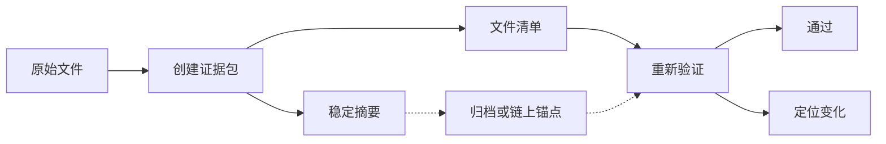
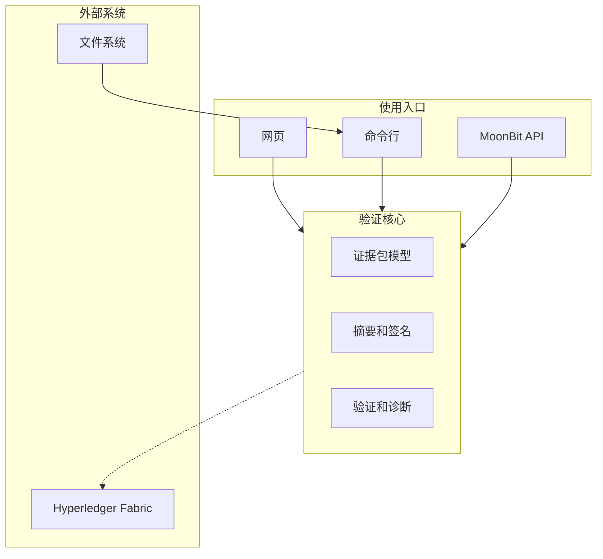

# MoonEvidence 文档重构计划

> 状态：待确认
>
> 建立日期：2026-07-11
>
> 适用范围：README、用户指南、开发报告、架构文档、验收材料、测试文档、项目索引
>
> 执行原则：先确定叙事和内容归属，再逐份重写；每轮只处理一类读者任务；事实、命令、链接全部经过复验。

## 目标

文档需要在三个阅读时长内完成不同任务：

| 阅读时长 | 读者获得的结果 |
| --- | --- |
| 30 秒 | 看懂 MoonEvidence 服务的场景、交付的结果、最直接的体验入口 |
| 5 分钟 | 跑通创建、篡改、验证、定位的完整流程 |
| 15 分钟 | 看清系统架构、账本实验、测试证据、工程取舍 |

所有公开材料围绕一条主线组织：

> MoonEvidence 为需要长期保存或上链的文件创建可验证证据包，固定文件内容、清单结构和版本锚点；复核时，它能发现变化、定位文件，并输出适合脚本和审计流程消费的结果。

主线按固定顺序展开：

1. 文件进入创建流程。
2. 系统生成规范清单和稳定摘要。
3. 摘要进入归档系统或 Hyperledger Fabric。
4. 文件在交付、迁移、归档后重新接受验证。
5. 验证结果指出内容变化、清单变化或锚点冲突。

README、报告和演示都使用这条主线。功能列表、测试方法、历史记录只在支持主线时出现。

## 阅读对象

| 读者 | 首要问题 | 主要入口 | 阅读完成标准 |
| --- | --- | --- | --- |
| 竞赛评委 | 项目解决什么问题，能否复现，工程质量如何 | `README.md`、开发报告、验收清单 | 能在五分钟内跑通闭环，并找到质量证据 |
| 使用者 | 怎样创建证据包，怎样检查文件，怎样接入脚本 | README、用户指南 | 能独立完成一次创建和一次验证 |
| MoonBit 开发者 | 可复用哪些包，接口怎样调用，多后端如何运行 | README、API 文档、架构文档 | 能选择正确入口并完成最小集成 |
| 审计人员 | 摘要如何形成，篡改如何暴露，账本记录如何复核 | 开发报告、架构文档、规范 | 能追踪输入、摘要、锚点、结果之间的关系 |
| 维护者 | 改动影响哪些契约，测试门禁在哪里，结果怎样留档 | 项目索引、测试治理、结果记录 | 能更新代码和文档，同时保持证据可追溯 |

## 文档分工

每个主题只设一个完整说明位置。其他文档保留短摘要和链接，避免同一套命令、指标、架构历史被多次手工维护。

| 文档 | 职责 | 保留内容 | 移出内容 |
| --- | --- | --- | --- |
| `README.md` | 项目首页 | 定位、场景、闭环、快速开始、结果、架构概览、质量摘要 | 完整 API 表、完整错误码、阶段历史、测试方法细节 |
| `README.en.md` | 英文镜像 | 与中文首页相同的结构和事实 | 独立扩展出来的英文内容 |
| `docs/GUIDE.md` | 用户操作手册 | 创建、验证、脚本接入、浏览器复核、Fabric 锚定、排错 | 项目论证、完整架构、测试体系 |
| `docs/report/DEVELOPMENT_REPORT.md` | 竞赛开发报告 | 场景、目标、方案、实现、实验、质量、生态价值、工程取舍 | 命令大全、逐包 API、按日期堆叠的开发流水 |
| `docs/ARCHITECTURE.md` | 当前架构说明 | 组件职责、数据流、信任边界、核心契约、运行形态 | 旧版 API 快照、版本变更历史、阶段加固记录 |
| `docs/records/ACCEPTANCE_CHECKLIST.md` | 验收证据索引 | 九项要求、复现命令、公开链接、当前结论 | 产品介绍、实现细节、长篇测试说明 |
| `docs/TEST_PLAN.md` | 测试设计 | 风险模型、测试分层、覆盖矩阵、独立参考结果、完成标准 | 每次运行的原始日志、发布流程 |
| `docs/TEST_GOVERNANCE.md` | 质量门禁 | 变更门禁、失败处理、发布准入、证据留存 | 测试原理的重复说明、历史结果 |
| `docs/records/RESULTS_LOG.md` | 原始结果档案 | 日期、提交、环境、命令、结果、偏差、产物 | 面向评委的叙事、重复结论 |
| `docs/PROJECT_INDEX.md` | 维护入口 | 文档地图、源码地图、证据地图、更新规则 | 产品首页内容、详细使用教程 |
| `SECURITY.md` | 安全入口 | 信任模型、支持范围、报告渠道、部署建议 | 竞赛包装、测试数量、版本营销 |
| 三份规范 | 契约来源 | 证据包格式、CLI 机器接口、Fabric 锚点格式 | 教程、项目价值论证、开发历史 |

语言入口统一为：

- `README.md`：中文主文档，面向竞赛评委和中文使用者。
- `README.en.md`：英文镜像，章节顺序、命令、图表、数字保持一致。
- `README.zh.md`：重构完成后保留短期兼容入口，指向 `README.md`，避免旧链接失效。

## 写作契约

### 叙事顺序

每个重要能力按同一顺序表达：

1. **场景**：文件在交付、归档、模型训练或上链前面临什么变化风险。
2. **方案**：MoonEvidence 采用什么可观察的处理步骤。
3. **结果**：用户最终得到什么文件、摘要、诊断或账本记录。
4. **证据**：给出命令、测试、交易记录或规范链接。

优势放在因果关系中呈现。架构选择、用户结果和验证证据出现在同一段逻辑内，不追加“优势”“技术亮点”“问题难度”标签。

### 句子规则

- 一句话承载一个主要判断。
- 先写结论，再补条件和证据。
- 长句在第二个完整信息点处分开。
- 逗号用于自然停顿，不串联功能清单。
- 段落控制在二到四句；列表承担并列信息。
- 标题使用名词或短动词短语，通常不超过八个汉字。
- 同级标题保持同一种语法结构。
- 图题、表题控制在二到六个汉字。
- 中文正文使用中文标点；命令、路径、接口名保留原样。

### 禁用表达

| 模式 | 处理方式 |
| --- | --- |
| `不是……而是……` | 直接陈述定位、职责和作用范围 |
| `为什么……原因是……` | 把原因并入结论后的证据句 |
| `本章介绍……`、`本节说明……` | 直接进入内容 |
| `具体情况见……` | 在相关事实后放自然链接 |
| `优势：……`、`难点：……` | 使用“选择 → 结果 → 证据”表达 |
| `我们认为……`、`显而易见……` | 使用可验证事实 |
| 连续三项以上英文缩写 | 首次出现时给出中文名称，后续只保留必要缩写 |
| 无证据的最高级 | 改为有范围、有来源的量化结果 |

### 术语规则

公开首页优先使用用户能直接理解的语言。专业术语只在精确表达不可替代时出现。

| 工程术语 | 首页表达 | 深入文档表达 |
| --- | --- | --- |
| oracle | 独立参考结果 | 独立参考结果，可在括号中标出来源 |
| mutation testing | 故障注入验证 | 故障注入验证，并链接门禁脚本 |
| fuzz testing | 异常输入测试 | 异常输入测试，并说明轮数和边界 |
| canonical JSON | 规范 JSON | 规范 JSON，首次出现时说明稳定序列化 |
| digest | 文件摘要 | 摘要算法和字节格式在规范中展开 |
| anchor | 存证锚点 | Fabric 锚点格式在规范中展开 |
| low-order point | 异常公钥编码 | 密码学审计文档保留精确术语 |
| domain separation | 类型隔离标记 | 架构或规范中保留精确定义 |

包名、脚本名、错误码只在命令、代码和故障排查中出现。产品介绍不依赖内部目录名。

### 工程取舍

工程边界采用“当前保障级别 + 适用场景 + 扩展路径”的结构：

- 当前版本覆盖哪些输入、后端和验证流程。
- 这些保障适合哪些交付、教学、原型和受控归档场景。
- 高价值生产部署需要哪些独立审计、密钥托管和运行环境控制。
- 后续工作通过明确门禁进入主线，不使用模糊的“未来优化”。

所有取舍保持主动语态。设计选择先说明目的，再说明效果和证据。未完成的工作进入路线图，已完成的工作必须能追溯到提交、测试或实验记录。

### 视觉规则

- README 标题使用托管平台默认颜色，兼容浅色和深色模式。
- PDF、申报书和导出报告的标题使用黑色。
- 主色采用黑色、深灰和白色；可信状态使用克制的绿色；篡改状态使用少量红色。
- 图中最多保留一个主流程、一个辅助反馈方向。
- 节点文字使用用户动作或交付物，避免包名堆叠。
- 实线表示主要数据流；虚线表示外部锚点或可选路径。
- 图下正文解释结论，不逐节点复述。
- 每张图都提供一句替代文本，保证纯文本阅读仍能理解。

## 结构树

### 项目首页

`README.md` 承担理解、体验、信任三项任务。首屏只保留项目名、一句话定位、状态徽章和两个入口。

```text
# MoonEvidence
├─ 首屏
│  ├─ 一句话定位
│  ├─ 状态徽章
│  └─ 开始验证 / 查看源码
├─ 概览
├─ 使用场景
├─ 工作流程
├─ 快速开始
│  ├─ 网页体验
│  ├─ 命令行
│  └─ MoonBit 接入
├─ 验证结果
├─ 核心能力
├─ Fabric 锚定
├─ 系统架构
├─ 质量证据
├─ 适用范围
├─ 文档索引
└─ 开源许可
```

章节职责：

| 章节 | 回答的问题 | 主要内容 | 控制项 |
| --- | --- | --- | --- |
| 首屏 | 这是什么，马上能做什么 | 名称、定位、在线体验、仓库入口 | 不放长段落，不放内部术语 |
| 概览 | 最终交付什么 | 证据包、稳定摘要、验证报告 | 一段文字，一张结果图或实物截图 |
| 使用场景 | 谁会在何时使用 | 数据集归档、AI 产物审计、上链前校验 | 三个场景足够，每个场景两句 |
| 工作流程 | 一次闭环怎样完成 | 创建、记录、复核、定位 | 使用“验证闭环”图 |
| 快速开始 | 怎样立刻跑起来 | 网页、CLI、MoonBit 三个入口 | 每个入口只给最短成功路径 |
| 验证结果 | 成功和失败长什么样 | 完好包、单字节篡改、机器输出 | 使用真实输出，不使用概念描述代替 |
| 核心能力 | 产品已经覆盖什么 | 稳定清单、多算法、版本链、诊断 | 按用户结果分组，不按源码包分组 |
| Fabric 锚定 | 是否完成真实上链实验 | 提交摘要、查询交易、回灌验证 | 显示网络、交易结果、复现入口 |
| 系统架构 | 入口和核心如何组合 | 适配层、验证核心、外部系统 | 使用“系统架构”图，不列全部包 |
| 质量证据 | 结果为什么可信 | 标准向量、独立参考、多后端、故障注入 | 结论带链接，数字带提交和日期 |
| 适用范围 | 当前保障落在哪里 | 支持场景、部署要求、审计等级 | 使用积极、具体、可执行的措辞 |
| 文档索引 | 下一步去哪里 | 用户、开发、审计、维护四条路径 | 每条路径最多三个链接 |
| 开源许可 | 如何使用和贡献 | Apache-2.0、贡献入口 | 保持简短 |

### 开发报告

开发报告按“问题形成目标，目标形成设计，设计接受实验验证”的逻辑展开。阶段历史进入变更记录，不占据主体结构。

```text
# MoonEvidence 开发报告
├─ 执行摘要
├─ 场景挑战
├─ 交付目标
├─ 方案总览
├─ 系统架构
├─ 核心实现
│  ├─ 证据包模型
│  ├─ 规范摘要
│  ├─ 完整性验证
│  ├─ 版本锚点
│  └─ 多入口适配
├─ 账本实验
│  ├─ 实验环境
│  ├─ 提交流程
│  ├─ 查询复核
│  └─ 实验结果
├─ 工程验证
│  ├─ 风险模型
│  ├─ 测试分层
│  ├─ 多后端结果
│  └─ 发布门禁
├─ 生态价值
├─ 设计取舍
├─ 演进路线
└─ 附录
   ├─ 复现命令
   ├─ 指标来源
   └─ 资料索引
```

论证重点：

- “场景挑战”使用文件交付和长期归档中的实际变化风险，不从密码学名词起笔。
- “交付目标”给出可检查的完成条件，包括创建、验证、定位、脚本接入和真实账本锚定。
- “核心实现”只保留影响正确性和可复用性的设计，不逐个罗列源码包。
- “账本实验”引用真实交易记录，区分本地完整性结果、旧锚点冲突和账本查询结果。
- “工程验证”从风险出发组织测试，测试数量作为证据，测试名称不充当论证。
- “生态价值”聚焦 MoonBit 多后端实践、可复用包、规范示例和工程门禁。
- “设计取舍”写清纯核心、适配层、密钥责任和保障级别，给出部署路径。
- “演进路线”只保留有入口条件和完成标准的工作。

### 架构文档

架构文档只描述当前版本。历史 API、加固批次和阶段决策迁入 `CHANGELOG.md` 或 `docs/records/DECISION_LOG.md`。

```text
# MoonEvidence 架构
├─ 架构概览
├─ 组件职责
├─ 数据流
├─ 验证流程
├─ 锚定流程
├─ 信任边界
├─ 核心契约
│  ├─ 证据包契约
│  ├─ 诊断契约
│  ├─ CLI 契约
│  └─ 锚点契约
├─ 扩展机制
├─ 运行形态
└─ 设计决策
```

章节职责：

- “架构概览”给出四层模型和依赖方向。
- “组件职责”解释每层拥有的数据和行为。
- “数据流”覆盖创建、保存、读取、验证的正常路径。
- “验证流程”给出顺序、失败传播和诊断形成方式。
- “锚定流程”说明本地摘要、外部账本和回灌验证的关系。
- “信任边界”标出不可信证据包、可信验证器、外部锚点、密钥持有者。
- “核心契约”链接三份规范，正文保留架构需要的摘要。
- “扩展机制”说明算法注册、策略接口和适配入口。
- “运行形态”覆盖库、CLI、浏览器、Fabric 网关。
- “设计决策”保留当前仍有效的取舍，并链接完整决策记录。

### 用户指南

用户指南按任务组织。读者可以从任意任务进入，不需要先阅读项目历史。

```text
# MoonEvidence 用户指南
├─ 开始之前
├─ 选择入口
├─ 创建证据包
├─ 验证证据包
├─ 定位篡改
├─ 接入脚本
├─ 浏览器复核
├─ Fabric 锚定
├─ 版本记录
└─ 故障排查
```

每个任务使用固定模板：

1. 适用场景。
2. 前置条件。
3. 可直接执行的命令或代码。
4. 预期输出和退出码。
5. 下一步动作。

命令行示例以一种默认后端为主。其他后端放在紧邻的短说明中，避免每个任务重复整套构建命令。

### 验收清单

```text
# OSC 2026 验收清单
├─ 验收结论
├─ 条件映射
├─ 复现命令
├─ 公开入口
└─ 交付状态
```

“条件映射”严格对应九项验收要求。每项只包含状态、证据链接、最短复现方法。软性竞争力进入开发报告，不混入硬性验收结论。

### 测试计划

```text
# MoonEvidence 测试计划
├─ 测试目标
├─ 风险模型
├─ 测试分层
├─ 独立参考
├─ 故障注入
├─ 多后端验证
├─ 覆盖矩阵
├─ 运行命令
├─ 完成标准
└─ 保障范围
```

测试计划解释“哪些故障必须被抓住”。测试治理解释“什么条件允许合并和发布”。两份文档不重复大段测试原理。

### 测试治理

```text
# MoonEvidence 测试治理
├─ 质量层级
├─ 变更门禁
├─ 失败处理
├─ 证据记录
├─ 发布准入
└─ 维护规则
```

### 结果记录

`docs/records/RESULTS_LOG.md` 保持追加式记录，不改写为宣传材料。后续条目使用统一模板：

```text
## YYYY-MM-DD · <commit>
├─ 目的
├─ 环境
├─ 命令
├─ 结果
├─ 偏差
└─ 产物
```

### 项目索引

```text
# MoonEvidence 项目索引
├─ 交付入口
├─ 文档地图
├─ 源码地图
├─ 证据地图
├─ 维护入口
└─ 更新规则
```

项目索引服务维护者。README 的“文档索引”服务第一次访问的读者，两者不复制相同的长列表。

### 安全文档

```text
# MoonEvidence 安全说明
├─ 安全模型
├─ 支持范围
├─ 密钥职责
├─ 部署建议
├─ 版本支持
└─ 报告渠道
```

安全声明使用可验证的保障级别。算法合规、实现测试、运行环境控制和第三方审计分别陈述，不合并成笼统的“安全”结论。

## 图表方案

每张图必须回答一个明确问题。README 保留两张主图；深入文档承载信任边界和篡改路径。

| 图题 | 回答的问题 | 使用位置 | 核心元素 |
| --- | --- | --- | --- |
| 验证闭环 | 文件从创建到复核怎样流动 | README、开发报告 | 原始文件、证据包、摘要锚点、复核结果 |
| 系统架构 | 各入口如何共享同一验证核心 | README、架构文档 | 网页、CLI、MoonBit API、核心、外部系统 |
| 信任边界 | 哪些输入不可信，哪些主体承担信任 | 架构文档、安全文档 | 证据包、验证器、密钥、外部锚点 |
| 篡改路径 | 不同改动由哪一层发现 | 开发报告、用户指南 | 文件变化、清单重建、旧锚点、诊断结果 |
| 测试分层 | 测试怎样覆盖从函数到交付流程 | 开发报告、测试计划 | 标准向量、属性、差分、故障注入、黑盒、实链 |

### 验证闭环



最终版本需要减少交叉线，区分正常结果和篡改结果。移动端保持纵向可读。

### 系统架构



README 版本隐藏内部包名。架构文档版本增加依赖方向、信任边界和适配层职责。

### 图表制作标准

- Mermaid 用于流程和关系图，确保 GitHub 直接渲染。
- 浏览器截图用于展示真实工作台和诊断结果。
- 表格只比较同一维度；超过六列时拆分。
- 图题使用“验证闭环”“系统架构”这类短标题。
- 图后第一句直接写读者应得到的结论。
- 颜色之外增加文字和形状差异，避免状态只靠颜色表达。

## 内容归属

| 主题 | 唯一完整来源 | README 处理 | 其他文档处理 |
| --- | --- | --- | --- |
| 项目定位 | `README.md` | 完整表达 | 引用同一句核心定位 |
| 使用命令 | `docs/GUIDE.md` | 保留最短路径 | 报告只在附录链接 |
| 当前架构 | `docs/ARCHITECTURE.md` | 一图一段摘要 | 报告保留论证需要的结构 |
| 证据包格式 | `docs/spec/EVIDENCE_PACK_SPEC.md` | 说明用户结果 | 架构链接契约 |
| CLI 机器输出 | `docs/spec/CLI_MACHINE_CONTRACT.md` | 展示一个结果 | 指南给出脚本示例 |
| Fabric 锚点 | `docs/spec/FABRIC_ANCHOR_SPEC.md` | 展示闭环和实验入口 | 报告解释实验，指南给命令 |
| 测试方法 | `docs/TEST_PLAN.md` | 质量摘要 | 报告按风险引用 |
| 合并门禁 | `docs/TEST_GOVERNANCE.md` | 链接 CI 状态 | 项目索引提供维护入口 |
| 原始结果 | `docs/records/RESULTS_LOG.md` | 引用最新稳定基线 | 验收清单给精确记录 |
| 验收映射 | `docs/records/ACCEPTANCE_CHECKLIST.md` | 只给入口 | 不在报告重复九项表格 |
| 设计历史 | `docs/records/DECISION_LOG.md` | 不展开 | 架构链接仍生效的决策 |
| 版本历史 | `CHANGELOG.md` | 标出当前版本 | 报告不按版本复述 |
| 安全口径 | `SECURITY.md` | 简要适用范围 | 架构解释信任边界 |

路径以重构后的规范目录为准。当前位于仓库根目录的三份规范，在迁移前保持原链接；移动文件时必须提供兼容入口或一次性更新全部引用。

## 迁移清单

### 项目首页

| 现有内容 | 新位置 | 动作 |
| --- | --- | --- |
| `Positioning`、`定位` | 概览 | 合并成一段核心定位 |
| `5-Minute Reviewer Path` | 快速开始 | 保留可复现闭环，减少前置解释 |
| `Interactive Web Experience`、`在浏览器试用` | 快速开始 / 网页体验 | 合并入口、构建命令和截图 |
| `30 秒上手`、`Quick Start` | 快速开始 / 命令行 | 合并重复命令，保留一种默认路径 |
| `Features`、`功能总览` | 核心能力 | 按用户结果重组，删除逐包枚举 |
| `Architecture at a Glance`、`架构` | 系统架构 | 使用统一图和短说明 |
| `Hyperledger Fabric Anchor` | Fabric 锚定 | 加入真实实验结果和复现入口 |
| `Diagnostics Preview`、错误码表 | 验证结果 / 用户指南 | README 展示两个结果，完整表进入指南或契约 |
| `Performance` | 质量证据 | 只保留带环境和提交的结果 |
| `Current Status`、包列表 | 核心能力 / 项目索引 | 产品能力留首页，目录信息进索引 |
| `Project Documents`、项目文档 | 文档索引 | 按读者任务组织 |

### 开发报告

| 现有内容 | 新位置 | 动作 |
| --- | --- | --- |
| 项目概述 | 执行摘要、场景挑战 | 拆开价值结论和背景问题 |
| 架构设计 | 方案总览、系统架构 | 保留支撑主线的设计 |
| 六个架构决策 | 设计取舍 | 正文写当前有效结论，历史链接决策记录 |
| 功能阶段 | 核心实现、变更记录 | 按能力重写，阶段历史移出主体 |
| 逐包功能说明 | 架构文档、项目索引 | 报告只保留关键实现 |
| 密码学实现 | 核心实现、工程验证 | 合规来源和验证证据分开 |
| 测试体系 | 工程验证 | 按风险和证据组织 |
| CI 治理 | 工程验证 | 收束为发布门禁 |
| AI 协作实践 | 附录或开发记录 | 主体不以工具过程替代项目结果 |
| 量化指标 | 执行摘要、工程验证 | 每个数字绑定来源 |
| 创新点和竞争力 | 生态价值 | 用交付结果和复用价值自然呈现 |

### 架构文档

| 现有内容 | 新位置 | 动作 |
| --- | --- | --- |
| Layering | 架构概览、组件职责 | 改成当前四层视图 |
| Dependency Rules | 组件职责 | 保留依赖方向和纯核心约束 |
| MVP Verification Flow | 验证流程 | 更新为当前完整流程 |
| Public API v1 | 决策记录 | 从当前架构移出 |
| Public API v2 | 核心契约 | 只保留当前接口形态 |
| Fabric Anchor Boundary | 锚定流程、信任边界 | 使用统一图和责任说明 |
| Hardening Notes | 变更记录、决策记录 | 从架构主体移出 |

### 用户指南

现有三个场景保留为示例素材。章节入口改成具体任务，避免读者在不同场景中重复寻找同一条命令。数据集归档、AI 产物审计和上链存证分别放在任务后的短案例中。

## 事实来源

### 来源表

| 声明 | 权威来源 | 更新条件 |
| --- | --- | --- |
| 当前版本 | `moon.mod`、Mooncakes 页面、Git 标签 | 三者一致后更新公开文档 |
| 测试总数 | 当前 CI 日志、`RESULTS_LOG.md` | 测试增删后重新运行 |
| 后端支持 | CI 工作流、实际构建结果 | 后端矩阵变化后更新 |
| 标准向量数量 | 向量来源、测试脚本、结果记录 | 数据集更新后重新核对 |
| 故障注入结果 | `tools/mutation-check.mjs`、CI 日志 | 变异集合变化后更新 |
| 性能数据 | 带环境、提交、命令的结果记录 | 代码或环境变化后重测 |
| Fabric 实验 | `docs/records/fabric-e2e/` 交易记录 | 网络或合约版本变化后重跑 |
| 包数量 | `moon info`、源码结构 | 包增删后重新生成 |
| 许可证 | `LICENSE` | 许可证变更后更新 |
| 仓库地址 | `git remote -v`、公开页面 | 仓库迁移后更新 |

### 引用规则

- 数字声明标出日期或提交，避免变成永久静态事实。
- 性能声明同时给出平台、后端、数据规模和命令。
- 安全声明区分标准符合性、测试覆盖、实现审计和部署控制。
- Fabric 声明链接交易 ID、区块号、状态和回灌验证结果。
- 发布声明以公开标签、Release 和 Mooncakes 页面为准。
- 命令必须在干净克隆中运行；预期输出来自同一次复验。
- 外部来源记录名称、版本、许可证和原始链接。
- 任何无法定位来源的精确数字先删除，再重新测量。

## 执行顺序

### 第一轮：项目首页

1. 将中文内容重写到 `README.md`。
2. 建立同结构的 `README.en.md`。
3. 合并快速开始和浏览器入口。
4. 绘制“验证闭环”和“系统架构”。
5. 在干净克隆中复验首页命令。
6. 检查所有链接、版本、徽章和截图。

完成标准：第一次访问的读者能说清项目定位，能找到体验入口，能跑通篡改验证。

### 第二轮：用户路径

1. 按任务重写 `docs/GUIDE.md`。
2. 同步 `demo/README.md`、`demo/web/README.md` 和集成示例。
3. 统一默认构建命令、产物路径、退出码和输出样例。
4. 验证 Windows、Linux/WSL 的关键差异。

完成标准：指南中的每个任务都能单独执行，示例不依赖对话背景。

### 第三轮：项目论证

1. 按新结构重写开发报告。
2. 将阶段历史迁入 `CHANGELOG.md` 或决策记录。
3. 使用真实 Fabric 记录重写账本实验。
4. 使用最新稳定基线重写工程验证。
5. 将生态贡献落到可复用包、规范、示例和多后端结果。

完成标准：报告形成“挑战 → 目标 → 设计 → 实验 → 证据 → 价值”的完整论证。

### 第四轮：技术说明

1. 按当前版本重写架构文档。
2. 统一三份规范的路径、术语和链接。
3. 重写 `SECURITY.md` 的信任模型和部署建议。
4. 将历史 API 和加固记录迁入历史文档。

完成标准：架构文档只描述当前系统，安全口径和开发报告一致。

### 第五轮：质量材料

1. 收束测试计划和测试治理的职责。
2. 将验收清单压缩为九项证据映射。
3. 更新项目索引。
4. 保持结果记录追加式结构。
5. 检查所有公开材料引用同一版本和测试基线。

完成标准：每个质量结论都有一个明确证据入口，同一事实没有冲突版本。

### 第六轮：读者测试

使用无对话背景的评审视角回答以下问题：

1. MoonEvidence 解决什么文件交付问题？
2. 一次完整验证需要哪些输入，产生哪些结果？
3. 文件被改动后，系统如何定位变化？
4. 清单被重新生成后，旧锚点怎样发挥作用？
5. 项目怎样接入脚本、浏览器和 MoonBit 程序？
6. Hyperledger Fabric 实验留下了哪些可复核证据？
7. 测试怎样避免实现自证？
8. 当前保障适合哪些场景？
9. 评委如何在五分钟内复现核心流程？

任何问题无法仅凭公开文档得到清楚答案，都回到对应的唯一来源修正。修正后重新执行读者测试。

## 验收标准

### 结构

- README 在首屏给出定位和行动入口。
- 每份文档只有一个明确读者任务。
- 同一主题只有一个完整来源。
- 章节顺序遵循读者决策过程。
- 标题短、同级一致、没有说明文式标题。
- README、开发报告、架构文档之间不存在大段复制。

### 语言

- 不出现禁用表达。
- 一句话只承担一个主要判断。
- 内部术语在首页降到最低。
- 技术词首次出现时给出清楚中文含义。
- 工程取舍使用主动、具体、可验证的表述。
- 适用范围包含部署条件和扩展路径。

### 事实

- 版本、标签、Release、Mooncakes 信息一致。
- 测试数字来自同一提交的运行记录。
- 性能数字包含环境和命令。
- Fabric 结论可追溯到交易记录。
- 安全声明与 `SECURITY.md`、架构文档一致。
- 所有命令在干净克隆中复验。

### 视觉

- README 只保留两张主图，页面节奏清楚。
- 深入文档中的图各自回答一个问题。
- 图表标题简短。
- 颜色克制，浅色和深色模式都可读。
- 移动端图形和表格不出现横向失控。
- 截图展示真实界面和真实结果。

### 导航

- 所有相对链接有效。
- 中文和英文首页结构一致。
- 旧入口保留兼容链接。
- README 的文档索引按读者任务分组。
- 项目索引能够追踪文档、源码和证据。

## 变更纪律

- 计划确认前不重写公开文档。
- 每一轮使用独立提交，提交内容只覆盖该轮职责。
- 改动前记录当前事实来源，改动后复验命令和链接。
- 不在格式调整中顺手改变技术结论。
- 不删除历史证据；需要收束时迁入记录目录。
- 不手工同步同一段长内容；短摘要链接唯一来源。
- 每轮完成后更新项目索引和迁移状态。
- 全部重写完成后执行一次干净克隆复现和无背景读者测试。

## 迁移状态

| 工作项 | 状态 |
| --- | --- |
| 写作契约 | 待确认 |
| 结构树 | 待确认 |
| 图表方案 | 待确认 |
| README 重写 | 未开始 |
| 用户指南重写 | 未开始 |
| 开发报告重写 | 未开始 |
| 架构文档重写 | 未开始 |
| 质量材料收束 | 未开始 |
| 干净克隆复验 | 未开始 |
| 无背景读者测试 | 未开始 |
