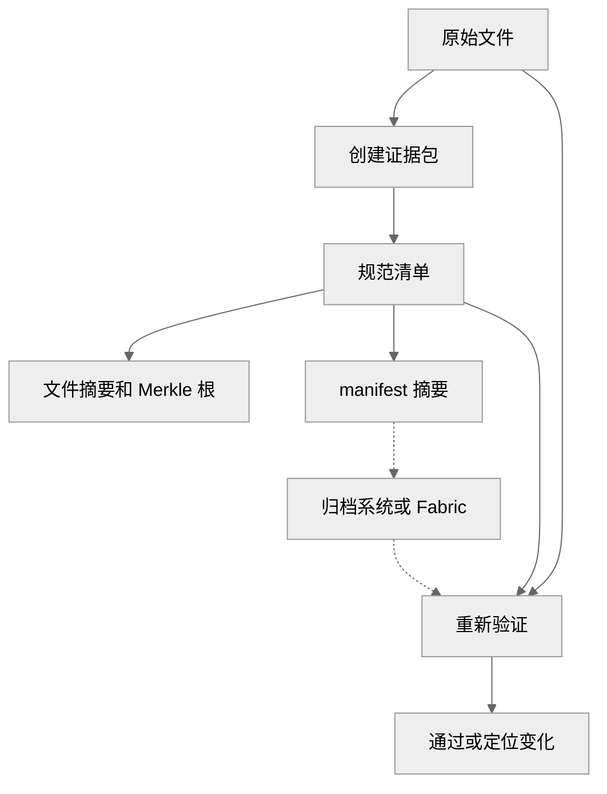
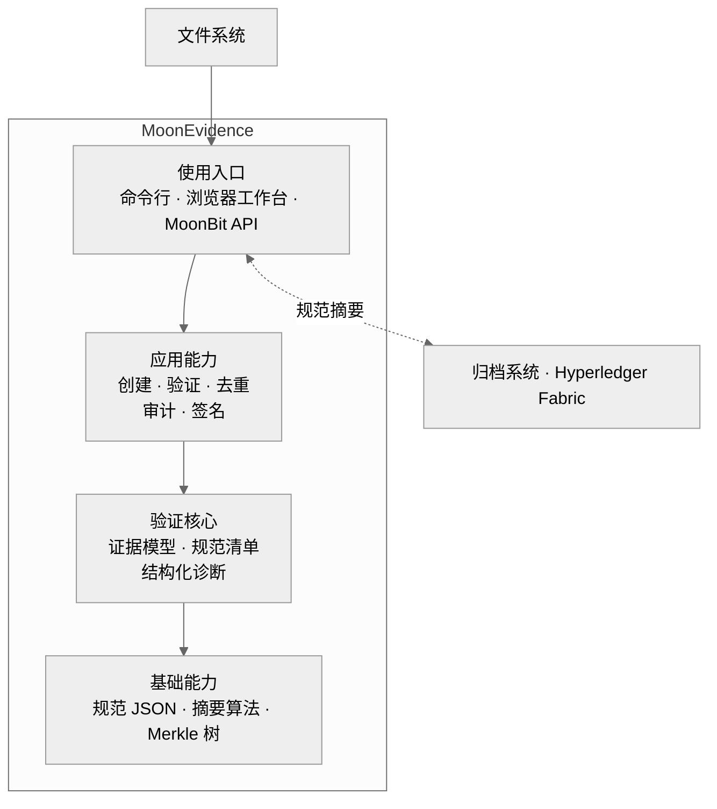
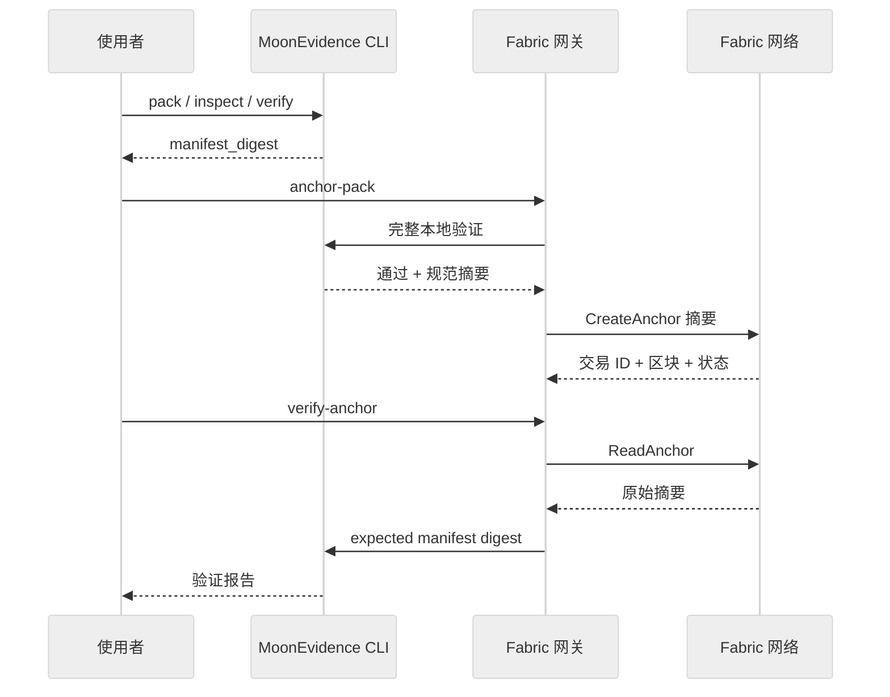
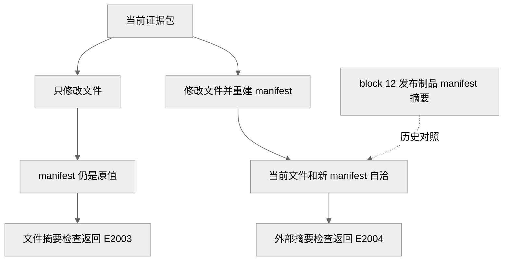
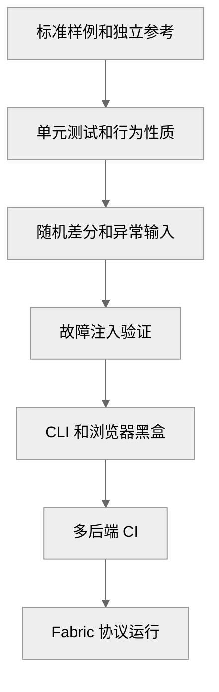

# MoonEvidence 开发报告

> MoonBit OSC2026 开源生态挑战赛
>
> 发布版本：`starlittle/MoonEvidence` v0.5.1
>
> 记录日期：2026-07-11 Asia/Shanghai

[项目首页](../../README.md) · [在线体验](https://wenlittle.github.io/MoonEvidence/) · [GitHub](https://github.com/wenlittle/MoonEvidence) · [GitLink](https://gitlink.org.cn/starlittle/MoonEvidence)

## 执行摘要

MoonEvidence 面向需要长期保存、跨团队交付或进入共享账本的文件。它把原始目录转换成可复核证据包，为文件、规范清单（manifest）和版本生成稳定记录；复核时，它重新计算当前状态，定位变化文件，并输出适合人工审查和自动化流程消费的结果。

项目交付了 MoonBit 库、命令行工具、浏览器工作台和可选的 Hyperledger Fabric 摘要锚定适配器。文件完整性语义集中在 MoonBit 核心中。CLI、浏览器和 Fabric Gateway 共享同一份规范清单、摘要和诊断结果。

当前版本已经跑通完整交付闭环：

1. 从原始文件创建自包含证据包。
2. 生成稳定的 manifest 摘要和 Merkle 根。
3. 在 CLI、脚本或浏览器中验证文件。
4. 将已验证摘要提交到双组织 Fabric 网络。
5. 查询原始账本记录并回传本地验证。
6. 分别识别文件变化和清单重建。

| 指标 | 当前基线 |
| --- | --- |
| 发布版本 | Mooncakes、Git 标签、GitHub Release 均为 `v0.5.1` |
| MoonBit 源码 | **14,977** 行（实现 6,547 + 测试 8,430） |
| MoonBit 包 | **13** 个（12 个产品包 + 1 个原生计时工具包） |
| 测试声明 | **357** 个（353 个可执行测试 + 4 个基准包装） |
| CLI 黑盒 | PowerShell、bash 各 `68/68`，覆盖 JS 和 native |
| Fabric | Chaincode 82.1% 语句覆盖，Gateway `19/19`，双组织协议运行记录完整 |
| 开源许可 | Apache-2.0 |

## 场景挑战

文件在生成完成后仍会经历复制、压缩、同步、换行转换、工具重写和人工编辑。普通文件夹缺少稳定承诺，接收方很难区分原始交付、传输损坏和后续修改。

| 场景 | 核心挑战 | 需要的结果 |
| --- | --- | --- |
| 数据集归档 | 文件多、保存周期长，单个损坏难以定位 | 固定文件清单，复核时指出具体路径 |
| AI 产物交付 | 输出、提示词、参数和评估结果分散 | 将产物和元数据纳入同一份可复核记录 |
| 研发成果发布 | JSON 键序、空格和平台换行可能变化 | 使用确定性格式形成跨机器稳定摘要 |
| 上链存证 | 直接保存文件带来隐私、容量和治理成本 | 本地验证完整内容，链上只记录最小摘要 |
| 历史复核 | 修改文件后可以重新生成一份自洽清单 | 使用独立保存的旧摘要识别历史变化 |
| 自动化审计 | 人类文本难以稳定接入 CI 和网关 | 固定数据结构、错误码和退出码 |

这些挑战形成两层检查需求。当前证据包检查文件和清单是否一致，外部锚点检查当前清单和历史记录是否一致。

## 交付目标

| 目标 | 可检查结果 | 状态 |
| --- | --- | --- |
| 创建证据包 | 一条命令生成 `manifest.json + files/`，失败时清理不完整目录 | 已完成 |
| 发现内容变化 | 文件缺失或字节变化返回 `E2003`，报告包含路径和摘要差异 | 已完成 |
| 固定历史状态 | 规范 manifest 摘要可以写入归档系统或共享账本 | 已完成 |
| 识别清单重建 | 当前 manifest 对照旧摘要时返回 `E2004` | 已完成 |
| 服务多种入口 | MoonBit API、CLI、浏览器使用同一验证核心 | 已完成 |
| 进入真实账本 | Fabric 完成提交、排序、验证、查询和摘要回传 | 已完成 |
| 支持自动化 | 版本化 manifest 回执、稳定验证报告、固定退出码、PowerShell/bash 对等流程 | 已完成 |
| 建立质量证据 | 标准向量、仓库内独立 oracle、差分检查、故障注入、多后端 CI | 已完成 |
| 完成生态发布 | Mooncakes v0.5.1、公开双仓、Apache-2.0 | 已完成 |

## 方案总览

MoonEvidence 使用证据包承载当前状态，使用规范摘要连接外部历史。文件内容留在本地或业务存储中，外部系统只需要保存一条稳定摘要。

### 验证闭环



规范清单记录路径、字节长度、文件摘要、Merkle 根、对象信息和版本关系。验证器重新计算这些值。外部摘要在复核阶段回传，补上历史一致性检查。

### 证据层次

| 层次 | 记录内容 | 发现的变化 |
| --- | --- | --- |
| 文件摘要 | 单个文件的字节状态 | 文件缺失、内容改变 |
| Merkle 根 | 文件条目组成的整体结构 | 条目增删、摘要字段改变、顺序改变 |
| manifest 摘要 | 完整规范清单 | 元数据、版本、文件条目或 Merkle 根改变 |
| 外部锚点 | 历史 manifest 摘要 | 清单被重新生成后的历史冲突 |
| 版本链 | 多次发布的父子关系 | 断链、环、分叉、多根 |

## 系统架构

### 分层结构



| 层次 | 主要包 | 职责 |
| --- | --- | --- |
| 基础能力 | `canonjson`、`digest`、`merkle` | 提供确定性字节和密码学构造 |
| 验证核心 | `model`、`verify`、`diag` | 解析证据、检查约束、生成报告 |
| 应用能力 | `create`、`store`、`audit`、`crypto` | 创建、去重、审计和签名扩展 |
| 使用入口 | `cmd/main`、`api` | 处理文件 IO、进程合同和浏览器接口 |
| 实验工具 | `timing` | 运行 native Ed25519 计时采样 |
| 账本适配 | `integrations/fabric` | 连接 Gateway 和 Chaincode，记录规范摘要 |

验证核心只接收文本和字节。文件读取、目录遍历、浏览器事件和账本连接停留在入口层。这个依赖方向让同一套证据语义进入 native、wasm、wasm-gc 和 js 后端。

## 核心实现

### 证据包模型

```text
evidence-pack/
├── manifest.json
├── files/
│   └── ...
└── versions/                 # 可选扩展
    └── version_chain.json
```

manifest 使用冻结的数据格式版本 `moon-evidence/v0`。每个文件条目记录包内相对路径、字节长度和规范摘要。对象信息、摘要算法、Merkle 根和当前版本共同形成完整清单。

模型在解析阶段拒绝绝对路径、盘符、反斜杠、空段、`.`、`..` 和 NTFS alternate stream 形式。恶意路径在进入文件适配层前已经变成结构化错误。

完整字段、路径规则和错误码定义见[证据包规范](../spec/EVIDENCE_PACK_SPEC.md)。

### 规范摘要

`canonjson` 实现 RFC 8785 JSON 规范化方案（JCS）。对象键按照 UTF-16 码元排序，字符串使用确定性转义，有限浮点数使用 ECMAScript 最短往返形式。RFC 附录 B 的数字样例固定了边界行为。

`digest` 提供纯 MoonBit SHA-256、SHA-512 和 HMAC-SHA256。文件条目先形成规范 JSON 字节，再进入 RFC 6962 风格 Merkle 构造：

```text
leaf = HASH(0x00 || canonical_file_entry)
node = HASH(0x01 || left || right)
```

叶节点和内部节点使用不同前缀。奇数节点直接提升，单叶树保留叶哈希，空文件集合不生成虚构根。

完整 manifest 再次规范化并生成 `manifest_digest`。这条摘要是归档系统、数据库和 Fabric 共用的外部接口。

### 完整性验证

| 步骤 | 检查 | 结果 |
| --- | --- | --- |
| 1 | 解析 manifest 并检查字段 | `E1001`–`E2002` |
| 2 | 生成规范 manifest 字节 | `E1004` |
| 3 | 对照外部 manifest 摘要 | `E2004` |
| 4 | 逐文件重算摘要 | `E2003` |
| 5 | 查找未登记文件 | `W1001` |
| 6 | 重算 Merkle 根 | `E3001`、`E3003` |
| 7 | 汇总全部发现 | `VerifyReport` |

验证采用完备式报告。单个文件失败后，流程继续检查剩余文件，让接收方在一轮报告中看到全部变化。

CLI 还会读取可选的 `versions/version_chain.json`，并把版本错误合并到同一份报告中。退出码固定为 `0` 通过、`1` 验证拒绝、`2` 运行错误。

### 版本锚点

版本链使用 `{ id, parent }` 节点描述发布顺序。验证器检查唯一根节点、父引用可达、无环和无分叉。线性历史为归档和连续发布提供清楚、可预测的语义。

外部锚点接受 `sha256:` 或 `sha512:` 规范摘要。`verify --expected-manifest-digest` 将归档记录或账本查询值接入步骤 3。当前文件和 manifest 自洽时，旧锚点仍能识别历史变化。

### 可复用扩展

| 能力 | 实现 | 使用结果 |
| --- | --- | --- |
| 证据包创建 | `create_manifest`、CLI `pack` | 从原始目录生成完整证据包和规范摘要 |
| 增量验证 | 受信任摘要缓存 | 重复检查跳过未变化文件；正式交付使用完整验证 |
| 内容去重 | SHA-256 键控内存存储 | 相同内容只保存一次，并支持重建和完整性检查 |
| 审计记录 | 追加式哈希链 | 操作顺序和条目变化可复核 |
| 数字签名 | 纯 MoonBit Ed25519 | 为审计条目提供签名和验签 |
| Merkle 证明 | 根、证明、完整树和路径 | 支持包含性验证和浏览器可视化 |

Ed25519 从 GF(2^255-19) 有限域、扩展坐标点运算、标量运算到 RFC 8032 签名流程均由 MoonBit 实现。RFC 8032 样例、Google Wycheproof 150 条向量和 Node.js 差分检查共同固定正确性边界。

### 多入口适配

- **CLI**：`pack`、`inspect`、`verify`、`explain`、`create`；manifest 回执携带 schema，验证报告使用稳定 `VerifyReport` 字段，并提供固定退出码。
- **MoonBit API**：应用直接传入 manifest 文本和 `Map[String, Bytes]`。
- **浏览器 API**：12 个接口统一接收和返回 JSON 字符串。发布版 JavaScript 产物在浏览器后台线程中运行。
- **网页工作台**：验证、创建、证明、审计、签名和篡改实验共用同一个后台线程。
- **Fabric 网关**：调用 CLI 机器合同，提交和查询规范摘要。

机器接口定义见 [CLI 契约](../spec/CLI_MACHINE_CONTRACT.md)。

## 账本实验

### 实验环境

| 项目 | 配置 |
| --- | --- |
| Fabric 版本 | v3.1.4 节点和排序服务 |
| 网络 | Org1MSP、Org2MSP 双组织测试网络 |
| 通道 | `evidencechannel` |
| 链码 | `moonevidence` 1.0，定义序号 1 |
| 背书策略 | 通道默认 MAJORITY，Org1/Org2 均批准 |
| 网关 | TypeScript、Fabric Gateway SDK、TLS 连接配置 |
| 链码环境 | Go 1.23 构建，v1 首笔保留摘要记录 |
| 本地验证 | MoonBit CLI v0.5.1 |

### 提交流程



Fabric 网关在提交前执行 `inspect` 和完整 `verify`。链码接收规范摘要，记录首笔交易 ID 和提交组织。顺序重复提交返回原始记录。并发首写冲突只有在 Fabric 返回 MVCC code 11 且查询到相同记录时才归一化。

### 实验结果

| 检查项 | 结果 |
| --- | --- |
| 发布文件 | `starlittle-MoonEvidence-0.5.1.zip`，SHA-256 `2d47fff6…fcfa35` |
| 首次提交 | 交易 `77dfcf43…896018` 在 block `12` 以 `VALID` 提交 |
| 双组织查询 | Org1、Org2 返回相同摘要、交易 ID 和提交组织 |
| 重复提交 | Org2 返回 `already_anchored`，保留原始交易 ID |
| 账本状态 | 重复提交后高度 8，Org1/Org2 账本末端一致 |
| 原始证据包 | 账本摘要回传后 2/2 文件通过 |
| 文件变化 | 精确返回 `E2003` |
| 清单重建 | 对照原始锚点精确返回 `E2004` |

交易、部署和验证结果保存在 [Fabric 发布 E2E 记录](../records/fabric-e2e/2026-07-12-v0.5.1/)。记录包含发布制品哈希、链码源码哈希、链码包 ID、交易 ID、区块号、提交状态和双组织查询结果。

### 篡改路径



这次实验跨越了 Gateway、背书、排序、提交验证、世界状态和跨组织查询边界。交易 ID、区块号和验证状态构成提交证据。完整文件、文件名、逐文件摘要、Merkle 叶子和本地凭据始终留在链下。

## 工程验证

### 风险模型

| 风险 | 验证手段 | 失败信号 |
| --- | --- | --- |
| 规范格式在不同实现中产生不同字节 | RFC/NIST 样例、独立 Node.js 结果、差分检查 | 字节或摘要不一致 |
| 创建和验证使用同一实现形成自证 | 外部向量、独立夹具生成器、跨实现对拍 | 独立结果不匹配 |
| 恶意编码、边界值或路径被接受 | Wycheproof、负向 manifest、路径矩阵 | 预期拒绝未发生 |
| 测试断言恒真或缺少敏感分支 | 故障注入验证 | 植入错误后测试仍然通过 |
| CLI、浏览器和核心语义漂移 | 黑盒流程、浏览器接口冒烟测试、机器合同 | 数据结构、退出码或结果不同 |
| 编译后端产生行为差异 | native、wasm、wasm-gc、js 测试 | 任一后端结果不同 |
| Fabric 适配层改变摘要语义 | Gateway 合同测试、真实双组织实验 | 本地结果和账本记录冲突 |

### 测试分层



底层样例固定算法边界，中层检查实现和适配合同，顶层验证真实交付流程。仓库内独立 oracle 使用 Node.js 标准库和单独实现，不调用 MoonBit 被测代码；独立密码学审计继续作为高价值生产部署门禁。新增能力必须进入对应风险层，并通过故障注入证明测试能够对错误变红。

### 当前基线

| 验证面 | 结果 |
| --- | --- |
| MoonBit 测试 | 353/353，native、wasm、wasm-gc、js 全部通过 |
| CLI | PowerShell/bash 各 68/68，JS/native 对等 |
| 标准样例 | RFC 8785、RFC 2104、RFC 8032、NIST SHA-256/SHA-512 |
| Ed25519 攻击向量 | Google Wycheproof 150/150，覆盖 7 类攻击 |
| 跨实现检查 | Ed25519、SHA-256、SHA-512、HMAC、Merkle 和夹具摘要 |
| 故障注入 | 18/18 个实现故障被现有测试捕获 |
| 浏览器 | 12 个公开 API，Node.js 接口冒烟测试 41/41，完整工作台生产构建通过 |
| Fabric Chaincode | `go vet`、race CI、82.1% 语句覆盖 |
| Fabric Gateway | TypeScript check/build，19/19 测试 |
| Fabric E2E | 提交、双查询、重复、`E2003`、`E2004` 全部留档 |

Ed25519 还提供原生发布构建的计时采样。Windows/MSVC 为 `verify`、`sign-message` 和 `sign-secret` 分别记录 50,000 个样本。三组 Welch t 分别为 `-0.147045`、`0.090476`、`-0.040215`。这些结果构成当前工具链的可复跑工程信号。独立密码学审计和最终机器码复核被设为高价值生产发布的认证门禁。

### 性能基线

以下结果来自 Windows、MoonBit `0.1.20260529`、Node.js v22.22.0、JS 后端，每项 10 个批次：

| 任务 | 均值 | 推导速率 |
| --- | ---: | ---: |
| SHA-256，1 MiB | 17.10 ms | 约 58 MiB/s |
| SHA-256，64 KiB | 1.12 ms | 约 56 MiB/s |
| 完整验证，1,000 个 64 B 文件 | 25.65 ms | 约 26 µs/文件 |
| 完整验证，10,000 个 64 B 文件 | 283.52 ms | 约 28 µs/文件 |

完整验证包含解析、规范化、逐文件摘要和 Merkle 重算。1,000 到 10,000 个文件的耗时增长为 11.05 倍，保持接近线性。

### 发布门禁

| 门禁 | 内容 |
| --- | --- |
| 代码质量 | `moon check --deny-warn --target all`、`moon fmt --check` |
| 接口稳定 | `moon info` 后生成接口必须无差异 |
| 多后端 | wasm、wasm-gc、js、native 测试和构建 |
| 夹具可信 | 重新生成夹具必须字节一致，Node.js 独立重算摘要 |
| 安全回归 | Wycheproof、异常输入、随机差分、故障注入 |
| 用户合同 | PowerShell/bash CLI、浏览器接口冒烟测试、固定数据结构和退出码 |
| Fabric | Go vet/race/coverage、Gateway check/build/test |
| 发布卫生 | Mooncakes 包内容门禁排除比赛记录和仓库级适配器 |
| 数字一致 | 指标门禁从源码和测试声明重新计算公开数字 |

CI 将 MoonBit 主体和 Fabric 适配器分成两个 required job。性能基准独立运行，避免共享 runner 的计时噪声阻塞功能发布。

## 生态价值

| 交付 | 对 MoonBit 生态的作用 |
| --- | --- |
| `canonjson` | 提供 RFC 8785 规范 JSON 和官方数字边界样例 |
| 证据包模型 | 提供文件清单、Merkle、版本和诊断的组合范式 |
| 多后端验证核心 | 展示同一安全语义跨 native、wasm、wasm-gc、js 运行 |
| CLI 机器合同 | 提供稳定数据结构、错误码和退出码的工具集成样例 |
| 浏览器工作台 | 展示 MoonBit 计算核心和 React/Three.js 交互层的协作方式 |
| Fabric 适配器 | 展示 MoonBit 库通过窄进程合同进入真实跨系统流程 |
| 测试门禁 | 提供标准向量、仓库内独立 oracle、随机差分、故障注入和多后端 CI 样板 |

2026-07-11 的 Mooncakes 检查覆盖 1,559 个模块。在该日期、该索引和 `rfc 8785`、`rfc8785`、`8785`、`jcs`、`evidence` 这些检索词下，没有发现其他 RFC 8785/JCS 专用实现或同名证据包项目。检索记录用于说明当时的生态位置，不替代持续的功能重合调查。

Mooncakes 已发布 `starlittle/MoonEvidence` v0.5.1。仓库级 Go/TypeScript Fabric 适配器保持在发布包外，MoonBit 使用者可以单独复用 12 个产品包，不需要引入账本依赖。

## 设计取舍

| 选择 | 工程结果 | 适用方式 |
| --- | --- | --- |
| 纯核心接收文本和字节 | 文件权限、浏览器事件和账本连接留在适配层 | 同一核心进入多后端和多入口 |
| RFC 8785 规范 manifest | JSON 表达差异收敛成稳定字节 | 摘要、签名和外部锚点共用同一输入 |
| Fabric 只记录 manifest 摘要 | 降低链上披露和状态规模 | 文件继续由业务系统保存和授权 |
| 线性版本链 | 根、父关系、环和分叉语义清楚 | 适合连续发布和归档历史 |
| 完整验证作为交付门禁 | 每次重新读取全部文件 | 外部交付、上链、正式验收 |
| 增量验证使用受信任缓存 | 重复检查可以跳过已确认文件 | 本机持续工作流和性能优化 |
| 纯 MoonBit 密码学实现 | 保持可移植性和源码可审阅性 | 当前证据由标准向量、差分、源码审计和计时采样组成 |
| 交易 ID、区块号、状态作为提交证据 | 提交轨迹保持可复核 | 法律时间语义由部署治理和外部时钟策略定义 |

当前版本适合可复现归档、数据交付、AI 产物审计、教学研究和受控业务原型。保护高价值资产的生产部署需要增加独立密码学审计、托管密钥、操作系统文件保护、Fabric 组织治理和持续运行监控。

这些部署控制位于适配层和运行环境中，可以在保持证据包格式和验证接口稳定的前提下独立演进。

## 演进路线

| 方向 | 下一项交付 | 完成证据 |
| --- | --- | --- |
| 大文件处理 | 将流式 SHA-256 接入 CLI 文件读取 | 峰值内存从全部文件总和降到单文件上限 |
| Fabric 生产身份 | CA 动态 enrollment、外部密钥管理、长期 Gateway 服务 | 多组织部署手册和轮换演练通过 |
| 多账本适配 | 沿用仅摘要合同接入其他锚点系统 | 新适配器不复制 manifest 语义 |
| 供应链兼容 | 映射 in-toto/SLSA provenance 字段 | 公开转换规范和跨工具样例 |
| 复杂版本历史 | 在新的数据格式版本中支持分支历史 | 兼容线性链，补齐分支和合并验证 |
| API 文档 | 补齐所有公开接口的 MoonBit 文档注释 | 生成文档覆盖全部 `pub` 接口 |
| 生产认证 | 独立密码学审查和最终产物侧信道复核 | 审查报告、工具链矩阵和发布门禁 |

路线图按可检查交付物推进。当前 v0.5.1 的创建、验证、浏览器、自动化和 Fabric 闭环保持冻结基线。

## 附录

### 复现命令

```powershell
moon check --deny-warn --target all
moon test --deny-warn --target wasm,wasm-gc,js
moon build --target js

$cli = "_build/js/debug/build/src/cmd/main/main.js"
node $cli verify examples/valid-pack
node $cli explain examples/tampered-pack

powershell -ExecutionPolicy Bypass -File tools/cli-test.ps1 -Target js
bash ./tools/cli-test.sh js
moon build --target js --release src/api
node tools/smoke-api.mjs

npm run fabric:check
npm run fabric:test
npm run fabric:build
```

Windows native 测试在加载 MSVC 环境后运行 `moon test --deny-warn --target native`。完整任务流程见[用户指南](../GUIDE.md)。

### 指标来源

| 事实 | 来源 |
| --- | --- |
| 版本、测试数、代码行、包数 | `moon.mod`、`tools/check-metrics.mjs` |
| 测试和性能结果 | [RESULTS_LOG.md](../records/RESULTS_LOG.md) |
| 架构决策 | [DECISION_LOG.md](../records/DECISION_LOG.md) |
| Fabric 交易 | [fabric-e2e/2026-07-12-v0.5.1](../records/fabric-e2e/2026-07-12-v0.5.1/) |
| 生态检索 | [MOONCAKES_COLLISION_CHECK.md](../research/MOONCAKES_COLLISION_CHECK.md) |
| 侧信道工程证据 | [CONST_TIME_AUDIT.md](../CONST_TIME_AUDIT.md) |
| 验收映射 | [ACCEPTANCE_CHECKLIST.md](../records/ACCEPTANCE_CHECKLIST.md) |

### 文档入口

- [项目首页](../../README.md)
- [用户指南](../GUIDE.md)
- [架构文档](../ARCHITECTURE.md)
- [证据包规范](../spec/EVIDENCE_PACK_SPEC.md)
- [CLI 契约](../spec/CLI_MACHINE_CONTRACT.md)
- [Fabric 规范](../spec/FABRIC_ANCHOR_SPEC.md)
- [测试计划](../TEST_PLAN.md)
- [安全说明](../../SECURITY.md)

项目采用 Apache-2.0 许可证。维护者为陈俊文，GitHub 使用 `wenlittle`，GitLink 和 Mooncakes 使用 `starlittle` 命名空间。
