# MoonEvidence：基于 MoonBit 的可信证据完整性验证框架

## 一、项目名称

MoonEvidence——一套以 MoonBit 语言从零实现、与具体区块链解耦的**可信证据包（Evidence Pack）完整性验证框架**，包含纯验证核心库、命令行工具（CLI）与浏览器适配层。

## 二、项目背景与目的

区块链之所以能承载信任，根源在于它为数据提供了"可复核、难篡改"的账本。但在存证上链、数据集归档、数字版权打包与 AI 产物审计等场景中，真正写入链之前存在一个前置环节：必须先在链下确认"一组文件、元数据、Merkle 证明与版本记录是否完整、未被篡改"。这一环节若不可靠，链上记录的便只是一份本已存疑数据的指纹，抗篡改性无从谈起。上链前的完整性核验，因此是整条信任链的第一块地基。

本项目把这块地基单独抽出来做扎实：构建一个与具体链解耦的**可信证据完整性验证框架（Verifiable Evidence Integrity Framework）**，为各类存证流程提供确定性、可复核、可移植的验证底座。全部密码学与验证逻辑以 MoonBit 从零实现，不依赖任何第三方密码库，项目并作为 MoonBit OSC2026 开源生态挑战赛参赛作品，用一门面向 WebAssembly 的新语言检验其支撑完整密码学核心的能力。

本项目的核心贡献可归纳为四点：

- **自研密码学核心。** 纯 MoonBit 从零实现 SHA-256/512、HMAC、域分离 Merkle 树与 Ed25519 数字签名，不引入任何第三方运行时；其中 Curve25519 有限域与曲线点运算合计 653 行。
- **确定性与跨端一致。** 以 RFC 8785 规范化为基石，使同一份数据在 native / wasm-gc / js 三后端得到逐字节一致的摘要，215 个单元测试在多后端结果完全相同。
- **完备式可解释诊断。** 以冻结错误码契约（E1xxx–E5xxx / W1xxx）与"跑完全部检查再汇总"的完备式验证，把任意篡改映射到确定错误码，用户一轮即可定位并修复全部问题。
- **生态可复用。** canonjson、digest、merkle 等纯包零 IO，可被任意 MoonBit 项目直接复用，其中 RFC 8785 规范化为 Mooncakes 生态内首个实现。

从设计目标看，本项目要求以可运行程序证明三条性质：**(P1)** 任一文件被改动一个字节必被发现；**(P2)** 恶意构造的 manifest 无法诱导工具越出证据包读取外部文件；**(P3)** 同一份数据在任意机器、任意后端得到逐字节一致的摘要。后文的原理、实现与实验都围绕这三条性质逐一展开并给出证据。

## 三、开发环境

| 项目 | 说明 |
|---|---|
| 操作系统 | Windows 10/11 |
| 实现语言 | MoonBit（工具链 moon 0.1.20260529） |
| 编译后端 | native / wasm-gc / js 三后端 |
| 运行时 | Node.js v24.12.0（运行 js 产物与浏览器 demo） |
| 外部依赖 | 无第三方运行时依赖；SHA-256 / SHA-512 / Merkle / Ed25519 均为纯 MoonBit 自研实现 |
| 测试与质量 | 内置 `moon test`、PowerShell CLI 黑盒套件、独立 Node 参考实现对账、GitHub Actions CI |
| 代码规模 | 12 个包（8 个零 IO 纯核心 + 4 个适配层），22 个实现文件约 3.85k 行 + 3.6k 行测试，215 个单元测试 |

项目遵循的外部参考是两份公开国际标准——RFC 8785（JSON 规范化）与 RFC 6962 风格的 Merkle 树域分离构造；除标准算法外均为原创实现。选择 MoonBit，一方面回应其开源生态建设的赛题背景，另一方面借一个真实密码学核心检验这门强类型、面向 WebAssembly 语言的工程承载力。

## 四、相关原理与理论基础

完整性验证的形式化对象是一个**证据包（Evidence Pack）**，记为三元组 EP=(M, F, C)：M 为清单（manifest），F 为按路径索引的文件字节集合，C 为可选的版本链。清单 M 登记每个文件的路径、大小与摘要，并携带由全部文件聚合而成的 Merkle 根，其组成如图 1。

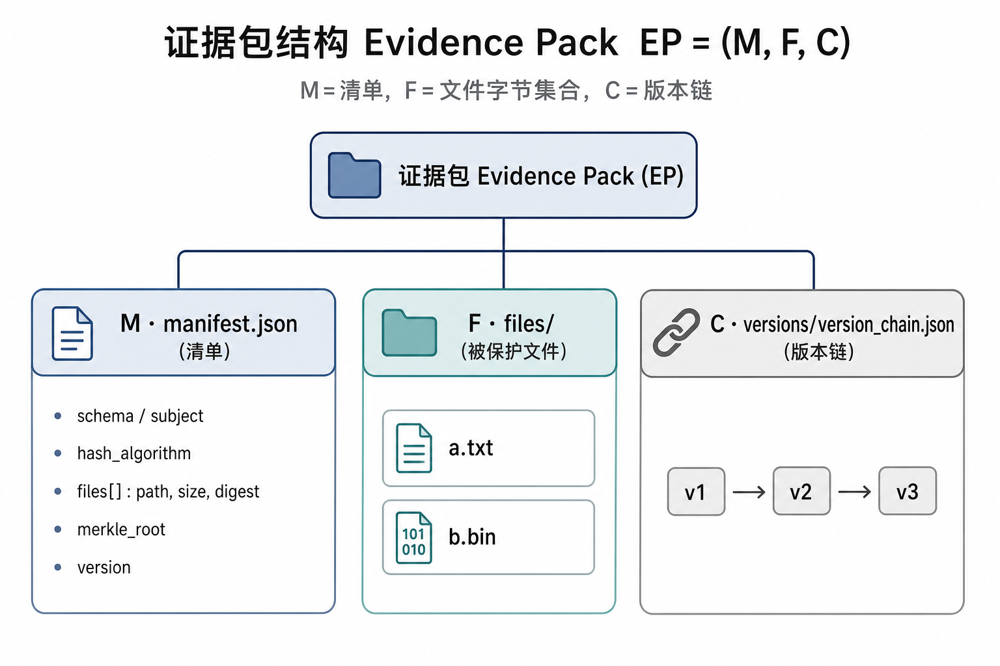

如图 1，清单是整个证据包的"承诺书"：它把每个文件的摘要与一棵 Merkle 树的根固定下来，files/ 存放被保护的文件，versions/ 记录版本演进。验证要回答的核心问题只有一个：EP 相对其被承诺的状态是否一字未改。围绕这一问题，本框架沿"确定性 → 抗篡改 → 聚合 → 线性 → 可解释"一条主线组织五重机制，每一重都为下一重提供前提。

### 1. 确定性：规范化 JSON（RFC 8785）

**可复现的摘要，建立在"被摘要的字节唯一"这一前提之上。**只要同一份数据可能被写成多种字节形式，对它算出的哈希指纹就会随之漂移，"比对是否一致"也就失去了意义。JSON 恰是这样一种一义多形的格式：`{"a":1,"b":2}` 与 `{ "b": 2, "a": 1 }` 语义完全相同，但键序、空白乃至数字 `5` 与 `5.0` 的差别，都会让两段字节不同、哈希不同；直接对原始文本取哈希，等价数据会得到互不相同的摘要，跨机器、跨语言的核验便无从建立。

RFC 8785（JSON Canonicalization Scheme）为消除这种不确定性规定了唯一的规范形：对象键按 UTF-16 码元升序排列、字符串按固定规则转义、数字统一采用 ECMAScript 最短表示。三条规则各堵一类歧义来源——键序规则消除排列歧义，转义规则消除同一字符的多种写法，最短数字规则消除 `5` 与 `5.0` 这类数值等价形。任意等价的 JSON 经规范化后都收敛到同一串字节，从而得到确定性性质

$$J_1 \equiv J_2 \;\Longrightarrow\; H(\mathrm{canon}(J_1)) = H(\mathrm{canon}(J_2))$$

即语义等价的两份数据，其规范化摘要必然相等。这条性质是后续一切比对的地基，也是性质 P3 成立的先决条件。实现上本项目严格遵循 RFC 8785 而非自定义序列化，代价是更高的实现复杂度，换来的是跨语言互操作与可被第三方独立复核的确定性：任何一方按同一标准独立实现规范化，都能对同一份数据复算出同一枚摘要。

### 2. 抗篡改：SHA-256 指纹

**确定性字节使"比对"成为可能，抗篡改能力则由密码学哈希提供。**SHA-256 把任意长度的输入压缩为固定的 256 位摘要，其安全性建立在两条经长期检验的性质上：雪崩效应保证输入哪怕只改动一比特，摘要也会面目全非；抗碰撞性保证在计算上无法构造出两段摘要相同的不同输入。摘要因此可以充当文件的指纹——指纹相等即内容相等，这一等价关系的失效概率不超过 $2^{-256}$，在工程意义上可视为零。

清单为每个文件登记一枚指纹，验证时对调用方提供的实际字节逐个重算并比对

$$\forall\, e \in M.\mathrm{files}:\; H\!\left(F[e.\mathrm{path}]\right) = e.\mathrm{digest}$$

任一条不成立即记为错误码 E2003，诊断同时给出期望摘要与实际摘要，直接定位到被改动的文件，性质 P1 由此获得密码学层面的保证。实现上，SHA-256/512 与 HMAC 合计约 537 行，全部以纯 MoonBit 手写，并以 NIST 官方测试向量逐位对拍钉死正确性；摆脱对第三方密码库的依赖后，这部分核心可以在任意 MoonBit 后端上原样编译，为后文的跨端一致性提供了源码层面的前提。

### 3. 聚合：域分离 Merkle 树（RFC 6962 风格）

**逐文件指纹回答"哪个文件被改"，证据包还需要一枚能代表整体的总指纹。**把全部文件条目聚合为单一根哈希后，任何一处改动都会沿树状结构逐层传导到根部，包级完整性从而可以用一次比对完成判定；根哈希同时是包含性证明的天然接口，为"不加载整包即可审计单个文件"预留了扩展空间。区块链账本采用的正是同一构造——一个区块内的全部交易被压缩为区块头中的一个 Merkle 根。本项目对所有文件条目建二叉哈希树，并对叶子与内节点做域分离

$$\mathrm{leaf}(d) = H(\mathtt{0x00} \,\Vert\, d), \qquad \mathrm{node}(l, r) = H(\mathtt{0x01} \,\Vert\, l \,\Vert\, r)$$

其构造如图 2。

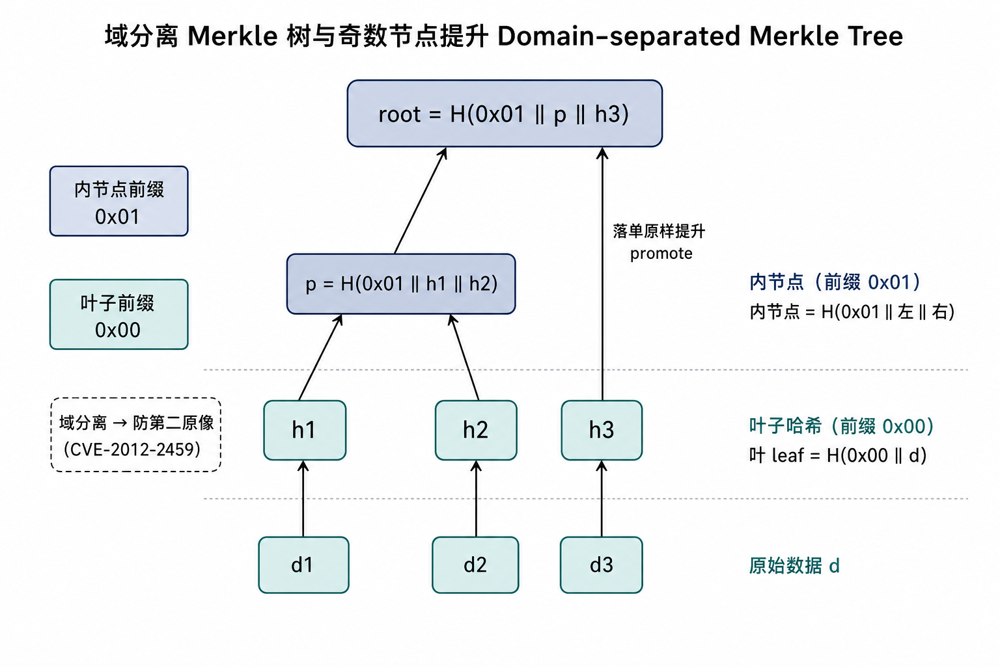

如图 2，前缀 `0x00` / `0x01` 把叶子哈希与内节点哈希隔到两个互不相交的取值空间，攻击者无法把一个叶子哈希伪装成内节点重放，第二原像攻击因此被从构造上堵死；当某一层节点数为奇数时，落单者原样向上提升、绝不与自身配对，从根源规避了比特币曾出现的重复叶子攻击（CVE-2012-2459）。相较不加前缀的朴素 Merkle 实现，域分离以极小的额外成本换来可证明的抗攻击性，两者差异见下表。

| 维度 | 朴素 Merkle | 本项目域分离 Merkle |
|---|---|---|
| 叶/内节点区分 | 无前缀，可混淆 | `0x00` / `0x01` 前缀隔离 |
| 第二原像攻击 | 可能 | 杜绝 |
| 奇数节点处理 | 常自我配对 | 落单原样提升 |
| CVE-2012-2459 | 潜在风险 | 已防御 |

### 4. 线性：版本链约束

**完整性约束的对象除了当前内容，还包括内容的演进历史。**证据包可携带版本链，每个版本记录其父版本的引用；这份历史可信的前提，是引用关系构成一条严格线性的链——断裂意味着历史被抽走一环，成环意味着时间顺序被伪造，分叉则意味着同一父版本派生出相互矛盾的谱系。线性性由四项约束联合刻画：唯一根、父引用可达、无环、每个节点入度不超过 1，即

$$\left|\mathrm{roots}\right| = 1 \;\wedge\; \mathrm{reachable}(\mathrm{parent}) \;\wedge\; \mathrm{acyclic} \;\wedge\; \forall v:\ \mathrm{indeg}(v) \le 1$$

四项约束分别对应四类非法形态：空链或无根记为 E4001，父引用断裂记为 E4002，成环记为 E4003，分叉记为 E4004，四类形态如图 3。这与区块链"区块按父哈希串联、不允许分叉"的思想一脉相承，区别仅在于此处约束的对象是版本记录而非区块。

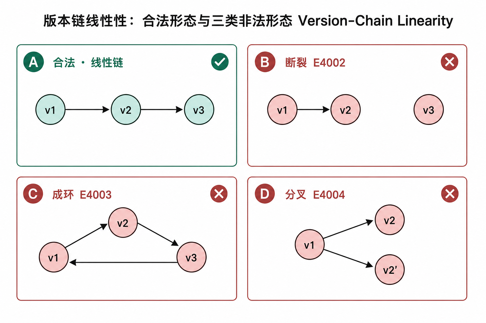

如图 3，最左为合法的线性链，其余三种分别是断裂、成环与分叉；验证器把每一种非法形态映射到一个确定错误码，使"版本被动过手脚"从一句模糊的判断变成可程序化检出的事实。

### 5. 可解释：冻结错误码契约

**诊断的价值取决于单轮能暴露多少问题，以及结论能否被自动化系统稳定消费。**遇错即停（fail-fast）策略在第一处失败即终止，多处篡改并存时用户只能修一处、跑一遍地反复试错；完备式（exhaustive）验证则跑完全部检查再统一汇总，把每一类失败映射到一个稳定错误码（E1xxx 模型 / E2xxx 摘要 / E3xxx Merkle / E4xxx 版本链 / E5xxx IO / W1xxx 警告），一轮输出全部问题。错误码一经发布即冻结——对脚本与 CI 而言，错误码是接口而非提示文案，后续版本不改变既有码的含义，自动化判定因此有了稳定的锚点。两种策略的取舍见下表。

| 维度 | 遇错即停 fail-fast | 本项目完备式 exhaustive |
|---|---|---|
| 单次暴露问题数 | 仅第一个 | 全部 |
| 修复轮数 | 多轮 | 一轮 |
| 错误定位 | 模糊 | 冻结错误码精确到条目 |
| 实现成本 | 低 | 略高（需收集而非抛出） |

五重机制共同支撑"纯核心零 IO + 适配层负责读写"的分层，使同一套验证语义能在命令行、浏览器与 CI 三种后端上逐字节一致地复核。

## 五、系统设计与实现

### 1. 总体架构：三层解耦

系统按三层组织：适配层是唯一允许 IO 的地方，纯验证核心零 IO、可在三后端移植，底层是可复用的基础能力包。文件字节由适配层以 `Map[String, Bytes]` 的形式注入核心，核心只做纯计算——这一约束正是三后端测试矩阵能钉死跨端语义一致的前提。整体分层与各包依赖如图 4。

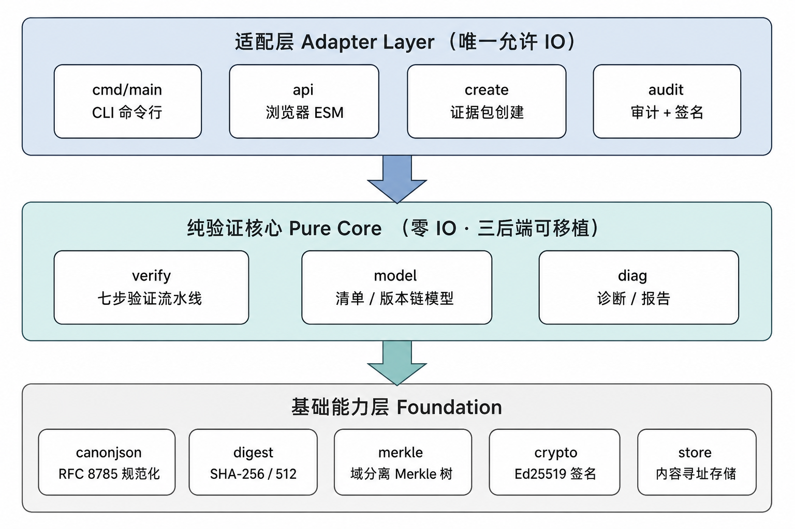

如图 4，纯核心与外部世界之间只留一个数据入口（注入的字节表）和一个数据出口（结构化报告），中间不触碰任何文件系统或网络，因此把核心整体搬到浏览器或 CI 时行为不变。各包职责如下表。

| 分层 | 包 | 职责 |
|---|---|---|
| 基础能力 | `canonjson` | RFC 8785 规范化（键序、转义、最短数字） |
| 基础能力 | `digest` | SHA-256 / SHA-512 / HMAC，`<algo>:<hex>` 文本形式 |
| 基础能力 | `merkle` | 域分离叶/内节点哈希、根计算、包含性证明 |
| 基础能力 | `crypto` | Ed25519 数字签名（RFC 8032，纯 MoonBit） |
| 基础能力 | `store` | 内容寻址存储，SHA-256 去重 |
| 验证核心 | `model` | manifest / 版本链模型与字段校验 |
| 验证核心 | `verify` | 完备式验证流水线 + 版本链线性性 |
| 验证核心 | `diag` | 结构化诊断、`explain` 与规范 JSON 报告 |
| 适配层 | `cmd/main` | CLI：`verify` / `explain` / `create`，冻结退出码 |
| 适配层 | `api` | 浏览器边界：JSON 字符串进出 |

### 2. 六阶完备式验证闭环

`verify` 包是核心的编排者，它把各纯包串成一条六阶完备式验证闭环：解析 → 规范化 → 摘要重算 → 域分离聚合 → 链式核验 → 可解释诊断，如图 5。整条流水线零 IO，文件字节由调用方注入。形式化地，验证是各阶段检查谓词的合取，其结果汇成发现集合

$$\mathrm{Verify}(EP) = \bigwedge_i \mathrm{check}_i(EP) \Rightarrow \mathrm{Findings}$$

最终判定则取决于发现集合中是否存在错误级条目

$$\mathrm{ok}(EP) \Leftrightarrow \nexists\, f \in \mathrm{Findings}:\ \mathrm{sev}(f) = \mathrm{Error}$$

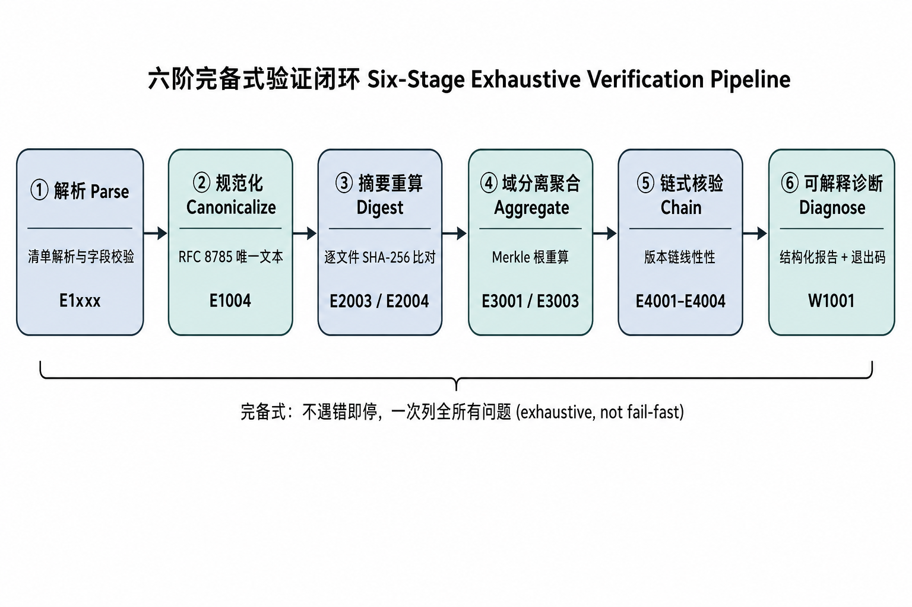

如图 5，每个阶段都对应一族确定错误码，且发现问题时并不立即返回，而是记入 `findings` 继续后续检查；只有全部阶段跑完、且没有任何一条错误级发现时才判定通过。该函数的完整实现如下（`src/verify/verify.mbt`）。

```moonbit
pub fn verify_manifest(
  manifest_json : String,
  files : Map[String, Bytes],
  expected_manifest_digest? : String,
) -> @diag.VerifyReport {
  let findings : Array[@diag.Finding] = []

  // 第 1 阶段：解析 manifest 并完成模型校验，失败即无法继续
  let manifest = @model.Manifest::parse(manifest_json) catch {
    error => {
      findings.push(
        finding(error.error_code(), Error, error.field_path(), error.detail()),
      )
      return {
        ok: false,
        findings,
        checked: { files_total: 0, files_passed: 0, merkle_checked: false },
      }
    }
  }

  // 第 2 阶段：对 manifest 做 RFC 8785 规范化（失败记 E1004）
  let canonical_manifest : String? = try
    @canonjson.canonicalize(manifest_json)
  catch {
    error => {
      findings.push(
        finding("E1004", Error, "manifest", "canonicalization failed: \{error}"),
      )
      None
    }
  } noraise {
    value => Some(value)
  }

  // 第 3 阶段：manifest 规范化摘要与外部登记值比对（不符记 E2004）
  if expected_manifest_digest is Some(expected) &&
    canonical_manifest is Some(canonical) {
    let actual = @digest.Digest::of_bytes(
      manifest.algorithm,
      @digest.string_to_utf8_bytes(canonical),
    ).to_string()
    if actual != expected {
      findings.push(
        finding(
          "E2004",
          Error,
          "manifest",
          "canonical digest mismatch, expected \{expected} got \{actual}",
        ),
      )
    }
  }

  // 第 4 阶段：逐文件重算 SHA-256 与登记摘要比对（不符记 E2003）；
  // 发现问题不中断，继续查完全部条目，并顺手登记路径供第 5 阶段使用
  let mut files_passed = 0
  let listed : Map[String, Bool] = {}
  for entry in manifest.files {
    listed[entry.path] = true
    match files.get(entry.path) {
      None =>
        findings.push(
          finding("E2003", Error, entry.path, "file content not provided by caller"),
        )
      Some(content) => {
        let actual = @digest.sha256_hex(content)
        if actual == entry.digest.hex {
          files_passed = files_passed + 1
        } else {
          findings.push(
            finding(
              "E2003",
              Error,
              entry.path,
              "digest mismatch, expected \{entry.digest.to_string()} got \{manifest.algorithm.label()}:\{actual}",
            ),
          )
        }
      }
    }
  }

  // 第 5 阶段：包内存在但未在 manifest 登记的文件，只记警告 W1001
  for path, _ in files {
    if listed.get(path) is None {
      findings.push(
        finding("W1001", Warning, path, "file present in pack but not listed in manifest"),
      )
    }
  }

  // 第 6 阶段：按规范化条目重建 Merkle 根并与登记值比对（E3001 / E3003）
  let mut merkle_checked = false
  match manifest.merkle_root {
    None =>
      if manifest.files.length() > 0 {
        findings.push(
          finding("E3001", Error, "merkle_root", "merkle root missing while files[] is non-empty"),
        )
      }
    Some(recorded) => {
      let leaves = manifest.files.map(entry => {
        @digest.string_to_utf8_bytes(canonical_file_entry(entry))
      })
      match @merkle.compute_root(leaves) {
        None =>
          findings.push(
            finding("E3001", Error, "merkle_root", "merkle root present but files[] is empty"),
          )
        Some(root) => {
          merkle_checked = true
          let actual = @digest.bytes_to_lower_hex(root)
          if actual != recorded.hex {
            findings.push(
              finding(
                "E3003",
                Error,
                "merkle_root",
                "merkle root mismatch, expected \{recorded.to_string()} got \{manifest.algorithm.label()}:\{actual}",
              ),
            )
          }
        }
      }
    }
  }

  // 汇总：不存在错误级发现才判定通过
  {
    ok: !findings.iter().any(item => item.severity is Error),
    findings,
    checked: {
      files_total: manifest.files.length(),
      files_passed,
      merkle_checked,
    },
  }
}
```

### 3. 证据包格式与 manifest 模型

一个证据包是一个目录，含 `manifest.json`（清单）、`files/`（被保护的文件）与可选的 `versions/version_chain.json`（版本链）。清单记录每个文件的路径、大小、摘要以及全部文件的 Merkle 根，示例如下。

```json
{
  "schema": "moon-evidence/v0",
  "subject": { "id": "golden-pack", "type": "dataset" },
  "hash_algorithm": "sha256",
  "files": [
    { "path": "files/a.txt", "size": 12,
      "digest": "sha256:a948904f2f0f479b8f8197694b30184b0d2ed1c1cd2a1ec0fb85d299a192a447" },
    { "path": "files/b.bin", "size": 0,
      "digest": "sha256:e3b0c44298fc1c149afbf4c8996fb92427ae41e4649b934ca495991b7852b855" }
  ],
  "merkle_root": "sha256:07a4f4bf0c83169b056f07acbf3483a5e418e58e09e942a3f06421f9cca316a5",
  "version": { "id": "v1", "parent": null }
}
```

`model` 包在解析期就完成全部字段校验，让下游流水线可以安全假设模型合法：schema 必须受支持、算法必须已知、路径非空且唯一、摘要必须是规范的 `<algo>:<小写hex>` 形式、大小为非负整数。摘要以"已校验"的形式存储，因此后续重新渲染条目做 Merkle 叶子哈希时能逐字节复现原文。完整的解析入口如下。

```moonbit
pub fn Manifest::parse(input : String) -> Manifest raise ModelError {
  let document = @json.parse(input) catch {
    error => raise ModelError::ParseFailed(error.to_json().stringify())
  }
  let root = expect_object(document, "manifest")

  // schema 版本必须受支持
  let schema = expect_string(root, "schema", "schema")
  if schema != SUPPORTED_SCHEMA {
    raise ModelError::UnsupportedSchema("schema", schema)
  }

  // subject：被存证对象的标识与类型
  let subject_fields = expect_object(
    expect_present(root, "subject", "subject"), "subject",
  )
  let subject = Subject::{
    id: expect_string(subject_fields, "id", "subject.id"),
    kind: expect_string(subject_fields, "type", "subject.type"),
  }

  // 哈希算法必须是已知算法
  let algorithm_name = expect_string(root, "hash_algorithm", "hash_algorithm")
  guard @digest.normalize_algorithm(algorithm_name) is Some(algorithm) else {
    raise ModelError::UnsupportedAlgorithm("hash_algorithm", algorithm_name)
  }

  // files：路径合法且唯一、摘要为规范形、大小非负
  let files_value = expect_present(root, "files", "files")
  guard files_value is Array(file_items) else {
    raise ModelError::InvalidField("files", "expected an array")
  }
  let files : Array[FileEntry] = []
  let seen_paths : Map[String, Bool] = {}
  for index in 0..<file_items.length() {
    let entry_path = "files[\{index}]"
    let entry_fields = expect_object(file_items[index], entry_path)
    let path = expect_string(entry_fields, "path", "\{entry_path}.path")
    validate_entry_path(path, "\{entry_path}.path")
    if seen_paths.get(path) is Some(_) {
      raise ModelError::InvalidField("\{entry_path}.path", "duplicate path \"\{path}\"")
    }
    seen_paths[path] = true
    let size = expect_size(entry_fields, "size", "\{entry_path}.size")
    let digest = expect_digest(
      expect_string(entry_fields, "digest", "\{entry_path}.digest"),
      algorithm, "\{entry_path}.digest",
    )
    files.push({ path, size, digest })
  }

  // merkle_root 可缺省，但出现时必须是规范形摘要
  let merkle_root : @digest.Digest? = match root.get("merkle_root") {
    None | Some(Null) => None
    Some(String(text)) => Some(expect_digest(text, algorithm, "merkle_root"))
    Some(_) => raise ModelError::InvalidField("merkle_root", "expected a string")
  }

  // version：当前版本标识及其父版本引用
  let version_fields = expect_object(
    expect_present(root, "version", "version"), "version",
  )
  let version = VersionRef::{
    id: expect_string(version_fields, "id", "version.id"),
    parent: expect_optional_string(version_fields, "parent", "version.parent"),
  }
  { schema, subject, algorithm, files, merkle_root, version }
}
```

### 4. Ed25519 数字签名的从零实现

签名能力是本项目工程强度最高的一块，也最能体现"自研密码学核心"。在不引入任何第三方依赖的约束下，本项目用纯 MoonBit 从零实现了 Curve25519 上的 Ed25519 签名，分三层、合计 653 行：`field25519`（202 行）实现素域 GF(2²⁵⁵−19) 上的模加、模乘、求逆与规约，是全部曲线运算的算术地基；`point25519`（154 行）实现扭曲爱德华曲线上的点加与标量乘；`ed25519`（297 行）实现 RFC 8032 的密钥派生、签名与验签流程。有限域与曲线运算对进位、规约与常量极为敏感，任一处偏差都会使签名整体失效，因此这一层完全依赖 NIST/RFC 标准测试向量逐位对拍来钉死正确性。签名与验签的主流程如下（`src/crypto/ed25519.mbt`）。

```moonbit
/// Ed25519 签名（RFC 8032 pure EdDSA）。
/// sk 为 32 字节私钥，返回 64 字节签名（R || S）。
pub fn ed25519_sign(sk : Bytes, msg : Bytes) -> Bytes {
  let h = sha512(sk)
  let a = clamp_scalar(h)
  // 随机数前缀取自私钥哈希的后 32 字节 h[32..64]
  let prefix : Array[Byte] = []
  for i in 32..<64 {
    prefix.push(h[i])
  }
  let prefix_bytes = Bytes::from_array(prefix)
  let pk = ed25519_public_key(sk)
  // r = SHA-512(prefix || msg) mod l
  let r_hash = sha512(concat_bytes(prefix_bytes, msg))
  let r = reduce_scalar_512(r_hash)
  // 承诺点 R = r * B
  let big_r = Point::base_point().scalar_mul(r)
  let big_r_enc = big_r.encode()
  // 挑战量 k = SHA-512(R || pk || msg) mod l
  let k_hash = sha512(concat3(big_r_enc, pk, msg))
  let k = reduce_scalar_512(k_hash)
  // 响应量 S = (r + k * a) mod l
  let s = sc_muladd(k, a, r)
  concat_bytes(big_r_enc, s)
}

/// Ed25519 验签。
/// pk 为 32 字节公钥，msg 为消息，sig 为 64 字节签名。
pub fn ed25519_verify(pk : Bytes, msg : Bytes, sig : Bytes) -> Bool {
  if sig.length() != 64 || pk.length() != 32 {
    return false
  }
  // 把签名拆回 R（前 32 字节）与 S（后 32 字节）
  let r_bytes : Array[Byte] = []
  let s_bytes : Array[Byte] = []
  for i in 0..<32 {
    r_bytes.push(sig[i])
  }
  for i in 32..<64 {
    s_bytes.push(sig[i])
  }
  let r_enc = Bytes::from_array(r_bytes)
  let s_enc = Bytes::from_array(s_bytes)
  // 把公钥与承诺值解码回曲线上的点，解码失败即拒绝
  let a_point = match point_decode(pk) {
    Some(p) => p
    None => return false
  }
  let r_point = match point_decode(r_enc) {
    Some(p) => p
    None => return false
  }
  // 重算挑战量 k = SHA-512(R || pk || msg) mod l
  let k_hash = sha512(concat3(r_enc, pk, msg))
  let k = reduce_scalar_512(k_hash)
  // 验证方程 S*B == R + k*A 成立才接受签名
  let sb = Point::base_point().scalar_mul(s_enc)
  let ka = a_point.scalar_mul(k)
  let rhs = r_point.add(ka)
  sb.eq(rhs)
}
```

### 5. 域分离 Merkle 树的实现

`merkle` 包按第四章的域分离构造实现：叶子与内节点分别加 `0x00` / `0x01` 前缀，逐层两两配对向上归并，落单节点原样提升。整棵树的根计算如下（`src/merkle/merkle.mbt`）。

```moonbit
/// 叶子哈希：SHA256(0x00 || data)。
pub fn leaf_hash(data : Bytes) -> Bytes {
  let ctx = @digest.Sha256Ctx::new()
  ctx.update(b"\x00")
  ctx.update(data)
  ctx.finalize()
}

/// 内节点哈希：SHA256(0x01 || left || right)。
pub fn node_hash(left : Bytes, right : Bytes) -> Bytes {
  let ctx = @digest.Sha256Ctx::new()
  ctx.update(b"\x01")
  ctx.update(left)
  ctx.update(right)
  ctx.finalize()
}

/// 按 manifest 顺序对叶子原文计算 Merkle 根。
/// 空输入返回 None；只有一个叶子时该叶子哈希即为根。
pub fn compute_root(leaves : Array[Bytes]) -> Bytes? {
  if leaves.length() == 0 {
    return None
  }
  let mut level : Array[Bytes] = leaves.map(leaf_hash)
  while level.length() > 1 {
    let next : Array[Bytes] = []
    let mut index = 0
    while index + 1 < level.length() {
      next.push(node_hash(level[index], level[index + 1]))
      index = index + 2
    }
    if index < level.length() {
      // 落单节点原样提升，绝不与自身配对（防 CVE-2012-2459）
      next.push(level[index])
    }
    level = next
  }
  Some(level[0])
}
```

### 6. 解析期拒绝路径穿越

CLI 会按 manifest 里的 `path` 去读盘。若不加约束，一个恶意 manifest 就能用 `../` 或绝对路径诱导工具读取包外文件，这正是性质 P2 要防的攻击面。本项目把防线前移到解析期：只要路径含反斜杠、盘符冒号、绝对路径、`..` 逃逸段，或出现 `.` 与空段这类可绕过去重检查的别名，一律在 `validate_entry_path` 中判为 E1002，纯流水线与 IO 适配层因此永远接触不到危险路径。该缺口是开发中自审发现的，按"先写红测试复现、再改绿"的测试驱动流程修复，完整实现如下（`src/model/manifest.mbt`）。

```moonbit
fn validate_entry_path(path : String, context : String) -> Unit raise ModelError {
  for index in 0..<path.length() {
    let unit = path[index].to_int()
    if unit == 0x5c {
      raise ModelError::InvalidField(
        context, "backslash separators are not allowed (use \"/\")",
      )
    }
    if unit == 0x3a {
      raise ModelError::InvalidField(context, "\":\" is not allowed in paths")
    }
  }
  if path[0].to_int() == 0x2f {
    raise ModelError::InvalidField(context, "absolute paths are not allowed")
  }
  let mut segment_start = 0
  for index in 0..<(path.length() + 1) {
    let at_separator = index == path.length() || path[index].to_int() == 0x2f
    if at_separator {
      let segment_length = index - segment_start
      if segment_length == 0 {
        raise ModelError::InvalidField(context, "empty path segment is not allowed")
      }
      if segment_length == 1 && path[segment_start].to_int() == 0x2e {
        raise ModelError::InvalidField(context, "path segment \".\" is not allowed")
      }
      if segment_length == 2 &&
        path[segment_start].to_int() == 0x2e &&
        path[segment_start + 1].to_int() == 0x2e {
        raise ModelError::InvalidField(context, "path segment \"..\" is not allowed")
      }
      segment_start = index + 1
    }
  }
}
```

### 7. 跨端一致性与 CLI 冻结退出码

"纯核心零 IO"的分层使核心可在 native / wasm-gc / js 三后端编译运行且语义一致，这是性质 P3 的工程落地。`cmd/main` 只是一层薄适配：负责参数解析、IO（E5xxx 领域）、注入文件字节与渲染报告，验证逻辑全在纯库里。退出码被冻结为脚本可依赖的契约——`0` 全部通过、`1` 存在验证失败、`2` 用法或 IO 错误；批量模式下只有全部包通过才返回 `0`。命令分派入口如下（`src/cmd/main/main.mbt`）。

```moonbit
// 退出码契约（冻结）：0 全部通过，1 验证失败，2 用法或 IO 错误。
fn main {
  @sys.exit(run(@env.args()))
}

fn run(raw_args : Array[String]) -> Int {
  let args = strip_runtime_prefix(raw_args) // 抹平 native/js 运行时 argv 前缀差异
  if args.length() == 0 {
    println(usage_text)
    return 2
  }
  match args[0] {
    "--version" | "-v" | "version" => {
      println("moon-evidence \{CLI_VERSION}")
      0
    }
    "--help" | "-h" | "help" => {
      println(usage_text)
      0
    }
    "verify" => run_verify(args, json_allowed=true)
    "explain" => run_verify(args, json_allowed=false)
    "create" => run_create(args)
    _ => {
      println(usage_text)
      2
    }
  }
}
```

## 六、实验与结果分析

### 1. 构建与验证演示

全部产物由 `moon build` 一键编译，构建过程如图 6。图 6 中，`moon build --target wasm-gc,js` 依次完成 wasm-gc 与 js 两个后端的编译与链接，均以零错误零警告收束；随后以 `--version` 运行编译出的 js 产物，确认 CLI 可用且版本与源码一致。

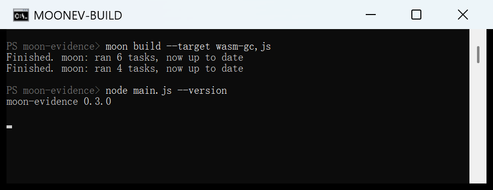

以构建出的 js 产物，对内置的两个示例包分别运行 `verify`（完好包）与 `explain`（被篡改包），结果如图 7。

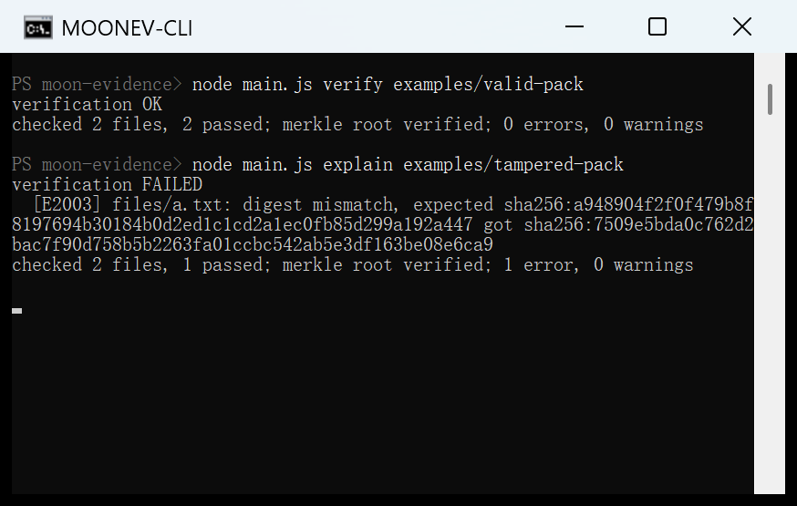

如图 7，完好包 `examples/valid-pack` 通过验证：2 个文件全部通过、Merkle 根校验通过、0 错误 0 警告，退出码 0；被篡改包 `examples/tampered-pack` 中 `files/a.txt` 被改动一个字节，工具立即报出 `[E2003] digest mismatch`，同时打印期望摘要与实际摘要，退出码 1。图中 `0 errors` 属于完好包、`1 error` 属于被篡改包，是两次独立运行的结果。期望的 `a948904f…` 与实际重算的 `7509e5bd…` 完全对不上，直观印证了性质 P1：改动一个字节必被发现。

### 2. 可解释诊断：错误码全覆盖

完备式诊断的价值，在错误包上最能看清。测试夹具中预置了一组各含一类缺陷的证据包，对它们逐一运行 `explain`，每个包都被精确映射到设计好的错误码，输出如图 8。

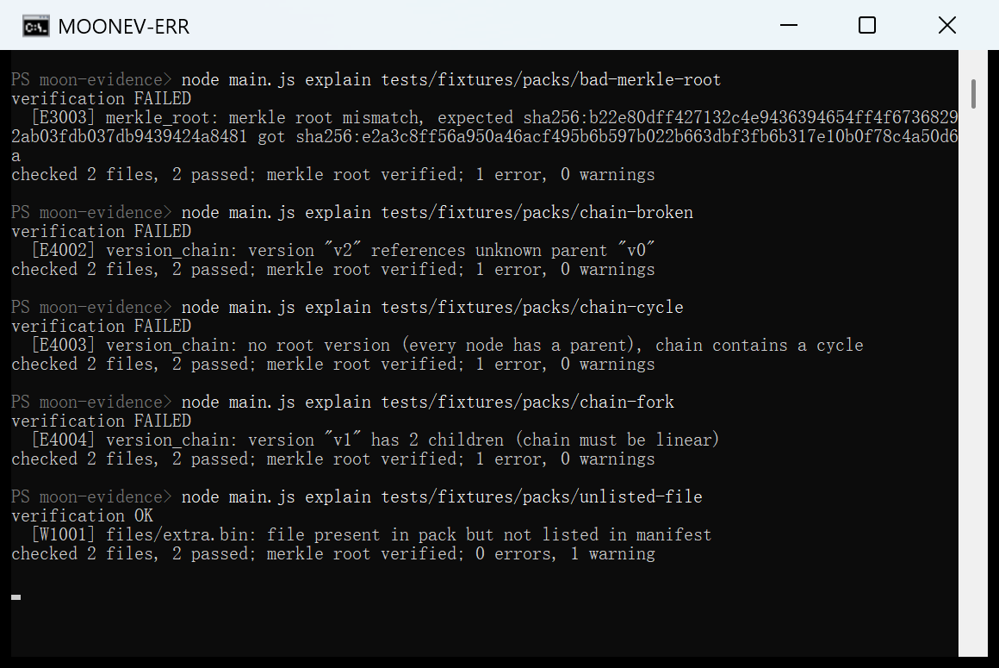

如图 8，Merkle 根被改报 `E3003`，诊断同时给出登记根与重算根两枚摘要；版本链断裂、成环、分叉分别报 `E4002`、`E4003`、`E4004`，且诊断文本点明具体成因（"references unknown parent"、"chain contains a cycle"、"has 2 children"）；"包内存在未登记文件"仅报 `W1001` 警告、结论仍为 OK、退出码保持 0，合法的补充文件不会被误判为篡改。诊断不止给出错误码，还定位到具体条目与原因，用户据此一轮即可修完全部问题，完备式相对遇错即停的收益在此得到直接体现。

### 3. 三后端一致性与质量体系

要确认上述行为是语义正确而非"碰巧在某个后端跑通"（即性质 P3），用 `moon test` 在 wasm-gc 与 js 两个后端各跑一遍全部单元测试，结果如图 9。

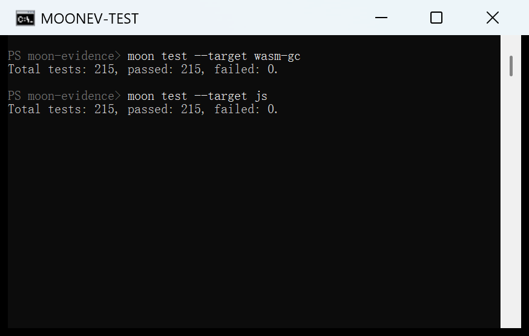

如图 9，两个后端均为 `Total tests: 215, passed: 215, failed: 0`：同一套核心在两种运行时上给出完全一致的结果，是跨端确定性的直接证据。native 后端在持续集成中完成构建与 CLI 黑盒套件校验，三后端覆盖策略与整体质量体系分别见下两表。

| 后端 | 构建 | 单元测试（215 个） | 验证途径 |
|---|---|---|---|
| wasm-gc | 通过 | 215 / 215 | 本机实测 |
| js | 通过 | 215 / 215 | 本机实测，并承载 CLI 与浏览器演示 |
| native | 通过 | 语义由可移植后端钉死 | GitHub Actions CI 构建并跑通 CLI 黑盒套件 |

| 测试层 | 数量与内容 | 结果 |
|---|---|---|
| 单元测试 | 215 个，覆盖 NIST SHA-256/512 向量、RFC 8785 Appendix B 向量、Merkle 域分离、版本链图语义等 | wasm-gc / js 双后端全绿 |
| CLI 黑盒套件 | 逐包断言精确错误码集合与退出码（禁止"至少包含"式宽松断言） | 通过 |
| 篡改矩阵 | 精心构造的证据包覆盖每个错误码族，CI 设防腐化校验 | 通过 |
| Property 测试 | 规范化幂等、Merkle 证明可靠性，经变异验证确认断言非恒真 | 通过 |
| 持续集成 | 三后端矩阵构建 + 测试 + 黑盒 + 浏览器适配器烟测 | 通过 |

### 4. 篡改矩阵与三道防线

篡改矩阵用一组精心构造的证据包，把每一类错误码逐个逼出来，并断言 CLI 返回的错误码集合与退出码同设计完全一致。核心用例与预期错误码如下表，其错误码与 `src` 源码中的定义一一对应。

| 证据包 | 触发场景 | 预期错误码 |
|---|---|---|
| valid | 完好包 | 无（退出 0） |
| tampered-file | 文件内容被改 | E2003 |
| missing-file | 缺少已登记文件 | E2003 |
| unlisted-file | 存在未登记文件 | W1001（退出仍为 0） |
| bad-digest-field | manifest 内摘要被改 | E2003 + E3003（双重命中） |
| bad-merkle-root | Merkle 根被改 | E3003 |
| chain-broken | 版本链父引用断裂 | E4002 |
| chain-cycle | 版本链成环 | E4003 |
| chain-empty | 版本链为空 | E4001 |
| chain-fork | 版本链分叉 | E4004 |

从防御视角看，这些错误码对应三道相互独立的防线，任一层级的篡改都被映射到确定错误码，如图 10。

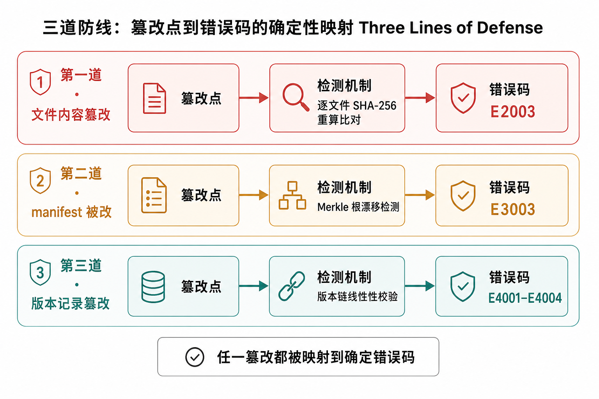

如图 10，第一道由逐文件 SHA-256 抓文件内容篡改（E2003）；第二道由 Merkle 根漂移抓 manifest 自身被改（E3003）；第三道由版本链线性性抓版本记录篡改（E4001–E4004）。三道防线各守一层、互不重叠，篡改无论落在哪一层都无处遁形。

### 5. 性能实测与近线性

为量化验证开销随规模的变化，用工具自身的 `create` 生成文件数 N 递增的证据包，再对每个包实测 `verify` 的端到端耗时（js 后端，取三次最小值，含运行时启动开销），数据如下表、曲线如图 11。

| 文件数 N | 端到端 verify 耗时 / ms（js，含启动） |
|---|---|
| 500 | 144 |
| 1000 | 232 |
| 2000 | 275 |
| 4000 | 429 |
| 8000 | 458 |

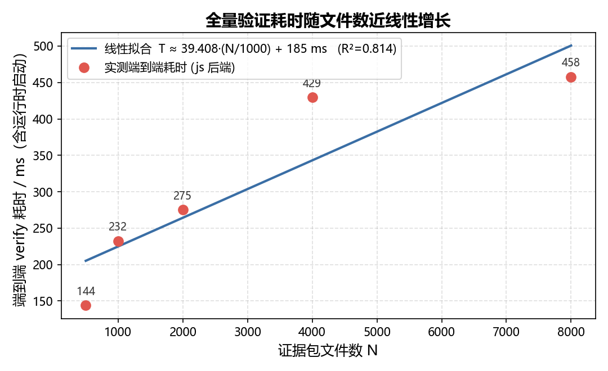

对实测点做线性拟合得

$$T(N) \approx 39.4 \cdot (N/1000) + 185\ \text{ms}, \qquad R^2 \approx 0.81$$

其中约 185 ms 的常数项是 Node 运行时启动等固定开销、与文件数无关，斜率项则随文件数近线性增长，与"逐文件哈希为线性主项、Merkle 树仅贡献对数深度"的复杂度分析吻合。随着证据包增大，均摊到每个文件的验证成本趋于稳定，框架因此具备处理大规模证据包的可扩展性。

### 6. 浏览器端验证 demo

同一套纯核心经 `moon build --target js` 编译为 ESM 产物后，可由 `api` 包以 JSON 字符串进出的边界接入任意 JS 宿主。浏览器 demo 在本地页面里直接调用该产物完成校验，文件不离开用户电脑，运行效果如图 12。

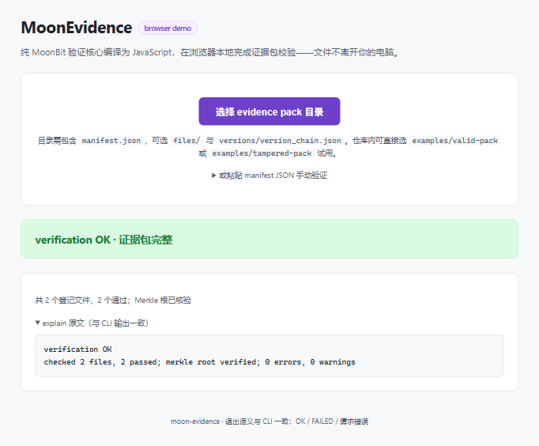

如图 12，选择 `examples/valid-pack` 目录后，验证在浏览器本地完成：页面给出绿色的 `verification OK` 结论与"2 个登记文件全部通过、Merkle 根已核验"的统计，展开的 explain 原文与 CLI 输出逐字一致。CLI 与浏览器共用同一套 MoonBit 核心、给出同一套语义，"纯核心 + 薄适配层"的分层由此兑现了一次实现、多端复用。

### 7. 与替代方案的能力对比

将本框架与两种常见做法（对文件直接做文本哈希、纯人工核验）对比，可见其在确定性、聚合、定位与自动化上的系统性优势。

| 能力 | 直接文本哈希 | 人工核验 | MoonEvidence |
|---|---|---|---|
| 跨机器同摘要 | 否（受序列化影响） | — | 是（RFC 8785 规范化） |
| 多文件聚合为单根 | 否 | 否 | 是（域分离 Merkle） |
| 篡改定位 | 仅知"变了" | 依赖人工 | 冻结错误码精确到条目 |
| 版本演进约束 | 无 | 无 | 版本链线性性 |
| 可复现 / 可自动化 | 弱 | 无 | 退出码契约 + 三后端一致 |
| 越权读取防护 | — | — | 解析期路径穿越阻断 |

## 七、结论与展望

本项目以 MoonBit 从零构建了一套六阶完备式可信证据完整性验证框架，并用可运行程序与实测证据支撑了三条设计性质。综合原理、实现与实验，可得如下结论。

**确定性是一切可复核性的地基。** RFC 8785 规范化使"同一份数据得到同一摘要"成立，验证结果因此可跨机器、跨后端复现；图 9 中 wasm-gc 与 js 两后端 215 个测试完全一致，正是性质 P3 的直接证据。缺此地基，抗篡改与聚合所依赖的"比对"都无从谈起。

**三道防线把"不可篡改"变成可程序化检验的性质。** 文件内容篡改由逐文件 SHA-256 抓住（E2003），manifest 被改会同时使 Merkle 根漂移（E3003），版本记录被动手脚则由版本链线性性发现（E4001–E4004）。图 7 的 E2003、图 8 的错误码全覆盖、图 10 的防线映射与篡改矩阵表共同印证：哪一道防线抓什么，都是确定且可复核的——这正是把"内容与历史不可改"落成工程能力的意义所在。

**完备式诊断与冻结错误码提升了工程可用性。** 完备式让用户一轮修完全部问题，错误码契约与退出码契约让验证可被脚本与 CI 稳定消费。双后端 215 个测试全绿、golden 数据由独立 Node 参考实现逐字节对账、property 测试经变异验证，共同保证结论是"每次都对"而非"这次跑通"。

**生态价值与自主可控。** canonjson、digest、merkle 等纯包零 IO、可被任意 MoonBit 项目直接复用，其中 RFC 8785 规范化为 Mooncakes 生态内首个实现；`api` 包的字符串进出边界让任意 JS 宿主零成本集成，同一套核心即可跑在 CLI、浏览器与 CI（图 12）。用一门新语言从零实现含 Ed25519 在内的完整密码学核心并做到三后端一致，是对基础软件"从使用工具走向共建生态"的一次具体实践。

**演进方向。** 框架当前聚焦验证核心，下一步将沿三条线继续深化：一是把流式哈希接入适配层，将大包内存峰值从"全部文件之和"降到"单文件最大值"，进一步提升大规模证据包的处理能力；二是把 Merkle 包含性证明暴露到 CLI，使单文件审计无需加载整包；三是托管在线浏览器 demo 并扩展多哈希算法位。去中心化、可信数据与自主可控是可信数据探索的底层思想，而其前置的"可复核完整性验证"正是本项目持续深耕的着力点。

## 八、小组分工与贡献

本项目由四人小组协作完成，各成员分工与贡献度如下表。

| 成员 | 分工 | 贡献度 |
|---|---|---|
| 陈俊文 | 总体方案与三层架构设计；verify 验证流水线、model / diag 模块与 Ed25519 签名实现；报告撰写与统稿 | 28% |
| 袁豪谦 | canonjson 规范化与 digest 哈希模块实现；单元测试编写与 NIST / RFC 标准向量对拍 | 24% |
| 牛家麒 | merkle 域分离聚合与版本链校验实现；CLI 命令行工具与黑盒测试套件 | 24% |
| 柳思涵 | api 浏览器适配层与在线验证 demo；性能基准测量与 CI 持续集成配置 | 24% |
